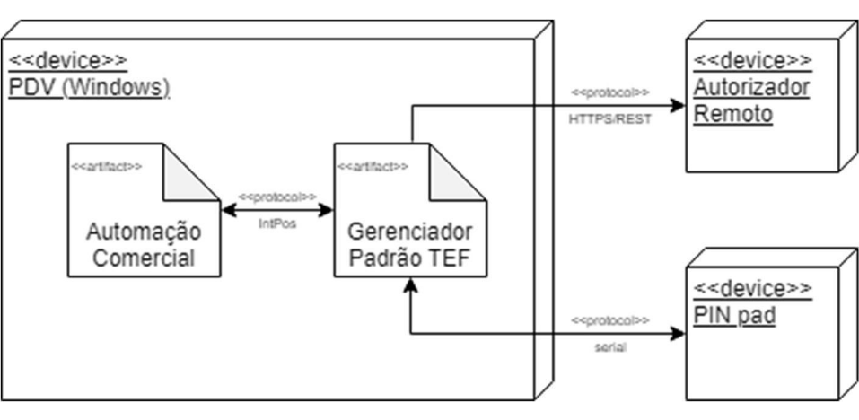
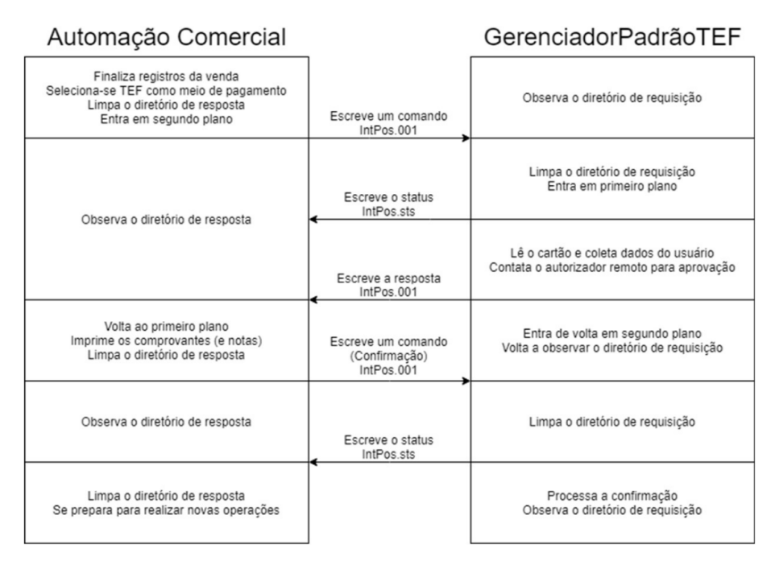
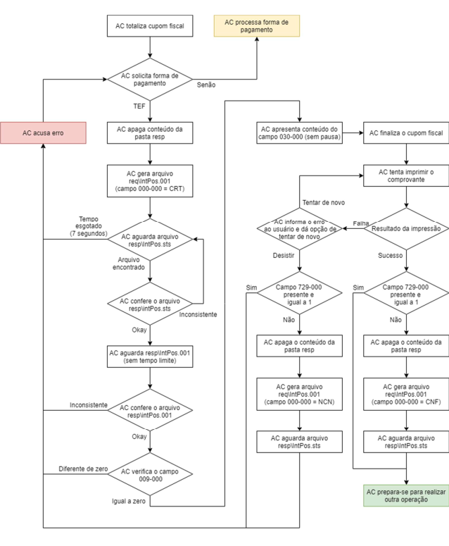
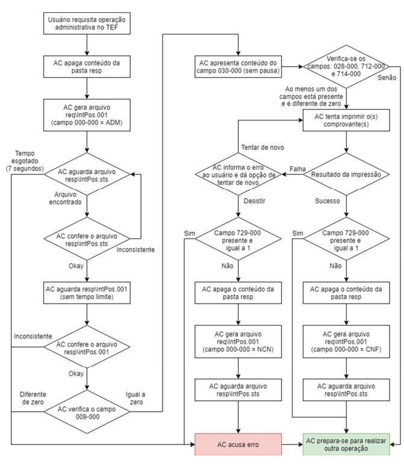
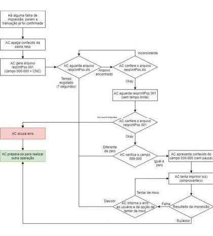
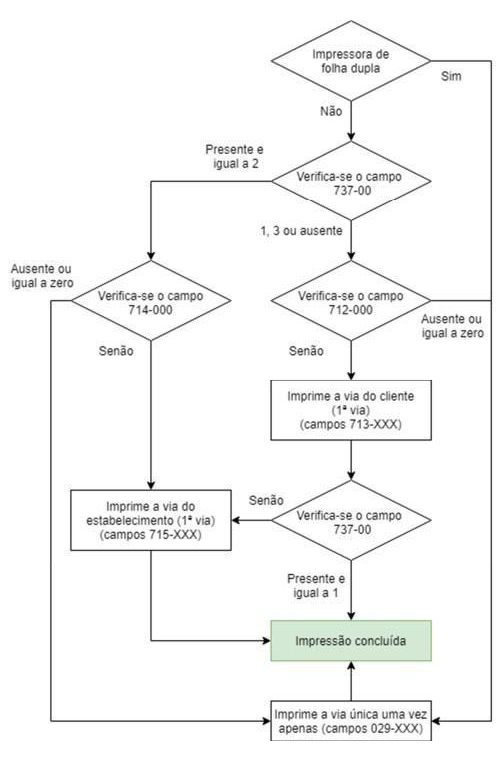
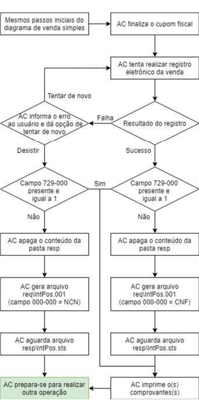
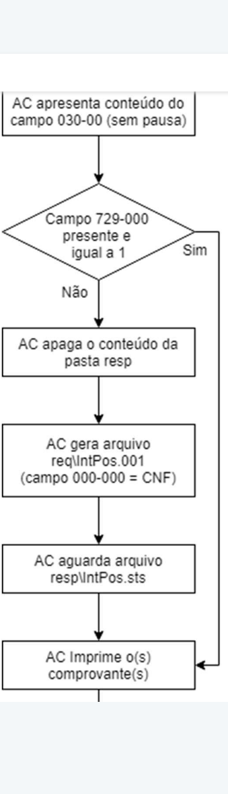

# TEF

TEF é a tecnologa para aceitação de cartões presencialmente. Essa seção tem como objetivo facilitar a integração com a API de TEF da Safrapay.

Para outras formas de integração, como intpos (troca de arquivos), consulte nosso time de integrações.

# INTPOS

<a id="1-diagrama-de-instalação"></a>

## 1. Diagrama de instalação

O seguinte diagrama mostra a arquitetura do GerenciadorPadrãoTEF com PDV na plataforma Windows:



O executável GerenciadorPadrãoTEF roda em segundo plano o tempo todo no PDV e é responsável por se comunicar com o autorizador remoto e com o PIN pad. Através do protocolo de leituras e gravações sucessivas de arquivos apelidado aqui de "IntPos" a Automação Comercial se comunica com o GerenciadorPadrãoTEF; esclarecer o funcionamento deste protocolo é o objetivo deste documento.

O nome "Autorizador Remoto" é uma abstração para um número indeterminado de máquinas, protocolos, processos e sistemas que operam em computadores remotos (na internet, por exemplo) para efetuar uma transação eletrônica.

<a id="2-comunicação-básica"></a>

## 2. Comunicação básica

<a id="21-fluxo-transacional"></a>

### 2.1 Fluxo transacional

O seguinte diagrama mostra a sequência de arquivos trocados durante uma transação de venda aprovada pela adquirente, que foi sucedida de confirmação.



O fluxo de comunicação sempre se inicia na Automação Comercial, sendo que o GerenciadorPadrãoTEF é uma entidade passiva e não retorna nenhum dado a menos que o requisitado.

O acionamento do GerenciadorPadrãoTEF pela Automação Comercial é realizado pela gravação de um arquivo de requisição em um diretório específico (explicado a seguir). Quando este arquivo é gravado, a Automação Comercial deve entrar em segundo plano até que o GerenciadorPadrãoTEF grave o arquivo de resposta, momento em que Automação Comercial deve voltar ao primeiro plano.

Isto é, apesar de ambos os softwares de Automação Comercial e GerenciadorPadrãoTEF estejam sendo executados simultaneamente, apenas um deve interagir com o usuário por vez. O outro sempre deve aguardar sua vez em segundo plano. A fim de se garantir o sincronismo entre as aplicações o protocolo "IntPos" deve ser seguido.

<a id="22-operações-suportadas"></a>

### 2.2 Operações suportadas

O GerenciadorPadrãoTEF pode realizar vários tipos de operações, no entanto destacam-se os seguintes:

- Autorização (pagamento simples);
- Pré autorização;
- Pré autorização incremental;
- Confirmação de pré autorização;
- Confirmação de pagamento;
- Reversão de pagamento;
- Cancelamento (estorno);
- Fechamento de turno;
- Outras funções administrativas.

<a id="23-troca-de-arquivos"></a>

### 2.3 Troca de arquivos

Para integração com o GerenciadorPadrãoTEF, utilize a pasta e disco local C:\Users\[usuario\]\AppData\Local\SAFRAPAY_INTPOS. Este diretório contém duas pastas (lembrando que a API de acesso a arquivos e diretórios do Windows é *case insensitive)*:

- req (C:\Users\[usuario\]\AppData\Local\SAFRAPAY_INTPOS\req):
  - Os arquivos (comandos) gerados pela Automação Comercialpara o GerenciadorPadrãoTEF são gravados nesta pasta.
  - GerenciadorPadrãoTEF deve excluir os arquivos gravados nesta pasta após a leitura.
- resp (C:\Users\[usuario\]\AppData\Local\SAFRAPAY_INTPOS\res):
  - Os arquivos (respostas) gerados pelo GerenciadorPadrãoTEF para a Automação Comercial são gravados nesta pasta
  - A Automação Comercial deve excluir os arquivos gravados nesta pasta após a leitura.

**Nota** : o GerenciadorPadrãoTEF automaticamente permite acesso de leitura e escrita nas pastas citadas acima para todos os usuários autenticados no computador logo na sua instalação.

A fim de se evitar conflitos durante o acesso aos arquivos, a automação comercial deve:

- Gravar um arquivo temporário com o conteúdo do comando a ser enviado;
- Esvaziar o cache e fechar o arquivo;
- Enfim, renomear e mover o arquivo temporário para C:\Users\[usuario\]\AppData\Local\SAFRAPAY_INTPOS\reqIntPos.001.

É possível que haja outros softwares autênticos instalados no PDV que monitorem o acesso a arquivos (principalmente antivírus), estes podem causar falhas de comunicação entre a automação comercial e o GerenciadorPadrãoTEF. Por isso, é importante que a automação comercial identifique e trate esta situação específica, tentando novamente várias vezes o acesso ao arquivo, com intervalos de fração de segundos, antes de reportar o erro para o usuário.

<a id="24-comprovantes"></a>

### 2.4 Comprovantes

O GerenciadorPadrãoTEF gerar dois tipos de comprovantes para transações financeiras bem sucedidas:

- Comprovante **via do cliente** : contém mais informações úteis ao cliente. Este comprovante sempre está presente quando a via do estabelecimento estiver.
- Comprovante **via do estabelecimento** : comprovante que contém informações quanto à transação.

Nas operações de venda (autorização ou confirmação de pré autorização), a automação comercial deve sempre imprimir os comprovantes vinculados ao documento fiscal (quando utilizada impressora fiscal). As vias impressas e sua ordem são definidas pelos diagramas a seguir.

Caso a impressão seja de duas vias na mesma folha, a Automação Comercial deverá prever um mecanismo para separação das vias, seja de maneira automática (guilhotina) ou manual (pausa na impressão, pois há um espaçamento de 5 linhas entre as vias).

<a id="25-boas-práticas"></a>

### 2.5 Boas práticas

Não é mandatório, porém é considerada uma boa prática que a automação comercial faça o menor uso possível do processador enquanto aguarda pelo arquivo de resposta do GerenciadorPadrãoTEF. Desta maneira, o computador deve apresentar melhor responsividade, bem como o próprio GerenciadorPadrãoTEF.

Recomenda-se verificar a existência do arquivo de resposta no máximo quatro vezes por segundo.

<a id="3-fluxos-operacionais"></a>

## 3. Fluxos Operacionais

Esta seção detalha os fluxos de processamento que devem ser seguidos pela Automação Comercial (AC) para realizar uma operação de pagamento de TEF.

<a id="31-transação-de-venda"></a>

### 3.1 Transação de venda

Uma transação de venda segue o fluxo abaixo, para uma solução integrada com Impressora Fiscal:



Algumas etapas do fluxograma apresentado acima são explicadas em detalhes na próxima sessão.

<a id="32-transação-administrativa"></a>

### 3.2 Transação Administrativa

O fluxo de transação administrativa é bem similar ao de venda, exceto pela geração de comprovantes:



<a id="33-transação-de-cancelamento"></a>

### 3.3 Transação de cancelamento

A transação de cancelamento pode ser requisitada explicitamente pela Automação Comercial através do uso do comando "CNC", ou ainda através de um fluxo de telas de operações administrativas que sucedem o comando "ADM". O fluxo do cancelamento é muito parecido com o de uma transação administrativa, exceto pela geração obrigatória de comprovantes no caso de sucesso. O fluxo de operação é como sucede:



<a id="34-impressão"></a>

### 3.4 Impressão

A impressão dos comprovantes fiscais são uma parte crítica da transação, e o sucesso ou falha desta, implica na transação ser ou confirmada ou cancelada, respectivamente. Uma má implementação desta funcionalidade pode implicar em infração da lei fiscal, em perda financeira para o lojista, etc.

Quando houver falha de impressão, a automação comercial deve informar o operador e perguntar-lhe se deseja tentar novamente sem tempo máximo para resposta (dando a oportunidade de verificar o estado e as conexões da impressora) e sem quantidade máxima de tentativas.

Em caso de falha irreversível na impressão (com desistência de tentativas do operador) a automação comercial de indicar que a transação foi revertida, apresentando a mensagem de erro "Transação 'NSU' cancelada".

Porém, em casos raros onde o campo 729-000 indique que a transação já foi capturada (confirmada automaticamente), é mandatória a realização do fluxo de cancelamento da transação, pois o valor já fora descontado do portador do cartão e a transação não pode ser cancelada sem o mesmo cartão usado no pagamento

O fluxo abaixo deve ser utilizado para determinar quais vias do comprovante devem ser impressas:



<a id="4-detalhes-de-operação"></a>

## 4. Detalhes de Operação

Esta seção detalha os como processar determinados casos não previstos anteriormente, ou operações que devem ser tratadas de forma especial pela automação comercial quando ocorrerem.

<a id="41-interrupção-da-transação"></a>

### 4.1 Interrupção da transação

Devido à interação com o usuário, o fluxo de telas e captura de informação não tem tempo máximo definido. Pois, apesar de haver tempo máximo de ociosidade, o contador é reiniciado a cada interação do usuário.

Por isso, não há tempo máximo para a automação comercial aguardar o arquivo resp\IntPos.001 gerado pelo GerenciadorPadrãoTEF. Tampou há mecanismos fornecidos à automação comercial para abortar uma operação do GerenciadorPadrãoTEF depois de receber o arquivo resp\IntPos.sts.

**Importante** :

- Algumas transações, mesmo bem-sucedidas e gerando comprovantes, podem não necessitar de confirmação, ou seja, são capturadas automaticamente. Esta situação é identificada pela Automação Comercial através do campo 729-000. Isto se dá devido à Adquirente não permitir desfazê-la.
- A transação de cancelamento não é completamente automática e requer diversas ações do usuário (reaproximação do cartão, digitação de dados do cartão, etc.), assim como na transação original. Além disso, pode ser mal-sucedida, devido a falhas de comunicação ou erros na digitação, por exemplo. A automação comercial apenas deve considerar a transação de cancelamento bem sucedida, após impressão com sucesso dos comprovantes.

<a id="42-falta-de-energia"></a>

### 4.2 Falta de energia

Quando houver falta de energia enquanto a automação comercial estiver aguardando o arquivo resp\IntPos.001, a mesma deve verificar se o arquivo já está presente. E caso esteja, deve-se utilizar o mesmo procedimento de falha de impressão. Caso contrário, não deve-se considerar a transação como realizada.

<a id="43-mensagens-de-erro-padrão"></a>

### 4.3 Mensagens de erro padrão

Caso haja um erro de comunicação com o GerenciadorPadrãoTEF, a mensagem apresentada para o usuário deve corresponder à tabela abaixo. No fluxo em "6.1. Transação de Venda" destacam-se as seguintes situações, por exemplo:

| **Situação** | **Mensagem de erro** |
| --- | --- |
| O arquivo resp\IntPos.sts não é gerado pelo TEF | TEF não responde |
| Inconsistência no arquivo resp\IntPos.001 | Inconsistência no campo <número do campo> do arquivo <nome do arquivo> gerado pelo TEF |
| Campo 009-000 diferente de zero | <campo 030-000> |
| Falha na impressão | Transação 'NSU' cancelada |

**Observação** : a automação comercial deve apresentar a mensagem e até o operador confirmar a leitura da mesma, com a implementação de um botão "OK", por exemplo.

<a id="44-várias-formas-de-pagamento"></a>

### 4.4 Várias formas de pagamento

Caso o cliente requisite fazer o pagamento através de vários meios, inclusive via TEF, as formas de pagamento adicionais devem ser registradas antes de acionar o GerenciadorPadrãoTEF. O valor da transação de venda informado pela automação comercial deve sempre ser o valor total ainda não pago. Neste caso, a venda do PDV é finalizada apenas quando o GerenciadorPadrãoTEF responde que a transação foi autorizada e a automação comercial confirma a venda, caso necessário.

<a id="45-verificação-da-atividade-do-gerenciadorpadrãotef"></a>

### 4.5 Verificação da atividade do GerenciadorPadrãoTEF

Para verificar se o GerenciadorPadrãoTEF está ativo, a Automação Comercialdeve:

- Apagar o conteúdo da pasta resp;
- Gerar um arquivo req\IntPos.001, com campo 000-000 = ATV;
- Aguardar até 7 segundos pela geração do arquivo resp\IntPos.sts;
- Considerar que o GerenciadorPadrãoTEF está ativo se o arquivo for gerado.

**Importante** :

- O GerenciadorPadrãoTEF é inicializado automaticamente junto ao sistema operacional, para qualquer usuário da máquina. Caso o mesmo não se inicie automaticamente, deverá ser acionado o suporte ao produto para verificar a instalação e corrigir o problema.
- Caso seja constatado que o GerenciadorPadrãoTEF esteja inativo, a automação comercial deve indicar ao operador que o acione manualmente.

<a id="5-fluxos-sem-impressora-fiscal"></a>

## 5. Fluxos sem impressora fiscal

Esta seção detalha os fluxos de processamento que devem ser seguidos pela automação comercial quando o estabelecimento não fizer uso de impressora fiscal para realizar uma operação de pagamento de TEF.

<a id="51-emissão-de-documento-fiscal-eletrônico"></a>

### 5.1 Emissão de documento fiscal eletrônico

Para estabelecimentos que emitam um documento fiscal eletrônico (NF-e, NFC-e, SAT, etc.) ao invés de um Cupom Fiscal, a fim de garantir que a transação foi completada, todos os passos referentes à impressão dos comprovantes detalhados até agora devem ser repostos pelo registro do documento fiscal eletrônico. Isto é, o registro desse documento com o serviço fiscal é crítico para confirmação ou reversão da venda recém aprovada. Como mostra o diagrama:



<a id="52-impressora-não-fiscal"></a>

### 5.2 Impressora não fiscal

Os estabelecimentos que não se utilizam de impressora fiscal, a automação comercial é livre para realizar a impressão dos comprovantes em impressoras não fiscais. Neste cenário, o sucesso ou falha da impressão destes comprovantes não são críticos para a confirmação da transação recém realizada. O fluxo a ser adotado deve ser como no diagrama abaixo:



**Observações** :

- Caso a impressão falhe, é possível recobrar os comprovantes da última transação através de uma nova transação administrativa (genérica).
- Quando a automação comercial estiver integrada a algum sistema que necessita de verificar a integridade de toda operação até confirmá-la, é a checagem deste sistema que deve ser o critério para confirmação ou reversão da transação recém realizada. Substituindo a impressão fiscal nos fluxos apresentados anteriormente.

<a id="6-captura-de-dado-pessoal-do-cliente"></a>

## 6. Captura de dado pessoal do cliente

O GerenciadorPadrãoTEF disponibiliza um comando específico (CDP) para captura de um dado pessoal do cliente no PIN-pad (quando suportado) utilizado pela solução, favorecendo a operação (evitando erros de digitação) e preservando a confidencialidade da informação. Este dado pode ser:

- O código CPF do cliente;ou
- O código CNPJ do cliente;ou
- Um identificador numérico qualquer, de 1 a 16 dígitos.

Ao receber este comando, o GerenciadorPadrãoTEF solicita imediatamente a captura do dado no PIN-pad; caso não seja suportado pelo mesmo, será requisitada entrada na tela do Checkout.

**Observações** :

- O comando CDP não gera comprovante e a Automação Comercial não deve gerar um arquivo de confirmação.
- Este comando pode ser usado separadamente de uma operação de TEF, e pode ser utilizado também para vendas com forma de pagamento não tratada pelo GerenciadorPadrãoTEF.

<a id="7-protocolo"></a>

## 7. Protocolo

Esta seção detalha a formação dos arquivos de comando e resposta do protocolo.

<a id="71-formação-dos-arquivos"></a>

### 7.1 Formação dos arquivos

Os arquivos são de texto, compostos de várias linhas.

Toda linha termina com os caracteres CR (ASCII hexadecimal 0Dh) seguido de LF (ASCII 0Ah). Exceto por estes dois caracteres citados acima, todos pertencem à faixa de caracteres ASCII de 20h (espaço) a 7Eh (~), não sendo permitidos caracteres acentuados.

Cada linha do arquivo define um único campo e índice, como no formato:AAA-BBB = CCCCC...CCCCC

onde:

- AAA é identificador (número) do campo;
- BBB é o índice de repetição do campo (para campos de múltiplos registros);
- CCCCC...CCCCC é o conteúdo do campo (tamanho variável ou fixo, de acordo com a especificação);
- O símbolo '=' (igual) é sempre precedido e seguido por um caractere ASCII de 20h (espaço).

<a id="72-comandos-e-respostas"></a>

### 7.2 Comandos e respostas

O primeiro campo 000-000 identifica o comando requisitado ou resposta a um comando, dependendo do arquivo em que se encontra. Como visto nos capítulo anteriores, há comandos que podem ser executados pelo GerenciadorPadrãoTEF. Considerando que estes devem obedecer à especificação que segue.

| **Comando** | **Status** | **Resposta** | **Descrição** |
| --- | --- | --- | --- |
| **ATV** | 🗸 |   | Verifica se o GerenciadorPadrãoTEF está ativo |
| **CRT** | 🗸 | 🗸 | Realiza uma transação de Venda |
| **ADM** | 🗸 | 🗸 | Realiza uma transação Administrativa |
| **CNC** | 🗸 | 🗸 | Realiza uma transação de Cancelamento |
| **CNF** | 🗸 |   | Realiza confirmação da última transação |
| **NCN** | 🗸 |   | Realiza reversão da última transação |
| **CDP** | 🗸 | 🗸 | Captura um dado pessoal do cliente |

**Observação** : os comandos "CNF" e "NCN" somente devem ser gerados pela Automação Comercial quando a última transação "CRT" ou "ADM" foi realizada com sucesso (campo 009-000 igual a zero) e:

- O campo 729-000 está presente e indica a necessidade de confirmação;
- O campo 729-000 está ausente e a transação gerou comprovantes (para compatibilidade com versões anteriores de especificação geral).

<a id="73-campos-previstos"></a>

### 7.3 Campos previstos

As tabelas a seguir expõem quais campos devem estar presentes em cada arquivo (solicitação, status ou resposta) dependendo do comando.

**Legenda** :

- 'M' indica que a presença do campo é mandatória;
- 'O' indica que a presença do campo é optativa;
- 'E' indica que o campo é ecoado (idêntico ao arquivo de solicitação);
- 'S' indica que o campo está presente se a transação foi bem-sucedida (campo 009-000 = 0);
- 'P' indica que o campo está presente caso a transação seja parcelada (de acordo com os campos 011-000, 017-000 ou 732-000);
- 'Z' indica que o campo está presente caso o campo anterior seja diferente de zero (tamanho do comprovante);
- 'T' indica que a presença do campo é obrigatória na aquisição de traslados;
- A ausência de caracteres em uma coluna indica que o campo não é esperado.

**Importante:** A automação comercial deve ignorar campos desconhecidos sem apresentar nenhum erro para garantir compatibilidade com versões futuras do protocolo.

<a id="74-arquivo-de-solicitação-reqintpos001"></a>

### 7.4 Arquivo de solicitação (req\IntPos.001)

| **Código** | **Nome** | **ATV** | **CRT** | **ADM** | **CNC** | **CNF** | **NCN** | **CDP** |
| --- | --- | --- | --- | --- | --- | --- | --- | --- |
| 000-000 | Comando | M | M | M | M | M | M | M |
| 001-000 | Identificação | M | M | M | M | M | M | M |
| 002-000 | Documento Fiscal |   | O | O | O |   |   |   |
| 003-000 | Valor total |   | M | O |   |   |   |   |
| 004-000 | Moeda |   | M | O |   |   |   |   |
| 006-000 | Entidade Cliente |   |   |   |   |   |   | M |
| 012-000 | NSU |   |   | O | M |   |   |   |
| 017-000 | Tipo de parcelamento |   | O | O |   |   |   |   |
| 018-000 | Qtde. parcelas |   | P | P |   |   |   |   |
| 716-000 | Empresa da Automação |   | M | M | M |   |   |   |
| 728-000 | Taxa de embarque |   | T | O |   |   |   |   |
| 730-000 | Operação |   |   | M |   |   |   |   |
| 731-000 | Tipo de cartão |   | O | O |   |   |   |   |
| 732-000 | Tipo de financiamento |   | O | O |   |   |   |   |
| 735-000 | Nome da Automação |   | M | M |   |   |   |   |
| 736-000 | Versão da Automação |   | M | M |   |   |   |   |
| 801-000 | Tipo de operação financeira |   | M | O |   |   |   |   |
| 802-000 | Tipo de entrada |   | O | O |   |   |   |   |
| 999-999 | Registro finalizador | M | M | M | M | M | M | M |

<a id="75-arquivo-de-status-respintpossts"></a>

### 7.5 Arquivo de status (resp\IntPos.sts)

| **Código** | **Nome** | **ATV** | **CRT** | **ADM** | **CNC** | **CNF** | **NCN** | **CDP** |
| --- | --- | --- | --- | --- | --- | --- | --- | --- |
| 000-000 | Comando | ME | ME | ME | ME | ME | ME | ME |
| 001-000 | Identificação | ME | ME | ME | ME | ME | ME | ME |
| 002-000 | Registro finalizador | M | M | M | M | M | M | M |

Todos os campos do arquivo de status têm o mesmo valor do arquivo de solicitação.

<a id="76-arquivo-de-resposta-respintpos001"></a>

### 7.6 Arquivo de resposta (resp\IntPos.001)

| **Código** | **Nome** | **CRT** | **ADM** | **CNC** | **CDP** |
| --- | --- | --- | --- | --- | --- |
| 000-000 | Comando | ME | ME | ME | ME |
| 001-000 | Identificação | ME | ME | ME | ME |
| 002-000 | Documento Fiscal | OE | OE | OE |   |
| 003-000 | Valor total | ME | O | M |   |
| 004-000 | Moeda | ME | O | M |   |
| 006-000 | Entidade Cliente |   |   |   | ME |
| 007-000 | Identificador Cliente |   |   |   | S |
| 009-000 | Status | M | M | M | M |
| 010-000 | Rede Adquirente | S | S | S |   |
| 011-000 | Tipo de transação | S | S | S |   |
| 012-000 | NSU | S | O | S |   |
| 013-000 | Código de autorização | O | O | O |   |
| 017-000 | Tipo de parcelamento | P | P |   |   |
| 018-000 | Qtde. parcelas | P | P |   |   |
| 022-000 | Data no comprovante | S | O | S |   |
| 023-000 | Hora no comprovante | S | O | S |   |
| 025-000 | NSU original |   | O | S |   |
| 026-000 | Data/hora da transação original |   | O | S |   |
| 027-000 | Código de controle | S | O | S |   |
| 028-000 | Tamanho via única | M | M | M |   |
| 029-xxx | Via única do comprovante | Z | Z | Z |   |
| 030-000 | Mensagem operador | M | M | M | M |
| 712-000 | Tamanho via Cliente | O | O | O |   |
| 713-xxx | Via Cliente do comprovante | Z | Z | Z |   |
| 714-000 | Tamanho via Estabelecimento | O | O | O |   |
| 715-xxx | Via Estabelecimento do comprovante | Z | Z | Z |   |
| 729-000 | Status da confirmação | S | S | S |   |
| 730-000 | Operação | S | S | S |   |
| 731-000 | Tipo de cartão | S | O | S |   |
| 732-000 | Tipo de financiamento | S | O | S |   |
| 737-000 | Vias de comprovante | S | O | S |   |
| 999-999 | Registro finalizador | M | M | M | M |

<a id="8-formatação-dos-campos"></a>

## 8. Formatação dos campos

<a id="81-detalhamento-dos-campos"></a>

### 8.1 Detalhamento dos campos

A tabela a seguir detalha o conteúdo e a formatação do conteúdo de cada campo anteriormente citado neste documento. Formatação:

- 'N' indica um campo contendo exclusivamente caracteres numéricos, ou seja, na faixa de caracteres ASCII de 30h (0) a 39h (9);
- 'A' indica um campo podendo conter qualquer caractere permitido, de acordo com "6.1. Formato genérico";
- 'A7' indica um campo de exatamente 7 caracteres;
- 'A..5' indica um campo de 1 a 5 caracteres.

| **Código** | **Nome** | **Formato** | **Descrição** |
| --- | --- | --- | --- |
| 000-000 | Comando | A3 | Identifica o propósito do arquivo, conforme "6.2. Comandos existentes". |
| 001-000 | Identificação | N..10 | Número de controle gerado pela Automação Comercial, devendo o valor ser diferente para cada nova operação de TEF. É ecoado pelo GerenciadorPadrãoTEF nos arquivos de status e de resposta, e deve ser persistido pelo Automação Comercial. |
| 002-000 | Documento fiscal | N..12 | Número do documento fiscal ao qual a operação de TEF está vinculada. Caso seja usada uma Impressora Fiscal, o preenchimento deste campo é obrigatório para transações de venda. |
| 003-000 | Valor total | N..12 | Valor total da operação, em centavos da moeda informada no campo 004-000, incluindo todas as taxas cobradas do cliente (por exemplo, taxa de embarque). No arquivo de resposta para transações de venda, este campo indica o valor efetivamente debitado do cliente e creditado para o estabelecimento (desconsiderando taxas referentes ao uso da solução, descontadas pela Rede Adquirente). Informa o valor total pré autorizado em operações de pré autorização incremental. |
| 004-000 | Moeda | N1 | 0: Real <br> 1: Dólar americano <br> 2: Euro |
| 006-000 | Entidade Cliente | A1 | Forma de identificação do Cliente: <br> F: CPF <br>J: CNPJ <br>X: Outro identificador, gerenciado pelo estabelecimento. |
| 007-000 | Identificador Cliente | N..16 | Identificador do Cliente (somente números, sem formatação), de acordo com o campo 006-000, obrigatório caso este campo esteja presente. |
| 009-000 | Status | A..3 | Indica o resultado final da operação de TEF: <br>0: operação bem-sucedida, ou transação aprovada; <br>qualquer outro valor: erro na transação, ou transação negada. |
| 010-000 | Rede Adquirente | A..8 | Codinome da Rede Adquirente que processou a transação. Consultar o item 6.4.1 Redes adquirentes no GerenciadorPadrãoTEF.<br> Para compatibilidade com versões futuras do produto (por exemplo, inclusão de novas redes), a Automação Comercial não deve consistir neste campo, somente armazená-lo para consulta ou agrupamento de transações. |
| 011-000 | Tipo de transação | N2 | Venda ou cancelamento (de acordo com o campo 000-000): <br>10: Cartão de crédito – à vista <br>11: Cartão de crédito – parcelado pelo Estabelecimento <br>12: Cartão de crédito – parcelado pelo Emissor <br>20: Cartão de débito – à vista 60: Voucher / PAT <br>99: Não definido (a operação não foi concluída)<br><br>Operação administrativa: <br>01: Fechamento / Finalização <br>13: Pré-autorização (com cartão de crédito) <br>00: Outra operação administrativa<br><br>Este campo é obsoleto, os campos 730-000, 731-000 e 732-000 tem prioridade quando retornados |
| 012-000 | NSU | A..9 | Identificador único da transação no GerenciadorPadrãoTEF. |
| 013-000 | Código de autorização | A..6 | Código de autorização, atribuído pelo Emissor. Não é utilizada apenas internamento por enquanto. |
| 017-000 | Tipo de parcelamento | N1 | 0: parcelado pelo Estabelecimento <br>1: parcelado pelo Emissor. <br>Este campo é obsoleto, o campo 732-000 tem prioridade quando retornado. |
| 018-000 | Qtde. parcelas | N..2 | Quantidade de parcelas, para transações parceladas |
| 022-000 | Data no comprovante | N8 | Formato DDMMAAAA. |
| 023-000 | Hora no comprovante | N6 | Formato hhmmss. |
| 025-000 | NSU original | A..9 | Campo 012-000 correspondente à transação original, para transações de cancelamento, pré autorização incremental ou confirmação de pré autorização. |
| 026-000 | Data/hora da transação original | N10 | Data/hora da transação original, para transações de cancelamento, pré autorização incremental ou confirmação de pré autorização.. Formato DDMMhhmmss. |
| 027-000 | Código de controle | A..60 | Identificador único da transação gerado pelo GerenciadorPadrãoTEF. |
| 028-000 | Tamanho via única | N..3 | Quantidade de linhas da via única do comprovante. |
| 029-xxx | Via única do comprovante | A..40 | Linha da via única do comprovante, entre aspas duplas. <br>xxx indica o número da linha, de 001 até a quantidade total de linhas indicada pelo campo 028-000. |
| 030-000 | Mensagem operador | A..40 | Mensagem de texto que deve ser apresentada ao operador do sistema pela Automação Comercial. |
| 712-000 | Tamanho via Cliente | N..3 | Quantidade de linhas da via diferenciada do comprovante destinada ao Cliente. |
| 713-xxx | Via Cliente do comprovante | A..40 | Linha da via do Cliente, entre aspas duplas. <br>xxx indica o número da linha, de 001 até a quantidade total de linhas indicada pelo campo 712-000. |
| 714-000 | Tamanho via Estabelecimento | N..3 | Quantidade de linhas da via diferenciada do comprovante destinado ao Estabelecimento. |
| 715-xxx | Via Estabelecimento do comprovante | A..40 | Linha da via do Estabelecimento, entre aspas duplas. <br>xxx indica o número da linha, de 001 até a quantidade total de linhas indicada pelo campo 714-000. |
| 716-000 | Empresa da Automação | A..40 | Razão social da empresa responsável pelo desenvolvimento da aplicação de Automação Comercial. <br>Exemplo: EXEMPLO SISTEMAS LTDA |
| 728-000 | Taxa de embarque | N..12 | Valor correspondente às taxas cobradas pelos aeroportos, portos, rodoviárias, etc. adicionalmente ao valor da passagem adquirida, em centavos da moeda informada no campo 004-000. <br>Este valor é incluído no valor total informado no campo 003-000 |
| 729-000 | Status da confirmação | N1 | Indica o status da confirmação da transação, para transações bem sucedidas (campo 009-000 = 0):<br><br>1: transação não requer confirmação, ou já confirmada <br>2: transação requer confirmação<br><br>Para manter compatibilidade com versões de especificação anteriores, caso este campo não esteja presente no arquivo de resposta, assumir que a transação requer confirmação se houver comprovantes a serem impressos. |
| 730-000 | Operação | N..2 | 1: venda (pagamento com cartão)<br>2: pré autorização (incremental incluída) <br>48: fechamento de turno<br>49: outra operação administrativa <br>51: cancelamento de venda (estorno) <br>52: cancelamento de pré-autorização (quando ainda não foi confirmada)<br><br>Para manter compatibilidade com versões de especificação anteriores, caso este campo não esteja presente no arquivo de resposta, verificar o campo 011-000. |
| 731-000 | Tipo de cartão | N..2 | Modalidade da transação com cartão: <br><br>0: qualquer / não definido (padrão) <br>1: crédito <br>2: débito <br>3: voucher<br><br>Para manter compatibilidade com versões de especificação anteriores, caso este campo não esteja presente no arquivo de resposta, verificar o campo 011-000. |
| 732-000 | Tipo de financiamento | N..2 | Modalidade de financiamento da transação: <br>0: qualquer / não definido (padrão)<br>1: à vista<br>2: parcelado pelo Emissor<br>3: parcelado pelo Estabelecimento<br><br>Para manter compatibilidade com versões de especificação anteriores, caso este campo não esteja presente no arquivo de resposta, verificar os campos 011-000 e 017-000. |
| 735-000 | Nome da Automação | A..40 | Nome da aplicação de Automação Comercial. |
| 736-000 | Versão da Automação A | A..20 | Versão da aplicação de Automação Comercial, conforme nomenclatura utilizada pelo desenvolvedor. |
| 737-000 | Vias de comprovantes | N1 | Indica quais vias devem ser impressas: 0: não há comprovante <br>1: imprimir somente a via do Cliente <br>2: imprimir somente a via do Estabelecimento <br>3: imprimir ambas as vias do Cliente e do Estabelecimento<br> <br>Para manter compatibilidade com versões de especificação anteriores, caso este campo não esteja presente no arquivo de resposta, assume o valor: 0 se o campo 028-000 estiver igual a zero; 3 se o campo 028-000 estiver diferente de zero. |
| 801-000 | Tipo de operação financeira | N..2 | Indica o tipo de operação financeira a ser realizada, dentre as opções: <br>0: autorização (venda) <br>1: pré autorização <br>2: pré autorização incremental <br>3: Confirmação de pré autorização<br><br>Caso este campo esteja ausente no comando "CRT", será considerado como uma autorização. |
| 802-000 | Tipo de entrada | N..2 | Indica a forma de entrada do cartão (ou outra forma de pagamento TEF): <br>0: cartão de chip, tarja ou sem contato; <br>1: pagamento digitado.<br><br>Caso este campo esteja ausente no comando "CRT" ou "ADM" para uma operação financeira, será considerado como 0. |
| 999-999 | Registro finalizador | N1 | Conteúdo fixo: 0 (zero) |

<a id="82-mapeamento-de-adquirentes"></a>

### 8.2 Mapeamento de adquirentes

A tabela a seguir detalha os valores aceitos no campo 010-000 de acordo com a coluna "codinome da rede" como uma string.

| **Índice da rede** | **Codinome da rede** | **Nome da rede** |
| --- | --- | --- |
| 000 | VISANET | Cielo |
| 001 | REDECARD | Rede |
| 060 | STONE | Stone |
| 066 | SAFRA | Safra |
| 067 | PAGSEG | PagSeguro |

<a id="9-exemplos"></a>

## 9. Exemplos

A seguir alguns exemplos de arquivos trocados numa operação de venda seguida de confirmação.

<a id="91-solicitação-de-venda-reqintpos001"></a>

### 9.1 Solicitação de venda (req\IntPos.001)

```http
000-000 = CRT
001-000 = 123456
002-000 = 654321
003-000 = 1000
004-000 = 0
716-000 = EXEMPLO AUTOMACAO E SISTEMAS
735-000 = LOGISTA
736-000 = V2.2
999-999 = 0
```

<a id="92-status-de-venda-respintpossts"></a>

### 9.2 Status de venda (resp\IntPos.sts)

```http
000-000 = CRT
001-000 = 123456
999-999 = 0
```

<a id="93-resposta-de-venda-respintpos001"></a>

### 9.3 Resposta de venda (resp\IntPos.001)

```http
000-000 = CRT
001-000 = 123456
002-000 = 654321
003-000 = 1000
004-000 = 0
009-000 = 0
010-000 = EXEMPACQ
011-000 = 20
012-000 = 000000001
013-000 = ABCDEF
022-000 = 01012020
023-000 = 120000
027-000 = CODIGO_DE_CONTROLE
028-000 = 45
029-001 = "LOGISTA"
029-002 = "MASTERCARD - VIA ESTABELICIMENTO"
029-003 = ""
029-004 = "EXEMPLO AUTOMACAO E SISTEMAS"
029-005 = "CNPJ: 99999999999999"
029-006 = "TERM=99999999"
029-007 = "--------------------------------"
029-008 = "01/01/2020 12:00 ONL-L"
029-009 = "CARTAO: ************0000"
029-010 = ""
029-011 = "DEBITO A VISTA"
029-012 = "VALOR: R$ 10,00"
029-013 = "--------------------------------"
029-014 = "NSU=00000000000 AUT=000000"
029-015 = ""
029-016 = "ARQC:0000000000000000"
029-017 = "MAESTRO"
029-018 = "AID=A0000000043060"
029-019 = ""
029-020 = " DOC TEF: 00000001"
029-021 = " V1.0.0"
029-022 = ""
029-023 = ""
029-024 = ""
029-025 = ""
029-026 = ""
029-027 = " LOGISTA"
029-028 = " MASTERCARD - VIA CLIENTE"
029-029 = ""
029-030 = "EXEMPLO AUTOMACAO E SISTEMAS"
029-031 = "CNPJ: 99999999999999"
029-032 = "AV PAULISTA, 9999"
029-033 = "SAO PAULO"
029-034 = "TERM=99999999"
029-035 = "--------------------------------"
029-036 = "01/01/2020 12:00 ONL-L"
029-037 = "CARTAO: \*\*\*\*\*\*\*\*\*\*\*\*0000"
029-038 = ""
029-039 = "DEBITO A VISTA"
029-040 = "VALOR: R$ 10,00"
029-041 = "--------------------------------"
029-042 = "NSU=00000000000 AUT=000000"
029-043 = ""
029-044 = " DOC TEF: 00000001"
029-045 = " V1.0.0"
030-000 = TRANSACAO APROVADA
712-000 = 19
713-001 = " LOGISTA"
713-002 = " MASTERCARD - VIA CLIENTE"
713-003 = ""
713-004 = "EXEMPLO AUTOMACAO E SISTEMAS"
713-005 = "CNPJ: 99999999999999"
713-006 = "AV PAULISTA, 9999"
713-007 = "SAO PAULO"
713-008 = "TERM=99999999"
713-009 = "--------------------------------"
713-010 = "01/01/2020 12:00 ONL-L"
713-011 = "CARTAO: \*\*\*\*\*\*\*\*\*\*\*\*0000"
713-012 = ""
713-013 = "DEBITO A VISTA"
713-014 = "VALOR: R$ 10,00"
713-015 = "--------------------------------"
713-016 = "NSU=00000000000 AUT=000000"
713-017 = ""
713-018 = " DOC TEF: 00000001"
713-019 = " V1.0.0"
714-000 = 21
715-001 = " LOGISTA"
715-002 = "MASTERCARD - VIA ESTABELICIMENTO"
715-003 = ""
715-004 = "EXEMPLO AUTOMACAO E SISTEMAS"
715-005 = "CNPJ: 99999999999999"
715-006 = "TERM=99999999"
715-007 = "--------------------------------"
715-008 = "01/01/2020 12:00 ONL-L"
715-009 = "CARTAO: \*\*\*\*\*\*\*\*\*\*\*\*0000"
715-010 = ""
715-011 = "DEBITO A VISTA"
715-012 = "VALOR: R$ 10,00"
715-013 = "--------------------------------"
715-014 = "NSU=00000000000 AUT=000000"
715-015 = ""
715-016 = "ARQC:0000000000000000"
715-017 = "MAESTRO"
715-018 = "AID=A0000000043060"
715-019 = ""
715-020 = " DOC TEF: 00000001"
715-021 = " V1.0.0"
729-000 = 2
730-000 = 1
731-000 = 2
732-000 = 1
737-000 = 3
999-999 = 0
```

<a id="94-confirmação-de-venda-reqintpos001"></a>

### 9.4 Confirmação de venda (req\IntPos.001)

```http
000-000 = CNF
001-000 = 012345
999-999 = 0
```

<a id="95-status-de-confirmação-respintpossts"></a>

### 9.5 Status de confirmação (Resp\intpos.sts)

```http
000-000 = CNF
001-000 = 012345
999-999 = 0
```

<a id="instalação"></a>

## Instalação

<a id="linux"></a>

### Linux

Para instalar no Linux em distros baseadas no Debian, use:

- AMD64

```http
$ sudo wget http://artifacts.aditum.com.br:8081/artifactory/aditum-pinpad-sdk/linux/amd64/aditumpaymentsdk-amd64-1.4.0-2.deb
$ sudo dpkg -i aditumpaymentsdk-amd64-1.4.0-2.deb
```

- I386

```http
$ sudo wget http://artifacts.aditum.com.br:8081/artifactory/aditum-pinpad-sdk/linux/i386/aditumpaymentsdk-i386-1.4.0-2.deb
$ sudo dpkg -i aditumpaymentsdk-i386-1.4.0-2.deb
```

- ARM

```http
$ sudo wget http://artifacts.aditum.com.br:8081/artifactory/aditum-pinpad-sdk/linux/armhf/aditumpaymentsdk-armhf-1.4.0-2.deb
$ sudo dpkg -i aditumpaymentsdk-armhf-1.4.0-2.deb
```

O instalador irá perguntar se quer adicionar a aplicação como serviço no Systemd, se assim desejar a aplicação será adicionada como serviço e ficará executando em background assim que o sistema iniciar e será automaticamente reiniciado se sofrer uma exception.

<a id="windows"></a>

### Windows

Baixar e executar o instalador do seguinte link:

Ambiente de DEV: [Instalador para ambiente de homologação](http://35.199.103.73:8081/artifactory/aditum-intpos/GerenciadorPadraoTEF-installer-dev.exe)

Basta seguir o passo a passo do instalador e ao final o servidor será automaticamente iniciado e configurado para ser iniciado na inicialização do windows automaticamente.

<a id="android"></a>

### Android

Baixar o arquivo .aar no seguinte link: [https://artifactory.aditum.com.br/ui/native/aditum-pinpad-sdk/plugrede/Android/AndroidTefSdk/](https://artifactory.aditum.com.br/ui/native/aditum-pinpad-sdk/plugrede/Android/AndroidTefSdk/)

```http
Baixe o arquivo AndroidTefSdk-armeabi-v7a.aar para arquiteturas 32 Bits e o  AndroidTefSdk-arm64-v8a.aar para arquiteturas 64 Bits
```

Basta adicionar o arquivo .aar que foi baixado na pasta \[SuaAplicação\]\app\libs e sua aplicação já terá acesso à dependência

<a id="utilização-para-desenvolvimento"></a>

#### Utilização para Desenvolvimento

A aplicação será instalada seguinte caminho:

para linux:

```http
/opt/aditumpayment/bin/AditumPaymentServer
```

ou para windows:

```http
C:\AditumPaymentServer\AditumPaymentServer.exe
```

Uma exceção será lançada se já existir um processo da aplicação, por isso lembre-se de encerrar o processo, para iniciar um novo. Se a aplicação estiver executando como um serviço do systemd, pare sua execução da seguinte forma:

```http
$ sudo systemctl stop aditum
```

A aplicação AditumPaymentServer inicializa um servidor por padrão em [http://localhost:4090](http://localhost:4090), podendo a porta ser alterada por meio da execução da aplicação com o parâmetro -p , da seguinte forma:

```http
/opt/aditumpayment/bin/AditumPaymentServer -p < porta >
```

**Atenção**: No Windows, além do executável AditumPaymentServer.exe que é propriamente o serviço de comunicação com o pinpad e a Aditum, outro processo AditumServiceLoader.exe é executado e ele garante que o AditumPaymentServer.exe continue executando mesmo em caso de falha crítica. Portanto para desenvolvimento encerre os dois processos antes de chamar o serviço pela linha de comando, encerrando primeiramente o AditumServiceLoader.exe

<a id="autenticação"></a>

## Autenticação

É necessário utilizar em todos os requests o header Authorization com a chave de parceiro fornecida pela Safrapay para utilização da API.

<a id="fluxo-transacional"></a>

## Fluxo Transacional

<a id="post-init"></a>

### `POST` Init

<a id="requisição-http"></a>

#### Requisição HTTP

```http
POST http://localhost:4090/v1/pinpad/init
```

> Exemplo de requisição - (`Inicialição Pinpad USB`)

```ruby
require "uri"
require "json"
require "net/http"

url = URI("http://localhost:4090/v1/pinpad/init")

http = Net::HTTP.new(url.host, url.port);
request = Net::HTTP::Post.new(url)
request["Authorization"] = "{{partner_token}}"
request["Content-Type"] = "application/json"
request.body = JSON.dump({
  "applicationName": "PDV do Mercadinho",
  "applicationVersion": "9.9.9",
  "activationCode": "999999999",
  "pinpadMessages": {
    "initializationMessage": "Iniciando...",
    "mainMessage": "Mercadinho",
    "processingMessage": "Enviando..."
  }
})

response = http.request(request)
puts response.read_body
```

```python
import requests
import json

url = "http://localhost:4090/v1/pinpad/init"

payload = json.dumps({
  "applicationName": "PDV do Mercadinho",
  "applicationVersion": "9.9.9",
  "activationCode": "999999999",
  "pinpadMessages": {
    "initializationMessage": "Iniciando...",
    "mainMessage": "Mercadinho",
    "processingMessage": "Enviando..."
  }
})
headers = {
  'Authorization': '{{partner_token}}',
  'Content-Type': 'application/json'
}

response = requests.request("POST", url, headers=headers, data=payload)

print(response.text)
```

```bash
curl --location --request POST 'http://localhost:4090/v1/pinpad/init' \
--header 'Authorization: {{partner_token}}' \
--header 'Content-Type: application/json' \
--data-raw '{
    "applicationName": "PDV do Mercadinho",
    "applicationVersion": "9.9.9",
    "activationCode": "999999999",
    "pinpadMessages": {
        "initializationMessage": "Iniciando...",
        "mainMessage": "Mercadinho",
        "processingMessage": "Enviando..."
    }
}'
```

```javascript
var myHeaders = new Headers();
myHeaders.append("Authorization", "{{partner_token}}");
myHeaders.append("Content-Type", "application/json");

var raw = JSON.stringify({
  "applicationName": "PDV do Mercadinho",
  "applicationVersion": "9.9.9",
  "activationCode": "999999999",
  "pinpadMessages": {
    "initializationMessage": "Iniciando...",
    "mainMessage": "Mercadinho",
    "processingMessage": "Enviando..."
  }
});

var requestOptions = {
  method: 'POST',
  headers: myHeaders,
  body: raw,
  redirect: 'follow'
};

fetch("http://localhost:4090/v1/pinpad/init", requestOptions)
  .then(response => response.text())
  .then(result => console.log(result))
  .catch(error => console.log('error', error));
```

> O comando acima retorna um JSON com status `200 OK`:

```json
{
    "availableBrands": [
        "Elo",
        "Cabal",
        "Visa",
        "Amex",
        "MasterCard",
        "Sorocred",
        "Sodexo",
        "Ticket",
        "Alelo",
        "Vr",
        "Hipercard"
    ],
    "hostInfo": {
        "applicationVersion": "1.2.6",
        "kernelType": "winnt",
        "kernelVersion": "10.0.19042",
        "machineUniqueId": "917b770b-0e73-4a01-vcd1-900931bf2f1a",
        "osType": "windows",
        "osVersion": "10"
    },
    "merchantInfo": {
        "acquirerSettings": [
            {
                "acquirer": "Simulator",
                "isActive": true,
                "merchantIdOnAcquirer": "123"
            }
        ],
        "cnpj": "88951985000181",
        "email": "isabellamaitedarosa-81@mktec.com.br",
        "fantasyName": "MK TEC TESTE",
        "id": "4d156d03-6133-9e38-85b1-48cc76954a12",
        "isActive": true,
        "socialName": "MK TEC TESTE"
    },
    "terminalInfo": {
        "contactlessSupported": true,
        "manufacturer": "GERTEC",
        "manufacturerVersion": "001.12 160914",
        "model": "PPC-930",
        "osVersion": "1202.11403.VR0012  @",
        "serialNumber": "7200031908171323",
        "specVersion": "2.03"
    },
    "errors": [],
    "success": true
}
```

Inicializa a conexão com o pinpad. Esse método deve ser executado sempre que iniciar a aplicação cliente. Caso algum outro método seja chamado antes do init, será retornado o erro -1000 ("Not initialized"). O método pode ser utilizado para inicializar conexão com pinpad por conexão cabeada.

Em caso de falha crítica o loader irá reiniciarlizar a aplicação e será necessário a utilização do método init novamente. OBS: Sendo assim, recomendamos o tratamento do erro -1000 ("Not initialized") em todos os métodos.

<a id="campos-na-mensageria-de-requisição"></a>

#### Campos na mensageria de requisição

| Campo | Tipo | Descrição | Obrigatório | Valor Padrão |
| --- | --- | --- | --- | --- |
| applicationName | string | Nome da aplicação do parceiro Safrapay | Sim | - |
| applicationVersion | string | Versão da aplicação do parceiro Safrapay | Sim | - |
| activationCode | string | Código de ativação composto por 9 dígitos | Sim | - |
| pinpadMessages | object | Mensagens padrão para ser exibida na tela do pinpad | Não | - |
| pinpadMessages.initializationMessage | string | Mensagens padrão na inicialização do pinpad | Não | "Inicializando..."; |
| pinpadMessages.processingMessage | string | Mensagens padrão para transação em processamento | Não | "Processando..."; |
| pinpadMessages.mainMessage | string | Mensagens padrão para transação aprovada | Não | Primeira palavra do nome fantasia do lojista; |

<a id="campos-na-mensageria-de-resposta"></a>

#### Campos na mensageria de resposta

| Campo | Tipo | Descrição |
| --- | --- | --- |
| success | bool | Indica se inicialização foi executada com sucesso |
| merchant | object | Dados da transação |
| merchant.cnpj | string | CNPJ do lojista |
| merchant.email | string | Email do lojista |
| merchant.fantasyName | string | Nome fantasia do lojista |
| merchant.merchantCode | string | Codigo do lojista |
| merchant.socialName | string | Razão social do lojista |
| merchant.acquirerSettings | list | Dados do lojista em adquirentes |
| merchant.acquirerSettings.isActive | bool | Indica se lojista está ativo na adquirente. |
| merchant.acquirerSettings.merchantIdOnAcquirer | string | Identificação do lojista na adquirente. |
| terminalInfo | object | Informações sobre o terminal |
| terminalInfo.contactlessSuported | bool | Indica se terminal suporta cartão por aproximação. |
| terminalInfo.emvTableVersion | string | Versão da tabela emv carregada no terminal |
| terminalInfo.manufacturerName | string | Nome do fabricante |
| terminalInfo.manufacturerVersion | string | Versão definida pelo fabricante |
| terminalInfo.model | string | Modelo do terminal |
| terminalInfo.osVersion | string | Versão do sistema operacional do terminal |
| terminalInfo.serialNumber | string | Número serial do terminal |
| terminalInfo.specVersion | string | Versão da especificação da ABECS |
| errors | list | Contém a lista de erros, se algum ocorreu |
| errors.errorCode | string | Código de erro |
| errors.message | string | Mensagem de erro |

<a id="body-raw"></a>

#### BODY Raw

```http
{
"applicationName": "PDV do Mercadinho",
"applicationVersion": "9.9.9",
"activationCode": "999999999",
"pinpadMessages": {
"initializationMessage": "Iniciando...",
"mainMessage": "Mercadinho",
"processingMessage": "Enviando..."
}
}
```

| HEADERS | - |
| --- | --- |
| **Content-Type** | application/x-www-form-urlencoded |
| **Authorization** | {{partner_token}} |

<a id="post-payment"></a>

### `POST` Payment

<a id="requisição-http-1"></a>

#### Requisição HTTP

```http
POST http://localhost:4090/v1/charge/authorization
```

> Exemplo de requisição - (`Pagamento em Andamento`)

```ruby
require "uri"
require "json"
require "net/http"

url = URI("http://localhost:4090/v1/charge/authorization")

http = Net::HTTP.new(url.host, url.port);
request = Net::HTTP::Post.new(url)
request["Authorization"] = "{{partner_token}}"
request["Content-Type"] = "application/json"
request.body = JSON.dump({
  "amount": 100,
  "paymentType": "Credit",
  "installmentType": "None"
})

response = http.request(request)
puts response.read_body
```

```python
import requests
import json

url = "http://localhost:4090/v1/charge/authorization"

payload = json.dumps({
  "amount": 100,
  "paymentType": "Credit",
  "installmentType": "None"
})
headers = {
  'Authorization': '{{partner_token}}',
  'Content-Type': 'application/json'
}

response = requests.request("POST", url, headers=headers, data=payload)

print(response.text)
```

```bash
curl --location --request POST 'http://localhost:4090/v1/charge/authorization' \
--header 'Authorization: {{partner_token}}' \
--header 'Content-Type: application/json' \
--data-raw '{
    "amount" : 100,
    "paymentType" : "Credit",
    "installmentType": "None"
}'
```

```javascript
var myHeaders = new Headers();
myHeaders.append("Authorization", "{{partner_token}}");
myHeaders.append("Content-Type", "application/json");

var raw = JSON.stringify({
  "amount": 100,
  "paymentType": "Credit",
  "installmentType": "None"
});

var requestOptions = {
  method: 'POST',
  headers: myHeaders,
  body: raw,
  redirect: 'follow'
};

fetch("http://localhost:4090/v1/charge/authorization", requestOptions)
  .then(response => response.text())
  .then(result => console.log(result))
  .catch(error => console.log('error', error));
```

> O comando acima retorna um JSON com status `200 - Resposta do Pagamento`:

```json
{
    "charge": {
        "acquirerName": "Simulator",
        "aid": "A0000000041010",
        "amount": 100,
        "authorizationCode": "923428",
        "authorizationResponseCode": "00",
        "balance": null,
        "brand": "MasterCard",
        "cancelationDateTime": null,
        "captureDateTime": null,
        "cardHolderName": "TESTE/TESTE R C",
        "cardNumber": "550209******9149",
        "cardholderReceipt": [
            "      SIMULATOR - VIA DO CLIENTE      ",
            "             MK TEC TESTE             ",
            "       CNPJ: 99.951.985/0001-99       ",
            "           CREDITO A VISTA            ",
            "                                      ",
            "***************9149  21/09/2021  18:30",
            "TESTE/TESTE R C                       ",
            "EC: 123                    AUT: 923428",
            "DOC TEF: 000000005                    ",
            "AID: A0000000041010                   ",
            "MASTERCARD CREDIT                     ",
            "TOTAL:                         R$ 1,00",
            "          DOC TEF: 000000005          ",
            "                                 1.2.6"
        ],
        "creationDateTime": "2021-09-21T18:30:53.522-03:00",
        "installmentNumber": 0,
        "installmentType": "None",
        "isApproved": true,
        "isCanceled": false,
        "merchantChargeId": null,
        "merchantIdOnAcquirer": "123",
        "merchantReceipt": [
            "      SIMULATOR - VIA DO LOJISTA      ",
            "             MK TEC TESTE             ",
            "       CNPJ: 99.951.985/0001-99       ",
            "           CREDITO A VISTA            ",
            "                                      ",
            "***************9149  21/09/2021  18:30",
            "TESTE/TESTE R C                       ",
            "EC: 123                    AUT: 923428",
            "DOC TEF: 000000005                    ",
            "AC: 931FFFAC7F84A5CD           ONL-EMV",
            "AID: A0000000041010                   ",
            "MASTERCARD CREDIT                     ",
            "                                      ",
            "TOTAL:                         R$ 1,00",
            "     TRANSAÇÃO APROVADA COM SENHA     ",
            "          DOC TEF: 000000005          ",
            "                                 1.2.6"
        ],
        "nsu": "000000005",
        "origin": null,
        "paymentType": "Credit",
        "transactionId": "85b7ce7c-d57b-4665-8d7e-7e81cb715378"
    },
    "errors": [],
    "isApproved": true,
    "operatorMessage": null,
    "status": "FINISHED",
    "success": true
}
```

**Inicializa e obtem resultado do fluxo de pagamento EMV no pinpad.**

Essa requisição funciona por meio de polling, portanto para obter corretamente a resposta da transação, deve ser chamada em loop até que `errors` ou `charge` seja diferente de `null`. Uma vez que o fluxo tenha sido iniciado e a transação ainda se encontra em progresso, a resposta da requisição retornará em `status` a etapa em que o fluxo se encontra e `errors` e `charge` serão nulos.

<a id="campos-na-mensageria-de-requisição-1"></a>

#### Campos na mensageria de requisição

| Campo | Tipo | Descrição | Obrigatório | Valor Padrão |
| --- | --- | --- | --- | --- |
| amount | int | Valor da transação em centavos | Sim | - |
| paymentType | string | Tipo da transação | Não | null (Selecionado pelo usuário) |
| installmentType | string | Tipo de parcelamento em caso de tipo de transação crédito | Não | "None" (À vista) |
| installmentNumber | int | Numero de parcelas da transação, sendo **1** o valor mínimo. Se não for preenchido, será considerado como pagamento a vista | Não | 1 |
| boardingAmount | int | Taxa de embarque, utilizaa em transações IATA | Opcional | - |
| manualEntry | bool | configura transação por entrada manual dos dados do cartão (depende das configurações do lojista na adquirente e da bandeira para aceitação) | Opcional | - |
| origin | string | Identificador da origem da transação. Ex: "Caixa 8" | Opcional | - |
| merchantChargeId | string | Identificador da transação pelo lojista | Opcional | - |

<a id="campos-na-mensageria-de-resposta-1"></a>

#### Campos na mensageria de resposta

| Campo | Tipo | Descrição |
| --- | --- | --- |
| charge | object | Dados da transação |
| charge.acquirerName | string | Nome da adquirete |
| charge.aid | string | AID do cartão utilizado |
| charge.amount | int | Valor da transação em centavos |
| charge.balance | int | Saldo para cartão do tipo voucher |
| charge.authorizationCode | string | Código de autorização retornado pelo emissor |
| charge.authorizationResponseCode | string | ódigo de autorização retornado pela rede credenciadora |
| charge.brand | string | Bandeira |
| charge.cardHolderName | string | Nome do portador do cartão |
| charge.cardNumber | string | Número mascarado do cartão utilizado, apenas ultimos digitos |
| charge.creationDateTime | string(datetime) | Data de criação da transação |
| charge.installmentNumber | string | Numero de parcelas da transação, sendo **1** o valor mínimo |
| charge.installmentType | string | Tipo de parcelamento em caso de tipo de transação crédito |
| charge.isApproved | bool | Define se a transação foi aprovada ou não |
| charge.merchantIdOnAcquirer | GUID | Identificador do lojista registrado na adquirente |
| charge.paymentType | string | Tipo da transação |
| charge.transactionId | int | Número Sequencial Único (NSU) da autorização, caso o pagamento seja aprovado pelo Emissor. |
| charge.transactionIdOnAcquirer | string | Identificador da cobrança definido pela adquirente |
| charge.paymentType | string | Tipo da transação selecionado |
| charge.receipt | object | Vias de recibo da transação se aprovada |
| charge.receipt.single | string(list) | Recibo em via unica, cada string da lista representa uma linha do recibo |
| charge.receipt.merchant | string(list) | Recibo via do lojista, cada string da lista representa uma linha do recibo |
| charge.receipt.client | string(list) | Recibo via do portador do cartão, cada string da lista representa uma linha do recibo |
| errors | list | Contém a lista de erros, se algum ocorreu |
| errors.errorCode | string | Código de erro |
| errors.message | string | Mensagem de erro |
| isApproved | bool? | Contém o status de aprovação da transação, será nulo até que esteja disponível o status logo após o processamento da transação. |
| status | string | Etapa atual da transação |

**PaymentType**

| Valor | Descrição |
| --- | --- |
| null | Selecionado pelo usuário (será exibido um menu para seleção pelo usuário) |
| "Debit" | Débito |
| "Credit" | Crédito |
| "Voucher" | Voucher (transações voucher também passam no modo Débito) |

**InstallmentType**

| Valor | Descrição |
| --- | --- |
| "None" | À vista |
| "Merchant" | Parcelado lojista (sem juros) |
| "Issuer" | Parcelado emissor (com juros) |

**TransactionStatus**

| Valor | Descrição |
| --- | --- |
| "STARTING_TRANSACTION" | Iniciando transação |
| "CHARGING_TABLES" | Carregado parâmetros EMV no pinpad |
| "CHECK_CARD_EVENT" | Aguardando inserção de cartão |
| "WAITING_TYPED_CARD" | Aguardando entrada manual do cartão (venda digitada) |
| "GETTING_PIN" | Aguardando inserção de PIN |
| "PROCESSING_ONLINE" | Enviando transação ao gateway Safrapay |
| "PROCESSING_REVERSION" | Transação negada pelo cartão, enviando reversão da transação |
| "WAITING_REMOVE_CARD" | Aguardando remoção do cartão |
| "FINISHING_TRANSACTION" | Encerrando fluxo transacional |
| "FINISHED" | Fluxo completo (mesmo que não aprovado) |

<a id="body-raw-1"></a>

#### BODY Raw

```http
{
"amount" : 100,
"paymentType" : "Credit",
"installmentType": "None"
}
```

| HEADERS | - |
| --- | --- |
| **Authorization** | {{partner_token}} |

<a id="get-abort"></a>

### `GET` Abort

<a id="requisição-http-2"></a>

#### Requisição HTTP

```http
GET http://localhost:4090/v1/charge/authorization/abort
```

> Exemplo de requisição - (`Abortar Requisição`)

```ruby
require "uri"
require "net/http"

url = URI("http://localhost:4090/v1/charge/authorization/abort")

http = Net::HTTP.new(url.host, url.port);
request = Net::HTTP::Get.new(url)
request["Authorization"] = "{{partner_token}}"

response = http.request(request)
puts response.read_body
```

```python
import requests

url = "http://localhost:4090/v1/charge/authorization/abort"

payload={}
headers = {
  'Authorization': '{{partner_token}}'
}

response = requests.request("GET", url, headers=headers, data=payload)

print(response.text)
```

```bash
curl --location --request GET 'http://localhost:4090/v1/charge/authorization/abort' \
--header 'Authorization: {{partner_token}}'
```

```javascript
var myHeaders = new Headers();
myHeaders.append("Authorization", "{{partner_token}}");

var requestOptions = {
  method: 'GET',
  headers: myHeaders,
  redirect: 'follow'
};

fetch("http://localhost:4090/v1/charge/authorization/abort", requestOptions)
  .then(response => response.text())
  .then(result => console.log(result))
  .catch(error => console.log('error', error));
```

> O comando acima retorna um JSON com status `200`:

```json
{
  "errors": [],
  "success": false
}
```

| HEADERS | - |
| --- | --- |
| **Authorization** | {{partner_token}} |

<a id="get-cancelation"></a>

### `GET` Cancelation

<a id="requisição-http-3"></a>

#### Requisição HTTP

```http
GET http://localhost:4090/v1/charge/cancelation?nsu={{NSU}}
```

> Exemplo de requisição- (`Cancelamento`)

```ruby
require "uri"
require "net/http"

url = URI("http://localhost:4090/v1/charge/cancelation?nsu={{NSU}}")

http = Net::HTTP.new(url.host, url.port);
request = Net::HTTP::Get.new(url)
request["Authorization"] = "{{partner_token}}"

response = http.request(request)
puts response.read_body
```

```python
import requests

url = "http://localhost:4090/v1/charge/cancelation?nsu={{NSU}}"

payload={}
headers = {
  'Authorization': '{{partner_token}}'
}

response = requests.request("GET", url, headers=headers, data=payload)

print(response.text)
```

```bash
curl --location --request GET 'http://localhost:4090/v1/charge/cancelation?nsu={{NSU}}' \
--header 'Authorization: {{partner_token}}'
```

```javascript
var xhr = new XMLHttpRequest();
xhr.withCredentials = true;

xhr.addEventListener("readystatechange", function() {
  if(this.readyState === 4) {
    console.log(this.responseText);
  }
});

xhr.open("GET", "http://localhost:4090/v1/charge/cancelation?nsu={{NSU}}");
xhr.setRequestHeader("Authorization", "{{partner_token}}");

xhr.send();
```

> O comando acima retorna um JSON com status `200`:

```json
{
  "canceled": true,
  "charge": {
      "acquirerName": "Simulator",
      "aid": "A0000000041010",
      "amount": 100,
      "authorizationCode": "923428",
      "authorizationResponseCode": "00",
      "balance": null,
      "brand": "MasterCard",
      "cancelationDateTime": null,
      "captureDateTime": null,
      "cardHolderName": "TESTE/TESTE R C",
      "cardNumber": "550209******9149",
      "cardholderReceipt": [
          "      SIMULATOR - VIA DO CLIENTE      ",
          "             MK TEC TESTE             ",
          "       CNPJ: 99.951.985/0001-99       ",
          "             CANCELAMENTO             ",
          "                                      ",
          "***************9149  21/09/2021  18:44",
          "MASTERCARD CREDIT                     ",
          "AUT: 288946                           ",
          "VALOR:                         R$ 1,00",
          "          DOC TEF: 000000006          ",
          "                                 1.2.6"
      ],
      "creationDateTime": "2021-09-21T18:30:53.522-03:00",
      "installmentNumber": 0,
      "installmentType": "None",
      "isApproved": true,
      "isCanceled": false,
      "merchantChargeId": null,
      "merchantIdOnAcquirer": "123",
      "merchantReceipt": [
          "      SIMULATOR - VIA DO LOJISTA      ",
          "             MK TEC TESTE             ",
          "       CNPJ: 99.951.985/0001-99       ",
          "             CANCELAMENTO             ",
          "                                      ",
          "***************9149  21/09/2021  18:44",
          "MASTERCARD CREDIT                     ",
          "AUT: 288946                           ",
          "VALOR:                         R$ 1,00",
          "          DOC TEF: 000000006          ",
          "                                 1.2.6"
      ],
      "nsu": "000000005",
      "origin": null,
      "paymentType": "Credit",
      "transactionId": "85b7ce7c-d57b-4665-8d7e-7e81cb715378"
  },
  "errors": [],
  "success": true
}
```

Envia requisição de cancelamento de transação ao gateway da Safrapay

<a id="campos-na-mensageria-de-requisição-2"></a>

#### Campos na mensageria de requisição

Corpo http da mensagem opcional, mandatório para PagSeguro.

| Campo | Tipo | Descrição |
| --- | --- | --- |
| requireCard | bool | Torna obrigatória a leitura do cartão usado na transação para permitir o cancelamento |

<a id="campos-na-mensageria-de-resposta-2"></a>

#### Campos na mensageria de resposta

| Campo | Tipo | Descrição |
| --- | --- | --- |
| canceled | bool | Define se a transação foi cancelada ou não |

| HEADERS | - |
| --- | --- |
| **Authorization** | {{partner_token}} |

| PARAMS | - |
| --- | --- |
| **nsu** | {{NSU}} |

<a id="get-reversal"></a>

### `GET` Reversal

<a id="requisição-http-4"></a>

#### Requisição HTTP

```http
GET http://localhost:4090/v1/charge/reversal?nsu={{NSU}}
```

> Exemplo de requisição

```ruby
require "uri"
require "net/http"

url = URI("http://localhost:4090/v1/charge/reversal?nsu={{NSU}}")

http = Net::HTTP.new(url.host, url.port);
request = Net::HTTP::Get.new(url)
request["Authorization"] = "{{partner_token}}"

response = http.request(request)
puts response.read_body
```

```python
import requests

url = "http://localhost:4090/v1/charge/reversal?nsu={{NSU}}"

payload={}
headers = {
  'Authorization': '{{partner_token}}'
}

response = requests.request("GET", url, headers=headers, data=payload)

print(response.text)
```

```bash
curl --location -g --request GET 'http://localhost:4090/v1/charge/reversal?nsu={{NSU}}' \
--header 'Authorization: {{partner_token}}'
```

```javascript
var myHeaders = new Headers();
myHeaders.append("Authorization", "{{partner_token}}");

var requestOptions = {
  method: 'GET',
  headers: myHeaders,
  redirect: 'follow'
};

fetch("http://localhost:4090/v1/charge/reversal?nsu={{NSU}}", requestOptions)
  .then(response => response.text())
  .then(result => console.log(result))
  .catch(error => console.log('error', error));
```

> O comando acima retorna um JSON com status `200`:

```json
{
    "canceled": true,
    "cardholderReceipt": [
        "      SIMULATOR - VIA DO CLIENTE      ",
        "             MK TEC TESTE             ",
        "       CNPJ: 99.951.985/0001-99       ",
        "             CANCELAMENTO             ",
        "                                      ",
        "***************9149  21/09/2021  18:38",
        "MASTERCARD CREDIT                     ",
        "AUT: 923428                           ",
        "VALOR:                         R$ 1,00",
        "          DOC TEF: 000000005          ",
        "                                 1.2.6"
    ],
    "charge": {
        "chargeStatus": "Canceled",
        "id": "85b7ce7c-d57b-4665-8d7e-7e81cb715378",
        "merchantChargeId": "720003190817132316322598510002",
        "nsu": "000000005",
        "origin": null,
        "transactions": [
            {
                "acquirer": "Simulator",
                "amount": 100,
                "authorizationCode": "923428",
                "authorizationResponseCode": "00",
                "canceledDateTime": "2021-09-21T18:38:46.6955536-03:00",
                "captureDateTime": null,
                "card": {
                    "aditumEmvTags1Ac": "9F02060000000001009F1A020076950504002480005F2A0209869A032109219C01009F370468EA2B49820239009F360201B69F10120014A000002A0000000000000000000000FF9F2608931FFFAC7F84A5CD9F2701809F3303E0F8C89F34034203008407A00000000410105F3401009F120E4372656469746F204E7562616E6B500A4D6173746572636172649F0607A0000000041010",
                    "aditumEmvTags2Ac": null,
                    "aid": "A0000000041010",
                    "balance": null,
                    "brand": "MasterCard",
                    "cardNumber": "550209******9149",
                    "cardholderName": null,
                    "cvv": null,
                    "cvvMissingReason": null,
                    "dataEncryptionType": "Undefined",
                    "emvTags": null,
                    "entryMode": "Emv",
                    "expirationMonth": 2,
                    "expirationYear": 2027,
                    "fallback": false,
                    "issuerScript": null,
                    "ksn": null,
                    "maxCvvLength": 0,
                    "pinBlock": null,
                    "pinEncryptionType": "Undefined",
                    "pinVerifiedOffline": false,
                    "sequenceNumber": null,
                    "signatureRequired": false,
                    "track1": null,
                    "track2": null
                },
                "cardholderReceipt": [
                    "      SIMULATOR - VIA DO CLIENTE      ",
                    "             MK TEC TESTE             ",
                    "       CNPJ: 99.951.985/0001-99       ",
                    "             CANCELAMENTO             ",
                    "                                      ",
                    "***************9149  21/09/2021  18:38",
                    "MASTERCARD CREDIT                     ",
                    "AUT: 923428                           ",
                    "VALOR:                         R$ 1,00",
                    "          DOC TEF: 000000005          ",
                    "                                 1.2.6"
                ],
                "creationDateTime": "2021-09-21T18:30:53.522-03:00",
                "deviceId": "7200031908171323",
                "errorCode": null,
                "errorMessage": null,
                "installmentNumber": 0,
                "installmentType": "None",
                "isApproved": true,
                "isCanceled": true,
                "isCapture": true,
                "merchantReceipt": [
                    "      SIMULATOR - VIA DO LOJISTA      ",
                    "             MK TEC TESTE             ",
                    "       CNPJ: 99.951.985/0001-99       ",
                    "             CANCELAMENTO             ",
                    "                                      ",
                    "***************9149  21/09/2021  18:38",
                    "MASTERCARD CREDIT                     ",
                    "AUT: 923428                           ",
                    "VALOR:                         R$ 1,00",
                    "          DOC TEF: 000000005          ",
                    "                                 1.2.6"
                ],
                "merchantTransactionId": "720003190817132316322598510002",
                "needCompletion": true,
                "paymentType": "Credit",
                "pinpadErrorMessage": null,
                "softDescriptor": "TASK*5333",
                "transactionStatus": "Canceled"
            }
        ]
    },
    "errors": [],
    "merchantReceipt": [
        "      SIMULATOR - VIA DO LOJISTA      ",
        "             MK TEC TESTE             ",
        "       CNPJ: 99.951.985/0001-99       ",
        "             CANCELAMENTO             ",
        "                                      ",
        "***************9149  21/09/2021  18:38",
        "MASTERCARD CREDIT                     ",
        "AUT: 923428                           ",
        "VALOR:                         R$ 1,00",
        "          DOC TEF: 000000005          ",
        "                                 1.2.6"
    ],
    "success": true
}
```

Envia requisição de desfazimento de transação.

Comumente utilizada quando a aplicação integradora não terminou o processamento necessário após aprovação da transação, ex: falha na emissão de nota-fiscal, falha ao liberar produto para o cliente.

**Atenção**: só é possível desfazer uma transação que ainda não foi confirmada.

<a id="campos-na-mensageria-de-resposta-3"></a>

#### Campos na mensageria de resposta

| Campo | Tipo | Descrição |
| --- | --- | --- |
| canceled | bool | Define se a transação foi cancelada ou não |
| charge | object | Dados da transação |
| success | bool | Define se a comunicação com o gateway safrapay foi bem sucedida |
| errors | list | Contém a lista de erros, se algum ocorreu |
| errors.errorCode | int | Código de erro |
| errors.message | int | Mensagem de erro |

| HEADERS | - |
| --- | --- |
| **Authorization** | {{partner_token}} |

| PARAMS | - |
| --- | --- |
| **nsu** | {{NSU}} |

<a id="get-getpending"></a>

### `GET` GetPending

<a id="requisição-http-5"></a>

#### Requisição HTTP

```http
GET http://localhost:4090/v1/charge/pending
```

> Exemplo de requisição

```ruby
require "uri"
require "net/http"

url = URI("http://localhost:4090/v1/charge/pending")

http = Net::HTTP.new(url.host, url.port);
request = Net::HTTP::Get.new(url)
request["Authorization"] = "{{partner_token}}"

response = http.request(request)
puts response.read_body
```

```python
import requests

url = "http://localhost:4090/v1/charge/pending"

payload={}
headers = {
  'Authorization': '{{partner_token}}'
}

response = requests.request("GET", url, headers=headers, data=payload)

print(response.text)
```

```bash
curl --location --request GET 'http://localhost:4090/v1/charge/pending' \
--header 'Authorization: {{partner_token}}'
```

```javascript
var myHeaders = new Headers();
myHeaders.append("Authorization", "{{partner_token}}");

var requestOptions = {
  method: 'GET',
  headers: myHeaders,
  redirect: 'follow'
};

fetch("http://localhost:4090/v1/charge/pending", requestOptions)
  .then(response => response.text())
  .then(result => console.log(result))
  .catch(error => console.log('error', error));
```

> O comando acima retorna um JSON com status `200`:

```json
{
    "charges": [
        {
            "acquirerName": "Simulator",
            "aid": "A0000000041010",
            "amount": 100,
            "authorizationCode": null,
            "authorizationResponseCode": null,
            "balance": 0,
            "brand": "MasterCard",
            "cancelationDateTime": null,
            "captureDateTime": null,
            "cardHolderName": null,
            "cardNumber": "550209******9149",
            "cardholderReceipt": [
                "      SIMULATOR - VIA DO CLIENTE      ",
                "             MK TEC TESTE             ",
                "       CNPJ: 99.951.985/0001-99       ",
                "           CREDITO A VISTA            ",
                "                                      ",
                "***************9149  21/09/2021  18:30",
                "TESTE/TESTE R C                       ",
                "EC: 123                    AUT: 923428",
                "DOC TEF: 000000005                    ",
                "AID: A0000000041010                   ",
                "MASTERCARD CREDIT                     ",
                "TOTAL:                         R$ 1,00",
                "          DOC TEF: 000000005          ",
                "                                 1.2.6"
            ],
            "creationDateTime": "2021-09-21T18:30:53.522011-03:00",
            "installmentNumber": 0,
            "installmentType": "None",
            "isApproved": true,
            "isCanceled": false,
            "merchantChargeId": "720003190817132316322598510002",
            "merchantIdOnAcquirer": null,
            "merchantReceipt": [
                "      SIMULATOR - VIA DO LOJISTA      ",
                "             MK TEC TESTE             ",
                "       CNPJ: 99.951.985/0001-99       ",
                "           CREDITO A VISTA            ",
                "                                      ",
                "***************9149  21/09/2021  18:30",
                "TESTE/TESTE R C                       ",
                "EC: 123                    AUT: 923428",
                "DOC TEF: 000000005                    ",
                "AC: 931FFFAC7F84A5CD           ONL-EMV",
                "AID: A0000000041010                   ",
                "MASTERCARD CREDIT                     ",
                "                                      ",
                "TOTAL:                         R$ 1,00",
                "     TRANSAÇÃO APROVADA COM SENHA     ",
                "          DOC TEF: 000000005          ",
                "                                 1.2.6"
            ],
            "nsu": "000000005",
            "origin": null,
            "paymentType": "Credit",
            "transactionId": "85b7ce7c-d57b-4665-8d7e-7e81cb715378"
        }
    ],
    "errors": [],
    "success": true
}
```

Verifique o status do serviço.

| HEADERS | - |
| --- | --- |
| **Authorization** | {{partner_token}} |

<a id="get-confirm"></a>

### `GET` Confirm

<a id="requisição-http-6"></a>

#### Requisição HTTP

```http
GET http://localhost:4090/v1/charge/confirmation?nsu={{NSU}}
```

> Exemplo de requisição

```ruby
require "uri"
require "net/http"

url = URI("http://localhost:4090/v1/charge/confirmation?nsu={{NSU}}")

http = Net::HTTP.new(url.host, url.port);
request = Net::HTTP::Get.new(url)
request["Authorization"] = "{{partner_token}}"

response = http.request(request)
puts response.read_body
```

```python
import requests

url = "http://localhost:4090/v1/charge/confirmation?nsu={{NSU}}"

payload={}
headers = {
  'Authorization': '{{partner_token}}'
}

response = requests.request("GET", url, headers=headers, data=payload)

print(response.text)
```

```bash
curl --location -g --request GET 'http://localhost:4090/v1/charge/confirmation?nsu={{NSU}}' \
--header 'Authorization: {{partner_token}}'
```

```javascript
var myHeaders = new Headers();
myHeaders.append("Authorization", "{{partner_token}}");

var requestOptions = {
  method: 'GET',
  headers: myHeaders,
  redirect: 'follow'
};

fetch("http://localhost:4090/v1/charge/confirmation?nsu={{NSU}}", requestOptions)
  .then(response => response.text())
  .then(result => console.log(result))
  .catch(error => console.log('error', error));
```

> O comando acima retorna um JSON com status `200`:

```json
{
    "confirmed": true,
    "errors": [],
    "success": true
}
```

Realiza confirmação de pagamento aprovado anteriormente. Essa função deve ser utilizada após a aplicação integradora concluir seus processos internos de tratamento do resultado da transação, como por exemplo: emissão de nota-fiscal, liberação de produto, etc...

Se não confirmada, a transação ficará como pendente, podendo ainda ser confirmada ou desfeita.

**Atenção**: Ao fim do dia todas as transações marcadas como pendente são automaticamente confirmadas.

| HEADERS | - |
| --- | --- |
| **Authorization** | {{partner_token}} |

<a id="funções-auxiliares"></a>

## Funções Auxiliares

<a id="get-display"></a>

### `GET` Display

<a id="requisição-http-7"></a>

#### Requisição HTTP

```http
GET http://localhost:4090/v1/pinpad/display?message=INSIRA, PASSE OU APROXIME CARTAO
```

> Exemplo de requisição - (`Hello World`)

```ruby
require "uri"
require "net/http"

url = URI("http://localhost:4090/v1/pinpad/display?message=HelloWorld")

http = Net::HTTP.new(url.host, url.port);
request = Net::HTTP::Get.new(url)
request["Authorization"] = "{{partner_token}}"
request["Content-Type"] = "application/json"

response = http.request(request)
puts response.read_body
```

```python
import requests
import json

url = "http://localhost:4090/v1/pinpad/display?message=HelloWorld"

payload={}
headers = {
  'Authorization': '{{partner_token}}',
  'Content-Type': 'application/json'
}

response = requests.request("GET", url, headers=headers, data=payload)

print(response.text)
```

```bash
curl --location --request GET 'http://localhost:4090/v1/pinpad/display?message=HelloWorld' \
--header 'Authorization: {{partner_token}}' \
--header 'Content-Type: application/json'
```

```javascript
var xhr = new XMLHttpRequest();
xhr.withCredentials = true;

xhr.addEventListener("readystatechange", function() {
  if(this.readyState === 4) {
    console.log(this.responseText);
  }
});

xhr.open("GET", "http://localhost:4090/v1/pinpad/display?message=HelloWorld");
xhr.setRequestHeader("Authorization", "{{partner_token}}");
xhr.setRequestHeader("Content-Type", "application/json");

xhr.send();
```

> O comando acima retorna um JSON com status `200`:

```json
{
  "errors": [],
  "success": true
}
```

Exibe no display do pinpad uma mensagem de texto. O display possui 2 linhas de 16 caracteres, portanto o atributo mensagem deve ser uma string de no máximo 32 caracteres, caso o atributo tenha tamanho superior ao permitido, a mensagem será truncada no tamanho máximo permitido.

<a id="campos-na-mensageria-de-resposta-4"></a>

#### Campos na mensageria de resposta

| Campo | Tipo | Descrição |
| --- | --- | --- |
| success | bool | Define se a operação foi executada com sucesso |
| errors | list | Contém a lista de erros, se algum ocorreu |
| errors.errorCode | int | Código de erro |
| errors.message | int | Mensagem de erro |

| HEADERS | - |
| --- | --- |
| **Authorization** | {{partner_token}} |

| PARAMS | - |
| --- | --- |
| **message** | INSIRA, PASSE OU APROXIME CARTAO |

<a id="post-datapicker"></a>

### `POST` DataPicker

<a id="requisição-http-8"></a>

#### Requisição HTTP

```http
POST http://localhost:4090/v1/pinpad/input/datapicker
```

> Exemplo de requisição - (`Selecionador de Data`)

```ruby
require "uri"
require "net/http"

url = URI("http://localhost:4090/v1/pinpad/input/datapicker")

http = Net::HTTP.new(url.host, url.port);
request = Net::HTTP::Post.new(url)
request["Authorization"] = "{{partner_token}}"
request.body = "{\n\t\"menu\": {\n\t\t\"title\": \"SELECIONE O ITEM\",\n\t\t\"options\": [ \"1.COCA-COLA\", \"2.CERVEJA\", \"3.SUCO\", \"4.WISKY\", \"5.AGUA DE COCO\" ]\n\t}\n}"

response = http.request(request)
puts response.read_body
```

```python
import requests

url = "http://localhost:4090/v1/pinpad/input/datapicker"

payload = "{\n\t\"menu\": {\n\t\t\"title\": \"SELECIONE O ITEM\",\n\t\t\"options\": [ \"1.COCA-COLA\", \"2.CERVEJA\", \"3.SUCO\", \"4.WISKY\", \"5.AGUA DE COCO\" ]\n\t}\n}"
headers = {
  'Authorization': '{{partner_token}}'
}

response = requests.request("POST", url, headers=headers, data=payload)

print(response.text)
```

```bash
curl --location -g --request POST 'http://localhost:4090/v1/pinpad/input/datapicker' \
--header 'Authorization: {{partner_token}}' \
--data-raw '{
    "menu": {
        "title": "SELECIONE O ITEM",
        "options": [ "1.COCA-COLA", "2.CERVEJA", "3.SUCO", "4.WISKY", "5.AGUA DE COCO" ]
    }
}'
```

```javascript
var data = "{\n	\"menu\": {\n		\"title\": \"SELECIONE O ITEM\",\n		\"options\": [ \"1.COCA-COLA\", \"2.CERVEJA\", \"3.SUCO\", \"4.WISKY\", \"5.AGUA DE COCO\" ]\n	}\n}";

var xhr = new XMLHttpRequest();
xhr.withCredentials = true;

xhr.addEventListener("readystatechange", function() {
  if(this.readyState === 4) {
    console.log(this.responseText);
  }
});

xhr.open("POST", "http://localhost:4090/v1/pinpad/input/datapicker");
xhr.setRequestHeader("Authorization", "{{partner_token}}");

xhr.send(data);
```

Endpoint responsável por obter, através do teclado do pinpad, um input genérico. Para isso um menu é mostrado no display do pinpad. A primeira linha do display possui o titulo, em caixa alta, centralizado e fixo. A navegação entre os itens do menu é feita através das teclas de cima e baixo. Cada item do menu é mostrado na segunda linha do display.

<a id="campos-na-mensageria-de-requisição-3"></a>

#### Campos na mensageria de requisição

| Campo | Tipo | Descrição |
| --- | --- | --- |
| menu | object | Informações do menu |
| menu.title | string | Titulo do menu. Pode ter até 16 caracteres |
| menu.options | string\[\] | Opções do menu. Cada opção pode ter até 12 caracteres |

<a id="campos-na-mensageria-de-resposta-5"></a>

#### Campos na mensageria de resposta

| Campo | Tipo | Descrição |
| --- | --- | --- |
| selected | int | Indice do item selecionado, começando em 1 |
| success | bool | Define se a operação foi executada com sucesso |
| errors | list | Contém a lista de erros, se algum ocorreu |
| errors.errorCode | int | Código de erro |
| errors.message | int | Mensagem de erro |

<a id="body-raw-2"></a>

#### BODY Raw

```http
{
"menu": {
"title": "SELECIONE O ITEM",
"options": [ "1.COCA-COLA", "2.CERVEJA", "3.SUCO", "4.WISKY", "5.AGUA DE COCO" ]
}
}
```

| HEADERS | - |
| --- | --- |
| **Authorization** | {{partner_token}} |

<a id="get-waitevent"></a>

### `GET` WaitEvent

<a id="requisição-http-9"></a>

#### Requisição HTTP

```http
GET http://localhost:4090/v1/pinpad/input/events?key=true&magnetic_stripe=true&icc=true&ctls=true
```

> Exemplo de requisição - (`Esperar Evento`)

```ruby
require "uri"
require "net/http"

url = URI("http://localhost:4090/v1/pinpad/input/events?key=false&magnetic_stripe=true&icc=true&ctls=true")

http = Net::HTTP.new(url.host, url.port);
request = Net::HTTP::Get.new(url)
request["Authorization"] = "{{partner_token}}"

response = http.request(request)
puts response.read_body
```

```python
import requests

url = "http://localhost:4090/v1/pinpad/input/events?key=false&magnetic_stripe=true&icc=true&ctls=true"

payload={}
headers = {
  'Authorization': '{{partner_token}}'
}

response = requests.request("GET", url, headers=headers, data=payload)

print(response.text)
```

```bash
curl --location --request GET 'http://localhost:4090/v1/pinpad/input/events?key=false&magnetic_stripe=true&icc=true&ctls=true' \
--header 'Authorization: {{partner_token}}'
```

```javascript
var xhr = new XMLHttpRequest();
xhr.withCredentials = true;

xhr.addEventListener("readystatechange", function() {
  if(this.readyState === 4) {
    console.log(this.responseText);
  }
});

xhr.open("GET", "http://localhost:4090/v1/pinpad/input/events?key=false&magnetic_stripe=true&icc=true&ctls=true");
xhr.setRequestHeader("Authorization", "{{partner_token}}");

xhr.send();
```

> O comando acima retorna um JSON com status `200`:

```json
{
  "errors": [],
  "event": 2,
  "success": true,
  "traceKey": ""
}
```

Endpoint responsável por aguardar um evento do pinpad. Os eventos suportados são enviados como query string, como descrito abaixo.

<a id="campos-na-mensageria-de-requisição-4"></a>

#### Campos na mensageria de requisição

| Campo | Tipo | Descrição |
| --- | --- | --- |
| key | bool | Se a API deve notificar quando uma tecla de controle for pressionada |
| magnetic_stripe | bool | Se a API deve notificar quando um cartão de tarja magnética for passado |
| icc | bool | Se a API deve notificar quando um cartão de chip for inserido |
| ctls | bool | Se a API deve notificar quando um cartão de proximidade (contactless) for detectado |

<a id="campos-na-mensageria-de-resposta-6"></a>

#### Campos na mensageria de resposta

| Campo | Tipo | Descrição |
| --- | --- | --- |
| event | int | (Tipo do evento retornado)\[#tipos-de-evento\] |
| success | bool | Define se a operação foi executada com sucesso |
| errors | list | Contém a lista de erros, se algum ocorreu |
| errors.errorCode | int | Código de erro |
| errors.message | int | Mensagem de erro |

**Tipos de Eventos**

| Código | Nome |
| --- | --- |
| 0 | Evento de tecla |
| 1 | Evento de tarja magnética |
| 2 | Evento de cartão de chip |
| 3 | Evento de cartão de proximidade (contactless) |

> **ℹ️ Nota:** Para melhorar a usabilidade dessa funcionalidade, indicamos usar o endpoint `/v1/pinpad/display` para exibir uma mensagem intuitiva.

| HEADERS | - |
| --- | --- |
| **Authorization** | {{partner_token}} |

| PARAMS | - | - |
| --- | --- | --- |
| **key** | true | Não notificar se uma tecla de controle for pressionada |
| **magnetic_stripe** | true | Notificar se um cartão de tarja magnética for passado |
| **icc** | true | Notificar se um cartão de chip for inserido |
| **ctls** | true | Notificar se um cartão contactless (aproximação) for detectado |

<a id="get-status"></a>

### `GET` Status

<a id="requisição-http-10"></a>

#### Requisição HTTP

```http
GET http://localhost:4090/v1/status
```

> Exemplo de requisição - (`Status`)

```ruby
require "uri"
require "net/http"

url = URI("http://localhost:4090/v1/status")

http = Net::HTTP.new(url.host, url.port);
request = Net::HTTP::Get.new(url)
request["Authorization"] = "{{partner_token}}"

response = http.request(request)
puts response.read_body
```

```python
import requests

url = "http://localhost:4090/v1/status"

payload={}
headers = {
  'Authorization': '{{partner_token}}'
}

response = requests.request("GET", url, headers=headers, data=payload)

print(response.text)
```

```bash
curl --location --request GET 'http://localhost:4090/v1/status' \
--header 'Authorization: {{partner_token}}'
```

```javascript
var myHeaders = new Headers();
myHeaders.append("Authorization", "{{partner_token}}");

var requestOptions = {
  method: 'GET',
  headers: myHeaders,
  redirect: 'follow'
};

fetch("http://localhost:4090/v1/status", requestOptions)
  .then(response => response.text())
  .then(result => console.log(result))
  .catch(error => console.log('error', error));
```

> O comando acima retorna um JSON com status `200`:

```json
{
  "errors": [],
  "hostInfo": {
    "applicationVersion": "",
    "kernelType": "winnt",
    "kernelVersion": "10.0.17134",
    "machineUniqueId": "27c0bacc-4662-48da-b741-b0204d4c6b7a",
    "osType": "windows",
    "osVersion": "10"
  },
  "paymentInProgress": false,
  "production": false,
  "status": "Ok",
  "terminalInfo": {
    "connected": false,
    "contactlessSupported": true,
    "emvTableVersion": "0000000000",
    "manufacturerName": "GERTEC",
    "manufacturerVersion": "001.12 160914",
    "model": "PPC-930",
    "osVersion": "2.03",
    "serialNumber": "7200031908171323",
    "specVersion": "203"
  }
}
```

Verifique o status do serviço.

| HEADERS | - |
| --- | --- |
| **Authorization** | {{partner_token}} |

<a id="get-removecard"></a>

### `GET` RemoveCard

<a id="requisição-http-11"></a>

#### Requisição HTTP

```http
GET http://localhost:4090/v1/pinpad/removecard
```

> Exemplo de requisição - (`Remover Cartão`)

```ruby
require "uri"
require "net/http"

url = URI("http://localhost:4090/v1/pinpad/removecard")

http = Net::HTTP.new(url.host, url.port);
request = Net::HTTP::Get.new(url)
request["Authorization"] = "{{partner_token}}"

response = http.request(request)
puts response.read_body
```

```python
import requests

url = "http://localhost:4090/v1/pinpad/removecard"

payload={}
headers = {
  'Authorization': '{{partner_token}}'
}

response = requests.request("GET", url, headers=headers, data=payload)

print(response.text)
```

```bash
curl --location --request GET 'http://localhost:4090/v1/pinpad/removecard' \
--header 'Authorization: {{partner_token}}'
```

```javascript
var xhr = new XMLHttpRequest();
xhr.withCredentials = true;

xhr.addEventListener("readystatechange", function() {
  if(this.readyState === 4) {
    console.log(this.responseText);
  }
});

xhr.open("GET", "http://localhost:4090/v1/pinpad/removecard");
xhr.setRequestHeader("Authorization", "{{partner_token}}");

xhr.send();
```

> O comando acima retorna um JSON com status `200`:

```json
{
  "errors": [],
  "success": true
}
```

Exibe mensagem na tela alertando usuário para remover cartão se algum estiver presente e espera até que o cartão seja removido.

| HEADERS | - |
| --- | --- |
| **Authorization** | {{partner_token}} |
