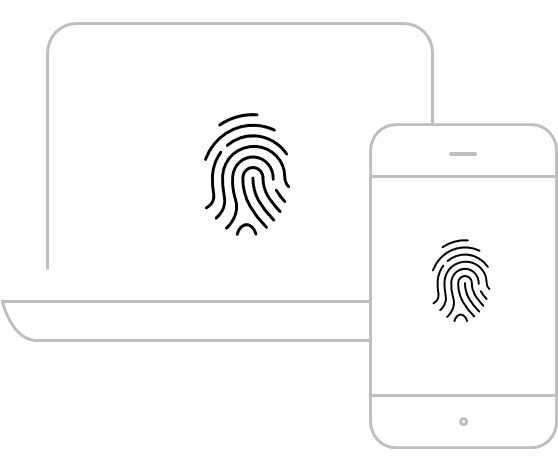

# Serviço de Antifraude SafraPay

A Safrapay oferece uma solução robusta de Antifraude para proteger o seu negócio. Integrar sua aplicação com o serviço de antifraude não só aumenta a segurança das transações, como também melhora a experiência dos clientes ao reduzir falsos positivos com um fluxo de pagamento mais seguro.

Esta documentação tem como objetivo orientar estabelecimentos e desenvolvedores na implementação de uma solução de Antifraude abordando as melhores práticas de integração, coleta de dados e análise de risco para minimizar perdas financeiras e maximizar a taxa de aprovação de transações legítimas. 
 
 Benefícios da Integração com o serviço de Antifraude:

- Utilização de algoritmos avançados para identificar e bloquear transações suspeitas em tempo real.
- Avalia o comportamento de compra dos clientes para detectar padrões suspeitos.
- Minimiza o bloqueio de transações legítimas, evitando frustrações e abandonos de carrinho.
- Análise rápida e eficiente, garantindo uma resposta imediata no checkout.
- Ao detectar fraudes, o serviço reduz a quantidade de chargebacks e suas implicações financeiras.

<a id="device-fingerprint"></a>

#### Device Fingerprint



- Tipo de device
- Marca
- Modelo
- Navegador
- Sistema Operacional
- IP
- Versão
- Release

Para garantir uma análise precisa de risco e maximizar a eficiência na prevenção à fraudes é fundamental implementar a coleta do Device Fingerprint. Esse recurso coleta informações detalhadas sobre o dispositivo utilizado pelo cliente como navegador, IP, sistema operacional e outras características permitindo identificar comportamentos suspeitos com mais precisão. 
 
 **A ausência do Device Fingerprint pode resultar em uma avaliação menos eficaz** da transação, aumentando a chance de falsos positivos (transações legítimas recusadas) ou falsos negativos (fraudes não detectadas). Portanto, para garantir a qualidade da análise e reduzir riscos financeiros, a coleta do Device Fingerprint é obrigatória.

Recomendamos seguir rigorosamente as orientações de integração e inserir o script de coleta de forma correta e segura na página de checkout. Isso assegura que todos os dados necessários sejam transmitidos à análise de risco, protegendo tanto o seu negócio quanto seus clientes.

<a id="como-ativar-o-serviço-de-antifraude"></a>

## Como ativar o serviço de Antifraude ?

Para ativar o serviço, você precisa ter uma conta Safrapay.

1. Se você não é um cliente Safrapay, fale com um consultor e tire suas dúvidas pelo telefone (11) 3175-8248.
2. Se você já é um cliente Safrapay, terá acesso ao Portal Safrapay, onde pode utilizar as chaves de acesso para realizar a integração para vender online com a proteção do Antifraude.

<a id="homologação-testes"></a>

## Homologação/Testes

Para ambiente de testes, envie um e-mail para [integracao.ecommerce@safra.com.br](mailto:integracao.ecommerce@safra.com.br) com o assunto: Chaves de acesso para integração Antifraude. No corpo do e-mail, deve conter: Qual loja está sendo utilizada para o teste. Dados: CNPJ ou EC(Código da loja). E-mail para acesso.

<a id="antifraude-safrapay-disponível-nas-seguintes-modalidades"></a>

### Antifraude SafraPay disponível nas seguintes modalidades

| Produto | Descrição | Instruções |
| --- | --- | --- |
| Gateway | Geração de transações no Ecommerce através de integração direta com seu site. | É obrigatório seguir as instruções de **campos obrigatórios e device fingerprint**. |
| Link de Pagamento Portal SafraPay | Geração de transações no Ecommerce através do Portal SafraPay. | Este serviço obrigatoriamente possui o antifraude SafraPay sem necessidade de integração. |
| Link de Pagamento via API | Geração de Link de Pagamento através de integração direta ao seu site, ERP etc. | É obrigatório seguir as instruções de **[campos obrigatórios](../api/gateway.md#crédito-à-vista)**. |

Caso utilize alguma Plataforma de mercado ou gateway terceiro consulte o canal [parceria.ecommerce@safra.com.br](mailto:parceria.ecommerce@safra.com.br) para análise de viabilidade.

<a id="device-fingerprint-1"></a>

## Device Fingerprint

A SafraPay disponibiliza uma SDK JavaScript para facilitar a integração com o sistema de antifraude. A SDK gerencia automaticamente a coleta de dados do dispositivo e a geração do Session ID.

<a id="instalação-da-sdk"></a>

### Instalação da SDK

<a id="via-cdn"></a>

#### Via CDN

```http
<!-- Ambiente de Homologação (HML) -->
<script src="https://safrastatic-a.akamaihd.net/safrapay/sdk/hml/safrapay-antifraud-v1.0.0.js"></script>
<!-- Ambiente de Produção (PROD) -->
<script src="https://safrastatic-a.akamaihd.net/safrapay/sdk/prod/safrapay-antifraud-v1.0.0.js"></script>
```

<a id="uso-da-sdk"></a>

### Uso da SDK

<a id="1-incluir-o-script"></a>

#### 1. Incluir o Script

```http
<!DOCTYPE html>
<html>
<head>
<script src="https://safrastatic-a.akamaihd.net/safrapay/sdk/hml/safrapay-antifraud-v1.0.0.js"></script>
</head>
<body>
<!-- Seu conteúdo -->
</body>
</html>
```

<a id="2-inicializar-com-merchant-id"></a>

#### 2. Inicializar com Merchant ID

A SDK se auto-inicializa quando o DOM estiver pronto. Você precisa apenas configurar as credenciais:

```http
// Opção 1: Usando o callback de inicialização (recomendado)
window.onSafraPayAntifraudReady = function(SafraPayAntifraud) {
SafraPayAntifraud.setCredentials('seu-merchant-id');
};
```

```http
// Opção 2: Chamando diretamente após o DOMContentLoaded
document.addEventListener('DOMContentLoaded', function() {
window.SafraPayAntifraud.setCredentials('seu-merchant-id');
});
```

<a id="3-obter-o-session-id"></a>

#### 3. Obter o Session ID

Após configurar as credenciais, você pode obter o Session ID para enviar nas transações:

```http
const sessionId = window.SafraPayAntifraud.getSessionId();
// Enviar o sessionId na sua requisição de pagamento
fetch('/api/payment', {
method: 'POST',
body: JSON.stringify({
remoteIp: "203.0.113.45",
charge: {
sessionId: sessionId,
// ... outros dados
},
capture: true
})
});
```

<a id="api-reference"></a>

### API Reference

<a id="safrapayantifraudsetcredentialsmerchantid"></a>

#### `SafraPayAntifraud.setCredentials(merchantId)`

Define o Merchant ID e inicia o processo de coleta de dados de antifraude.

| Parâmetro | Tipo | Obrigatório | Descrição |
| --- | --- | --- | --- |
| merchantId | string | Sim | Identificador único do merchant |

**Retorna:** `void`

**Throws:** `Error` - Se merchantId for inválido

```http
window.SafraPayAntifraud.setCredentials('91cd6a1b-340d-4a5e-8820-cb814c093cf');
```

<a id="safrapayantifraudgetsessionid"></a>

#### `SafraPayAntifraud.getSessionId()`

Retorna o Session ID atual usado para rastreamento de antifraude.

**Retorna:** `string` - Session ID no formato UUID

**Throws:** `Error` - Se `setCredentials()` não foi chamado antes

```http
const sessionId = window.SafraPayAntifraud.getSessionId();
console.log(sessionId); // '507f191e-810c-419e-8c2a-1d1f9b8c7c6e'
```

<a id="windowonsafrapayantifraudready"></a>

#### `window.onSafraPayAntifraudReady`

Callback global chamado quando a SDK está pronta para uso.

| Parâmetro | Tipo | Descrição |
| --- | --- | --- |
| SafraPayAntifraud | object | Instância da API pública |

```http
window.onSafraPayAntifraudReady = function(SafraPayAntifraud) {
console.log('SDK pronta!');
SafraPayAntifraud.setCredentials('seu-merchant-id');
};
```

<a id="exemplo-completo-e-commerce"></a>

### Exemplo Completo - E-commerce

```http
<!DOCTYPE html>
<html lang="pt-BR">
<head>
<meta charset="UTF-8">
<title>Checkout - Minha Loja</title>
<script src="https://safrastatic-a.akamaihd.net/safrapay/sdk/hml/safrapay-antifraud-v1.0.0.js"></script>
</head>
<body>
<form id="checkout-form">
<button type="submit">Finalizar Compra</button>
</form>
<script>
// Inicializar SDK
window.onSafraPayAntifraudReady = function(SafraPayAntifraud) {
// Configurar Merchant ID
SafraPayAntifraud.setCredentials('seu-merchant-id-aqui');
console.log('Antifraud inicializado com sucesso!');
};
document.getElementById('checkout-form').addEventListener('submit', async function(e) {
e.preventDefault();
// Recuperar o SessionId antes de enviar a requisição para o backend
const sessionId = window.SafraPayAntifraud.getSessionId();
// Enviar para seu backend junto com os dados da transação
console.log('SessionId:', sessionId);
});
</script>
</body>
</html>
```

<a id="troubleshooting"></a>

### Troubleshooting

<a id="erro-call-setcredentials-before-getsessionid"></a>

#### Erro: "Call setCredentials() before getSessionId()"

**Causa:** Tentou obter o Session ID antes de configurar as credenciais.

**Solução:** Sempre chame `setCredentials()` antes de `getSessionId()`:

```http
SafraPayAntifraud.setCredentials('seu-merchant-id');
const sessionId = SafraPayAntifraud.getSessionId(); // Agora funciona
```

<a id="erro-safrapayantifraud-is-not-defined"></a>

#### Erro: "SafraPayAntifraud is not defined"

**Causa:** A SDK ainda não foi carregada ou não está incluída na página.

**Solução:** Use o callback `onSafraPayAntifraudReady` ou aguarde o carregamento:

```http
window.onSafraPayAntifraudReady = function(SafraPayAntifraud) {
// SDK está pronta aqui
};
```

<a id="notas-importantes"></a>

### Notas Importantes

1. **Session ID por página:** Um novo Session ID é gerado a cada carregamento/refresh da página.
2. **Merchant ID obrigatório:** Sempre configure o Merchant ID antes de usar outras funcionalidades.
3. **Scripts automáticos:** A SDK injeta automaticamente os scripts do antifraude.
4. **Compatibilidade:** A SDK funciona com JavaScript vanilla, React, Vue, Angular e outros frameworks.

Para dúvidas ou suporte, entre em contato com a equipe de integração da SafraPay através do e-mail [integracao.ecommerce@safra.com.br](mailto:integracao.ecommerce@safra.com.br)

<a id="campo-remoteip-complemento-ao-device-fingerprint"></a>

## Campo RemoteIp - Complemento ao Device Fingerprint

Além do Device Fingerprint obrigatório, disponibilizamos o campo **obrigatório** `remoteIp` nos endpoints de autorização de cobrança e assinatura.

<a id="o-que-é-o-remoteip"></a>

### O que é o RemoteIp?

O `remoteIp` é o endereço IP do comprador/cliente final. Quando fornecido, este dado complementa a análise de risco realizada pelo sistema de antifraude, permitindo:

- ✅ Verificações de localização geográfica
- ✅ Detecção de múltiplas tentativas de pagamento do mesmo IP
- ✅ Identificação de uso de VPNs, proxies ou redes Tor
- ✅ Validação de consistência entre IP e dados cadastrais (país, região)
- ✅ Detecção de padrões de fraude baseados em IP

<a id="como-utilizar"></a>

### Como utilizar?

O campo `remoteIp` é **obrigatório** quando o antifraude estiver ativo. Você deve fornecer o IP real do comprador em todos os endpoints que suportam criação de transações.

**Endpoints que suportam `remoteIp`:**

**Gateway - Autorizações:**

- [POST /v2/charge/authorization](../api/gateway.md#crédito-à-vista) - Crédito à vista, parcelado sem juros e com juros

**Gateway - Autenticação 3DS:**

- [POST /v2/charge/ecommerce/3ds/setup](../api/gateway.md#post-v2-charge-ecommerce-3ds-setup) - Inicialização 3DS (Etapa 1)
- [PUT /v2/charge/ecommerce/3ds/enrollment](../api/gateway.md#put-v2-charge-ecommerce-3ds-enrollment) - Inscrição 3DS (Etapa 2)

**Assinaturas:**

- [POST /v2/subscription](../api/recorrencia.md#post-subscription) - Criar assinatura
- [POST /v2/subscription/bulk](../api/recorrencia.md#post-subscription-bulk) - Criar assinatura em lote

**Consulte cada endpoint específico** para ver exemplos completos com o campo `remoteIp` corretamente posicionado.

<a id="formato-do-remoteip"></a>

### Formato do RemoteIp

O campo aceita **IPv4**:

- **IPv4:** `192.168.1.100`

<a id="quando-usar-cada-campo"></a>

### Quando usar cada campo?

A tabela abaixo esclarece quando e como usar cada campo relacionado ao antifraude:

| Campo | Obrigatório? | Quando usar | Exemplo de uso |
| --- | --- | --- | --- |
| `sessionId` | ✅ **Sim** (quando antifraude ativo) | Device Fingerprint - identificador da sessão do usuário no checkout | Toda transação com antifraude ativo |
| `remoteIp` | ✅ **Sim** (quando antifraude ativo) | IP real do comprador para análise geográfica e detecção de fraudes | Toda transação com antifraude ativo |

**💡 Melhor prática:** Use **AMBOS** os campos juntos para máxima proteção antifraude:

- ✅ `sessionId` → Identifica o dispositivo e comportamento completo do usuário
- ✅ `remoteIp` → Valida localização geográfica e detecta padrões de fraude por IP

**Exemplo de uso combinado:**

```http
// Frontend - SDK SafraPay Antifraud (obrigatório)
<script src="https://safrastatic-a.akamaihd.net/safrapay/sdk/prod/safrapay-antifraud-v1.0.0.js"></script>
<script>
window.onSafraPayAntifraudReady = function(SafraPayAntifraud) {
SafraPayAntifraud.setCredentials('seu-merchant-id');
};
</script>
// Backend - API (ambos os campos)
const sessionId = window.SafraPayAntifraud.getSessionId();
{
"remoteIp": "203.0.113.45",  // ✅ IP real capturado do request
"charge": {
"sessionId": sessionId,  // ✅ SessionId obtido da SDK
// ... outros campos
},
"capture": true
}
```

<a id="remoteip-vs-device-fingerprint"></a>

### RemoteIp vs Device Fingerprint

| Aspecto | Device Fingerprint | RemoteIp |
| --- | --- | --- |
| **Obrigatoriedade** | Obrigatório (quando antifraude ativo) | Obrigatório (quando antifraude ativo) |
| **Coleta** | JavaScript no front-end | Server-side ou front-end |
| **Dados coletados** | Tipo de device, navegador, SO, IP, etc. | Apenas endereço IP |
| **Formato** | `sessionId` com prefixo `safrapay_br` no front-end | IPv4 direto na API |

**⚠️ IMPORTANTE:**

- O campo `remoteIp` é **obrigatório** quando o antifraude estiver ativo
- Deve ser fornecido junto com o Device Fingerprint para máxima precisão na análise de risco
- Sempre forneça o IP real do comprador capturado no servidor
- Em casos de inconsistência entre Device Fingerprint e `remoteIp`, o sistema registra a divergência para análise

<a id="exemplo-completo"></a>

### Exemplo Completo

```http
// Frontend - SDK SafraPay Antifraud (obrigatório com antifraude)
<script src="https://safrastatic-a.akamaihd.net/safrapay/sdk/prod/safrapay-antifraud-v1.0.0.js"></script>
<script>
window.onSafraPayAntifraudReady = function(SafraPayAntifraud) {
SafraPayAntifraud.setCredentials('seu-merchant-id');
};
</script>
```

```http
// Backend - Chamada à API
{
"remoteIp": "203.0.113.45",
"charge": {
"sessionId": "123456789",
"customer": {
"name": "Maria Silva",
"email": "maria@example.com",
"document": "12345678900",
"documentType": 1,
"phone": {
"countryCode": "55",
"areaCode": "11",
"number": "999999999",
"type": 5
},
"address": {
"street": "Rua Exemplo",
"number": "123",
"neighborhood": "Centro",
"city": "São Paulo",
"state": "SP",
"country": "BR",
"zipCode": "01234-567",
"complement": "Apto 45"
}
},
"transactions": [
{
"card": {
"cardNumber": "4444585001234562",
"cvv": "123",
"brand": 1,
"cardholderName": "Maria Silva",
"cardholderDocument": "12345678900",
"expirationMonth": 12,
"expirationYear": 2026,
"billingAddress": {
"street": "Rua Exemplo",
"number": "123",
"neighborhood": "Centro",
"city": "São Paulo",
"state": "SP",
"country": "BR",
"zipCode": "01234-567",
"complement": "Apto 45"
},
"isPrivateLabel": false
},
"paymentType": 0,
"amount": 10000,
"installmentNumber": 1
}
],
"source": 1
},
"capture": true
}
```

<a id="boas-práticas"></a>

### Boas Práticas

<a id="1-sempre-forneça-o-remoteip"></a>

#### 1. ✅ Sempre forneça o `remoteIp`

**Obrigatório!** O campo `remoteIp` é obrigatório quando o antifraude estiver ativo, pois melhora significativamente a precisão da análise de risco e reduz falsos positivos.

**Como fazer:**

```http
// Backend - Capturar IP antes de enviar à API
const remoteIp = req.headers['x-forwarded-for']?.split(',')[0] || req.connection.remoteAddress;
const payload = {
remoteIp: remoteIp,  // ✅ Incluir sempre que disponível
charge: {
sessionId: "123456789",
customer: { /* ... */ },
transactions: [ /* ... */ ],
source: 1
},
capture: true
};
```

---

<a id="2-não-falsifique-o-ip"></a>

#### 2. ❌ Não falsifique o IP

**Nunca faça:**

```http
// ❌ ERRADO - IP fixo
"remoteIp": "192.168.1.1"
// ❌ ERRADO - IP do servidor
"remoteIp": "10.0.0.1"
// ❌ ERRADO - IP de teste
"remoteIp": "127.0.0.1"
```

**Sempre use o IP real do comprador:**

```http
// ✅ CORRETO - IP capturado do request HTTP
const remoteIp = req.headers['x-forwarded-for'] || req.connection.remoteAddress;
```

**Consequências de falsificar:**

- 🚫 Análise de risco imprecisa
- 🚫 Aumento de fraudes não detectadas
- 🚫 Transações legítimas podem ser bloqueadas incorretamente

---

<a id="3-valide-o-formato-do-ip"></a>

#### 3. ⚠️ Valide o formato do IP

**Validação básica em JavaScript:**

```http
function isValidIPv4(ip) {
const regex = /^(\d{1,3}\.){3}\d{1,3}$/;
if (!regex.test(ip)) return false;
const parts = ip.split('.');
return parts.every(part => parseInt(part) >= 0 && parseInt(part) <= 255);
}
// Uso
const remoteIp = req.headers['x-forwarded-for']?.split(',')[0];
if (remoteIp && isValidIPv4(remoteIp)) {
payload.remoteIp = remoteIp;
}
```

---

<a id="4-atenção-com-proxies-cdns-e-load-balancers"></a>

#### 4. 🔧 Atenção com proxies, CDNs e load balancers

Se você usa **Cloudflare, Nginx, AWS ELB** ou similar, o IP real pode estar em headers específicos:

```http
// Node.js/Express - Capturar IP correto considerando proxies
function getRealIP(req) {
return req.headers['cf-connecting-ip'] ||      // Cloudflare
req.headers['x-real-ip'] ||             // Nginx
req.headers['x-forwarded-for']?.split(',')[0] ||  // Load Balancer
req.connection.remoteAddress;           // Conexão direta
}
const remoteIp = getRealIP(req);
```

```http
// PHP - Capturar IP correto
function getRealIP() {
if (!empty($_SERVER['HTTP_CF_CONNECTING_IP'])) {
return $_SERVER['HTTP_CF_CONNECTING_IP'];  // Cloudflare
}
if (!empty($_SERVER['HTTP_X_REAL_IP'])) {
return $_SERVER['HTTP_X_REAL_IP'];  // Nginx
}
if (!empty($_SERVER['HTTP_X_FORWARDED_FOR'])) {
return explode(',', $_SERVER['HTTP_X_FORWARDED_FOR'])[0];  // Proxy
}
return $_SERVER['REMOTE_ADDR'];  // Direto
}
$remoteIp = getRealIP();
```

---

<a id="5-integração-server-side-backend"></a>

#### 5. 🔄 Integração server-side (backend)

**✅ RECOMENDADO:** Capturar o IP no backend

```http
// Backend captura o IP e envia para a API
app.post('/processar-pagamento', async (req, res) => {
const remoteIp = getRealIP(req);
const payload = {
remoteIp: remoteIp,  // IP capturado no servidor
charge: req.body.charge,
capture: true
};
const response = await safrapayAPI.post('/v2/charge/authorization', payload);
res.json(response.data);
});
```

**❌ EVITE:** Enviar IP do frontend (pode ser manipulado)

```http
// Frontend - NÃO RECOMENDADO
fetch('https://api.ipify.org?format=json')
.then(res => res.json())
.then(data => {
payload.remoteIp = data.ip;  // ⚠️ Pode ser manipulado pelo usuário
});
```

---

<a id="6-mantenha-a-sdk-safrapay-antifraud-ativa"></a>

#### 6. 📝 Mantenha a SDK SafraPay Antifraud ativa

**Lembre-se:** O `remoteIp` **complementa**, mas **não substitui** a SDK SafraPay Antifraud.

```http
<!-- Frontend - SDK SafraPay Antifraud (OBRIGATÓRIO) -->
<script src="https://safrastatic-a.akamaihd.net/safrapay/sdk/prod/safrapay-antifraud-v1.0.0.js"></script>
<script>
window.onSafraPayAntifraudReady = function(SafraPayAntifraud) {
SafraPayAntifraud.setCredentials('seu-merchant-id');
};
</script>
```

```http
// Backend - Enviar ambos (MELHOR PRÁTICA)
const sessionId = window.SafraPayAntifraud.getSessionId();
{
"remoteIp": "203.0.113.45",  // ✅ IP do comprador
"charge": {
"sessionId": sessionId,  // ✅ SessionId da SDK
// ... resto da charge
},
"capture": true
}
```

**Resultado:** Máxima proteção antifraude! 🛡️

<a id="campos-obrigatórios"></a>

## Campos Obrigatórios

Se o antifraude estiver ativado, alguns campos para as requisições de autorização e pré-autorização passam a ser obrigatórios, conforme descrito tabela abaixo.

<a id="campos-obrigatórios-caso-antifraude-esteja-ativo"></a>

#### Campos obrigatórios (caso antifraude esteja ativo)

| Propriedade | Tipo | Descrição |
| --- | --- | --- |
| remoteIp | string | **\[OBRIGATÓRIO quando antifraude ativo\]** Endereço IP do comprador. Complementa a análise de risco do Device Fingerprint. Suporta IPv4 (exemplo: `192.168.1.100`). Será priorizado sobre outras fontes de captura de IP. **Importante:** Este campo deve estar no nível raiz da requisição, FORA do objeto `charge`. |
| charge | object | Dados da transação. |
| charge.sessionId | string | ID da sessão criada pelo servidor do site do cliente e usada durante a visita de um determinado usuário. **Importante:** Na API este campo deve conter apenas o identificador único (ex: `123456789`), sem o prefixo `safrapay_br`. |
| charge.customer | object | Dados do comprador. |
| charge.customer.name | string | Nome completo do comprador. |
| charge.customer.email | string | E-mail do comprador. |
| charge.customer.documentType | int | Tipo do documento do comprador. |
| charge.customer.document | string | Documento do comprador. |
| charge.customer.phone | object | Dados do telefone do comprador. |
| charge.customer.phone.countryCode | string | Código do país. |
| charge.customer.phone.areaCode | string | Código de área. |
| charge.customer.phone.number | string | Número do Telefone. |
| charge.customer.phone.type | int | Tipo do telefone. |
| charge.customer.address | object | Dados de endereço do comprador. |
| charge.customer.address.street | string | Rua. |
| charge.customer.address.number | string | Número. |
| charge.customer.address.neighborhood | string | Bairro. |
| charge.customer.address.city | string | Cidade. |
| charge.customer.address.state | string | Estado. |
| charge.customer.address.country | string | País. |
| charge.customer.address.zipCode | string | CEP. |
| charge.customer.address.complement | string | Complemento. |
| charge.transactions | array(object) | Uma transação a ser realizada dentro da cobrança. |
| charge.transactions.card | object | O Cartão a ser utilizado na transação. |
| charge.transactions.card.cardNumber | string | O número impresso na frente do cartão. |
| charge.transactions.card.cvv | string | Card Verification Value (CVV) é um recurso de segurança para transações de cartão de pagamento "cartão ausente" instituído para reduzir a incidência de fraude de cartão de crédito. Consiste em um número de 3-4 dígitos impresso no cartão. |
| charge.transactions.card.brand | int | A bandeira do cartão à qual o imposto se aplica. |
| charge.transactions.card.cardholderName | string | O nome do títular do cartão. |
| charge.transactions.card.cardholderDocument | string | O documento do títular do cartão. |
| charge.transactions.card.expirationMonth | int | O Mês de expiração do cartão com 2 dígitos. |
| charge.transactions.card.expirationYear | int | O Ano de expiração do cartão com 4 dígitos. |
| charge.transactions.card.billingAddress | object | É o endereço conectado ao cartão de crédito ou débito. As empresas usam o endereço de cobrança para verificar o uso autorizado de tal cartão. É também para onde as empresas enviam contas em papel e extratos bancários. |
| charge.transactions.card.billingAddress.street | string | Rua. |
| charge.transactions.card.billingAddress.number | string | Número. |
| charge.transactions.card.billingAddress.neighborhood | string | Bairro. |
| charge.transactions.card.billingAddress.city | string | Cidade. |
| charge.transactions.card.billingAddress.state | string | Estado. |
| charge.transactions.card.billingAddress.country | string | País. |
| charge.transactions.card.billingAddress.zipCode | string | CEP. |
| charge.transactions.card.billingAddress.complement | string | Complemento. |
| charge.transactions.card.isPrivateLabel | bool | Indica se o cartão é um produto de whitelabel ou não. Whitelabel é um produto ou serviço que uma empresa produz e comercializa com outras empresas que tem interesse em utilizar o mesmo com sua marca estampada. |
| charge.transactions.paymentType | int | Tipo de transação. |
| charge.transactions.amount | int | O valor do pagamento em centavos. |
| charge.transactions.installmentNumber | int | Quantidade de parcelas. Só pode ser maior que **1** se o tipo de transação for crédito. |
| charge.source | int | Define a fonte de cobrança, por exemplo, um POS, pinpad, site de comércio eletrônico. |

#### BODY Raw

```http
{
"remoteIp": "192.168.1.100",
"charge": {
"sessionId": "123456",
"customer": {
"name": "Ester Patrícia Aparício",
"email": "eesterpatriciaaparicio@ladder.com.br",
"document": "71877920002",
"documentType": 1,
"phone": {
"number": "999999999",
"countryCode": "55",
"areaCode": "21",
"type": 5
},
"address": {
"street": "Rua Juvêncio Erudilho",
"number": "39",
"neighborhood": "Centro",
"city": "Gurupi",
"state": "BA",
"country": "BR",
"zipCode": "44002-528",
"complement": ""
}
},
"transactions": [
{
"card": {
"cardNumber": "4444585001234562",
"cvv": "123",
"brand": 1,
"cardholderName": "Ester Patrícia Aparício",
"cardholderDocument": "71877920002",
"expirationMonth": 12,
"expirationYear": 2034,
"billingAddress": {
"street": "Rua Juvêncio Erudilho",
"number": "39",
"neighborhood": "Centro",
"city": "Gurupi",
"state": "BA",
"country": "BR",
"zipCode": "44002-528",
"complement": ""
},
"isPrivateLabel": false
},
"paymentType": 1,
"amount": 1000,
"installmentNumber": 1
}
],
"source": 1
},
"capture": true
}
```

**Importante:**

- Transações de recorrência devem conter a flag: `isRecurrency = true`*   *Se a transação não contiver a flag: `isRecurrency = true`, serão aplicadas as mesmas regras das transações avulsas.
- Transações de cartões armazenados devem conter a informação (COF).

<a id="códigos-de-erro"></a>

#### Códigos de Erro

Lista com os possíveis códigos de erros que uma requisição não sucedida pode apresentar.

| Código | Descrição |
| --- | --- |
| 750 | Recusado pelo Antifraude. |
| 751 | Transação não processada. Entre em contato com a adquirente. |

## Boas Práticas para a Integração de Antifraude

Para garantir uma integração eficiente, segura e precisa do sistema de antifraude é importante seguir um conjunto de boas práticas. Estas diretrizes ajudam a otimizar a detecção de fraudes, proteger os dados dos clientes e maximizar a taxa de aprovação das transações.

**1. Segurança de Dados**

- **Transmissão Segura** Sempre utilize conexões seguras (HTTPS) para proteger os dados sensíveis durante a comunicação com a API.
- **Proteção de credenciais** Nunca exponha as credenciais de API (chaves de autenticação) no frontend. Mantenha-as seguras no backend.
- **Armazenamento seguro** Não armazene informações sensíveis como dados do cartão de crédito em logs ou relatórios.

**2. Implementação do Device Fingerprint**

- **Sincronização correta** Certifique-se que o SESSION_ID gerado foi obtido dos corretos parâmetros da API antes da chamada à mesma. Lembre-se: no Device Fingerprint use `safrapay_br{{identificador}}` e na API use apenas `{{identificador}}`.
- **Página de checkout segura** Insira o script necessário do Device Fingerprint somente nas páginas seguras e protegidas por HTTPS.
- **Manutenção periódica** Atualize regularmente o script utilizado para o Device Fingerprint, conforme recomendação do provedor da API.

**3. Estruturação de Dados para Análise de Risco**

- **Dados completos e precisos** Envie todas as informações possíveis sobre o cliente e a transação (nome, endereço, e-mail, telefone, IP, etc.) para aumentar a precisão da análise de risco.
- **Validação de dados** Realize validações rigorosas no frontend e backend para evitar o envio de informações incompletas ou inválidas.
- **Registro de exceções** Armazene logs detalhados das exceções e falhas, facilitando o diagnóstico e a correção de problemas.

**4. Testes e Monitoramento**

- **Ambiente de sandbox** Realize testes exaustivos no ambiente de sandbox antes de migrar para produção.
- **Cenários de teste** Simule transações reais, recusas, revisões manuais e fraudes intencionais para garantir a eficácia da análise.
- **Monitoramento contínuo** Monitore regularmente as transações processadas em produção, identificando padrões anômalos que possam sugerir áreas de análise.

**5. Tratamento de Respostas da API**

- **Decisões automatizadas** Defina ações automatizadas com base no resultado da análise de risco (aprovação, revisão manual ou recusa).
- **Revisão manual** Mantenha uma equipe treinada para revisar manualmente transações sinalizadas como suspeitas ou pendentes.
- **Feedback à API** Caso o provedor permita, forneça feedback sobre transações fraudulentas confirmadas para melhorar a precisão da análise de risco.

**6. Otimização da Experiência do Cliente**

- **Revisão das respostas** Certifique-se que todas as respostas tenham uma revisão adequada. Isso inclui mensagens claras e concisas.
- **Tempo de resposta** Certifique-se de que a comunicação com a API seja rápida e eficiente para reduzir fricções na experiência do cliente.

**7. Conformidade e Regulamentações**

- **LGPD e GDPR** Certifique-se de cumprir todas as regulamentações e proteções de dados aplicáveis ao seu negócio, incluindo a LGPD no Brasil e o GDPR na Europa.
- **Auditorias regulares** Realize auditorias regulares dos sistemas de proteção de dados, seja internamente, seja por terceiros.

<a id="seguir-estas-boas-práticas-ajudará-a-maximizar-a-eficiência-da-solução-de-antifraude-e-a-minimizar-os-riscos-operacionais-e-financeiros"></a>

### Seguir estas boas práticas ajudará a maximizar a eficiência da solução de antifraude e a minimizar os riscos operacionais e financeiros.
