# Plataformas

<a id="vtex"></a>

## VTEX

Para as lojas parceiras que utilizem VTEX como plataforma de loja virtual, a Safrapay disponibiliza um plugin de pagamentos que pode ser configurado no painel administrativo da VTEX. Esse plugin pode ser utilizado como única forma de pagamento; ou pode ser utilizado em conjunto com outros plugins de pagamento, de acordo com regras de roteamento por bandeira definidas também no painel administrativo da VTEX.

Os próximos passos descrevem como obter as credenciais da Safrapay, e como configurar nosso plugin no painel administrativo da VTEX.

<a id="credenciais"></a>

#### Credenciais

Primeiro passo é entrar em contato com a equipa da Safrapay para ser feito o processo de criação de conta e geração das credenciais necessárias.

Após ter a sua conta criada junto a Safrapay Pagamentos. Com as chaves liberadas, será necessária realizar a configuração através do Portal Safrapay e da Dashboard VTEX com os seguintes dados

<a id="configuração-de-nova-loja-no-portal-safrapay"></a>

#### Configuração de “Nova Loja” no Portal SafraPay

O primeiro passo para integrar com a VTEX consiste em configurar a loja no Portal SafraPay. Essa informação é importante para que a transação que seja criada na VTEX seja validada pela API da SafraPay. Para isso, é necessário logar no portal e acessar **Menu > Gerenciamento > Chaves de Acesso**, conforme imagem abaixo, para poder recuperar o Merchant ID, informação necessária para configuração de nova loja.

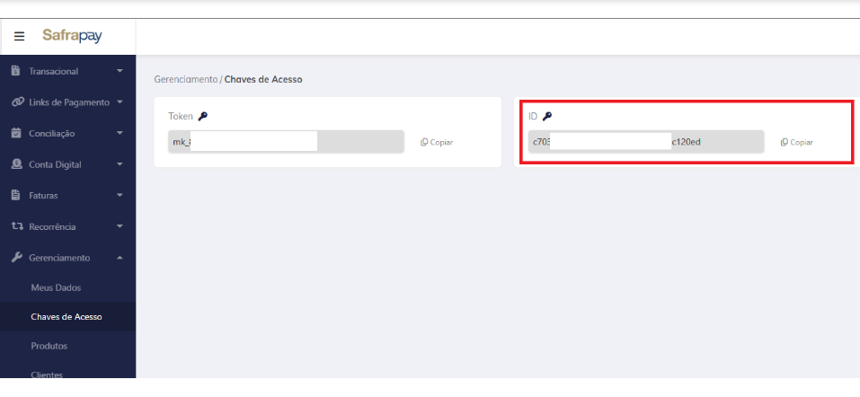

Após recuperar o Merchant ID, acesse **Menu > Gerenciamento > Loja Virtual**, conforme imagem abaixo:

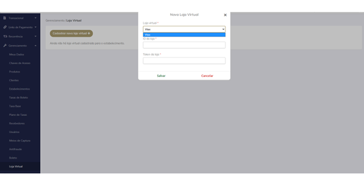

1º Clique em **Cadastrar nova loja virtual**

Será exibido um pop-up para preencher informações sobre a nova loja. Para isso, siga os seguintes critérios:

- Loja virtual = *Vtex.*
- ID da Loja = *Número do documento utilizado no cadastro da loja com pontuação.*
- Token da loja = *Merchant ID do SafraPay.*

2º Clique em **Salvar**.

<a id="integração-com-conector-safrapay"></a>

#### Integração com Conector SafraPay

Com as chaves de aplicação geradas, o cliente deverá acessar, na plataforma VTEX, o caminho **Menu > Configuração da loja > Pagamentos > Provedores**, onde será possível realizar a configuração para utilização do Conector SafraPay.

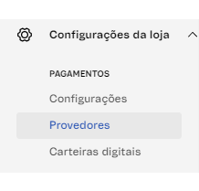

1º Clique em **Novo provedor**.

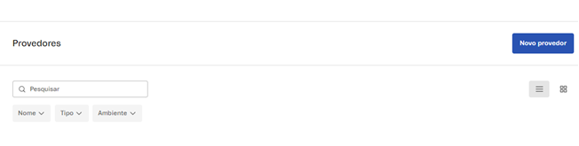

2º Busque por **SafraPay** e selecione.

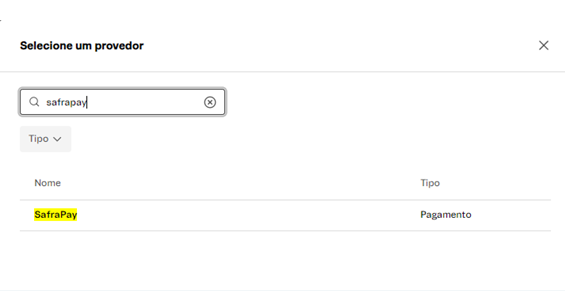

3º Preencha as credenciais SafraPay para configuração do Conector conforme imagem e **Salve**.

- Application Key = *Número do documento utilizado no cadastro da loja com pontuação.*
- Application Token = *Merchant ID do SafraPay.*

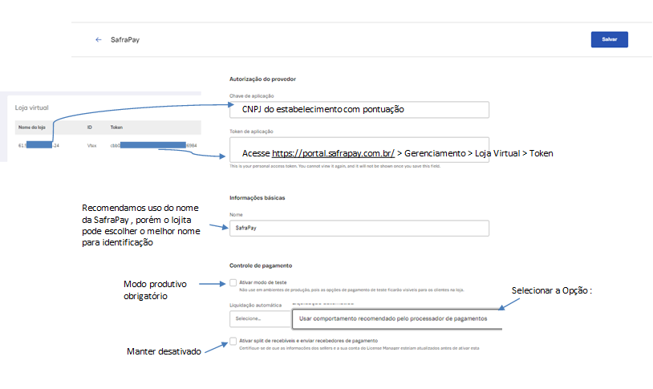

**Observação**: Verifique se não há espaços ao copiar e colar os dados.

4º Clique em **Salvar**.

<a id="condições-de-pagamento"></a>

#### Condições de Pagamento

Para cadastrar as condições de pagamento, o cliente deverá acessar, na plataforma VTEX, o **Menu > Configuração da Loja > Pagamentos > Configurações** e seguir as etapas abaixo:

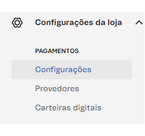

1º Clique em Condições de Pagamento.

2º Clique em "+".

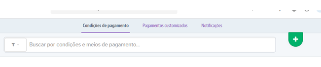

3º Serão exibidas as Condições de Pagamento disponíveis, em nosso conector seguem formas de pagamento disponíveis:

- Cartão de Crédito *\[Visa , Master , Amex , Hiper , Elo\]*
- Pagamento Instantâneo *\[PIX\]*

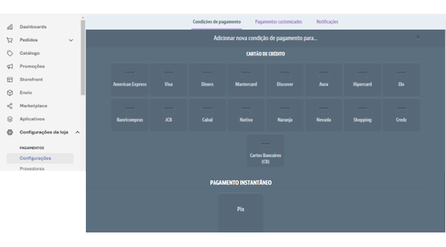

<a id="condições-de-pagamento-cartão-de-crédito"></a>

#### Condições de Pagamento - Cartão de Crédito

Ao selecionar a Condição de Pagamento - Cartão de Crédito, é necessário preencher o seguinte formulário:

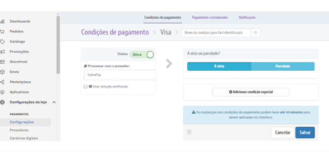

1º Informar o nome da regra.

2º Deslizar a barra de status para **Ativo**. Caso deseje, é possível ativar a utilização de conectores de Antifraude.

3º Selecionar o **provedor SafraPay**.

4º Selecionar se deseja configurar **à vista** ou **parcelado**. Ao optar pelo parcelado é obrigatório inclusão do valor da parcela mínima.

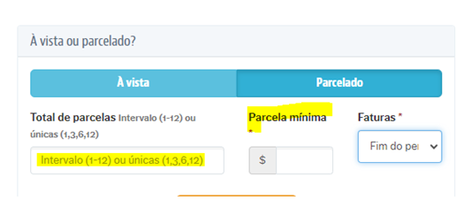

5º Adicionar ou não condição especial. **Não é obrigatório**.

6º Clique em **Salvar**.

**Observação**: Dúvidas ou suporte nos conectores de Antifraude devem ser direcionados diretamente ao fornecedor do serviço escolhido , SafraPay não tem atuação nesta aplicação.

<a id="condições-de-pagamento-pagamento-instantâneo"></a>

#### Condições de Pagamento - Pagamento Instantâneo

Ao selecionar a Condição de Pagamento - Pagamento Instantâneo, preencha o seguinte formulário:

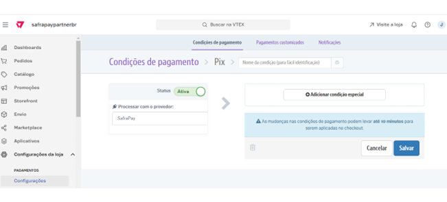

1º Informar o nome da Regra.

2º Deslizar a barra de Status para **Ativo**.

3º Selecionar o **provedor SafraPay**.

4º Adicionar ou não condição especial. **Não é obrigatório**.

5º Clique em **Salvar**.

<a id="portal-safrapay"></a>

#### Portal SafraPay

Ao utilizar o Conector da SafraPay na Plataforma VTEX, o cliente poderá visualizar todas as transações efetuadas dentro de sua Loja VTEX no Portal da SafraPay, acessando **Portal > Menu > Transacional > Transações**.

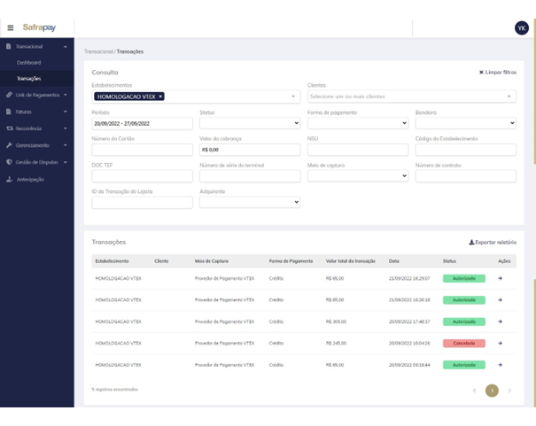

<a id="device-fingerprint-gtm-vtex"></a>

## Device Fingerprint (GTM/VTEX)

Se você utiliza o antifraude com o Safrapay, siga os passos abaixo para realizar o envio do device fingerprint por meio da sua loja VTEX.

<a id="1-criar-conta-no-google-tag-manager"></a>

### 1. Criar conta no Google Tag Manager

1. Acesse: [https://tagmanager.google.com](https://tagmanager.google.com) e faça login com sua conta Google.
2. Clique em **Criar Conta**.
3. Preencha os dados:

```php
Nome da conta (ex: sua empresa)
País
Nome do contêiner (ex: nome do site)
Plataforma: selecione Web
```

4. Aceite os termos e clique em **Sim**.
5. Copie o código **GTM-XXXXXXX** que será exibido.

<a id="2-configurar-o-gtm-google-tag-manager-na-vtex"></a>

### 2. Configurar o GTM (Google Tag Manager) na VTEX

1. Acesse o Admin da VTEX.
2. Vá em: **Configurações da loja** > **Storefront** > **Checkout**.
3. Selecione a configuração da sua loja.
4. Selecione a aba **Checkout**.
5. No campo **Google Tag Manager**, insira o código do seu GTM (ex.: GTM-XXXXXXX).
6. Clique em **Salvar**.

<a id="3-configurar-o-google-tag-manager-gtm"></a>

### 3. Configurar o Google Tag Manager (GTM)

<a id="a-criar-a-variável-cs-session-id"></a>

#### A. Criar a variável cs_session_id

1. No GTM, vá até o menu **Variáveis** > clique em **Nova**.
2. Nome: **cs_session_id**
3. Tipo da variável: **JavaScript Personalizado**
4. Código:

```javascript
function()
{
    return localStorage.getItem('cs_session_id');
}
```

5. Clique em **Salvar**.

<a id="b-criar-o-acionador-de-exibição-de-página-no-checkout"></a>

#### B. Criar o acionador de exibição de página no checkout

1. Vá em **Acionadores** > clique em **Novo**.
2. Nome: **Acionador Device Fingerprint**
3. Tipo: **Exibição de Página**
4. Configure como:
  - Este acionador é disparado em: **Algumas exibições de página**
  - Condição: **{{Page Path}}** → contém → `/checkout`
5. **Observação:** No exemplo, utilizamos a rota **`/checkout`**. Caso a sua página de checkout utilize uma rota diferente, ela precisa ser informada na condição.
6. Clique em **Salvar**.

<a id="c-criar-o-acionador-do-evento-payment"></a>

#### C. Criar o acionador do evento payment

1. Vá em **Acionadores** > clique em **Novo**.
2. Nome: **Evento personalizado (payment)**
3. Tipo: **Evento Personalizado**
4. Nome do evento: **payment**
5. Disparar este acionador em: **Alguns eventos personalizados**
6. Condição: **{{Event}}** → contém → `payment`
7. Clique em **Salvar**.

<a id="4-criar-as-tags"></a>

### 4. Criar as Tags

<a id="tag-1-device-fingerprint"></a>

#### Tag 1: Device Fingerprint

1. Vá em **Tags** > clique em **Nova**.
2. Nome: **Device Fingerprint**
3. Tipo: **HTML Personalizado**
4. Conteúdo HTML:

```html
<script>
(function () {
  // IMPORTANTE: Para o ambiente DE HOMOLOGAÇÃO, deve ser informado o org_id "1snn5n9w" na variável abaixo. Como padrão deixamos a variável org_id como ambiente produtivo
  var org_id =  "k8vif92e";
  var session_prefix = "safrapay_br";
  var storage_key = "cs_session_id";

  // Gera e armazena um novo session_id
  var sessionId = 'vtex_sid_' + Math.random().toString(36).substr(2, 9) + Date.now();
  localStorage.setItem(storage_key, sessionId);

  var fullSessionId = session_prefix + sessionId;

  // Função auxiliar para injetar scripts
  function injectScript(src) {
    var script = document.createElement("script");
    script.type = "text/javascript";
    script.async = true;
    script.src = src;
    var firstScript = document.getElementsByTagName("script")[0];
    firstScript.parentNode.insertBefore(script, firstScript);
  }

  // Injeção dos scripts e iframe
  injectScript("https://h.online-metrix.net/fp/tags.js?org_id=" + org_id + "&session_id=" + fullSessionId);
  injectScript("https://h.online-metrix.net/fp/check.js?org_id=" + org_id + "&session_id=" + fullSessionId);
})();
</script>
```

5. Acionamento: selecione o **Acionador Device Fingerprint**.
6. **Salve** a tag.

<a id="tag-2-pagamento"></a>

#### Tag 2: Pagamento

1. Vá em **Tags** > clique em **Nova**.
2. Nome: **Pagamento**
3. Tipo: **HTML Personalizado**
4. Conteúdo HTML:

```html
<script>
  window.vtex = window.vtex || {};
  window.vtex.deviceFingerprint = "{{cs_session_id}}";
</script>
```

5. Acionamento: selecione o **Evento personalizado (payment)**.
6. **Salve** a tag.

<a id="5-publicar-as-alterações"></a>

### 5. Publicar as alterações

1. No canto superior direito do GTM, clique em **Enviar**.
2. Adicione um nome e descrição para a versão (ex.: "Integração Antifraude VTEX").
3. Selecione a aba **Publicar e criar versão** e informe um **Nome da Versão**; em seguida, clique em **Publicar**.

<a id="resultado-final-esperado"></a>

### Resultado final esperado

- Ao acessar o **`/checkout`**, o script do Antifraude será executado e o **session_id** será salvo no `localStorage`.
- No momento do evento **payment**, o valor salvo será inserido em **window.vtex.deviceFingerprint**, permitindo que a VTEX envie esse identificador junto com os dados da transação.

<a id="wakecommerce"></a>

## WakeCommerce

A Wake acredita que humanizar as relações entre marcas e pessoas é o segredo para impulsionar negócios. E por isso, chegou para reinventar o varejo.

Com um poderoso ecossistema de soluções digitais e a partir da união de empresas reconhecidas e eficientes, a Wake nasce com a proposta de simplificar processos e integrações construindo soluções totalmente integradas.

A WakeCommerce possui integração com a Safrapay. Confira o passo a passo abaixo para realizar a integração com a pltafaorma:

1º Para fazer a integração é necessário criar um BCrypt, uma chave criptografada, BCrypt gerado a partir da concatenação do CNPJ da loja e o Merchant Token do estabelecimento.

Acesse [https://portal.safrapay.com.br/](https://portal.safrapay.com.br/)

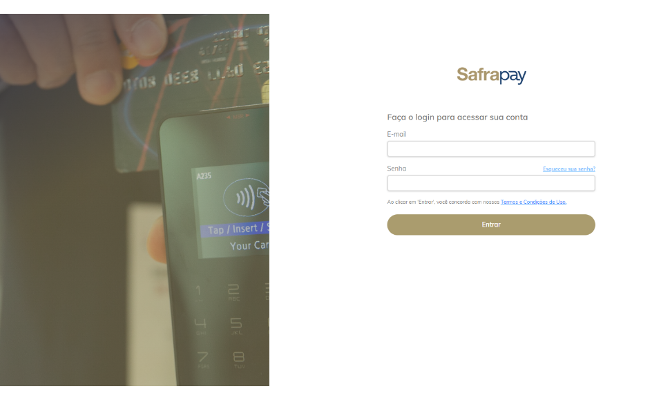

**Gerenciamento > Chaves de Acesso** para obter o Merchant Token do estabelecimento.

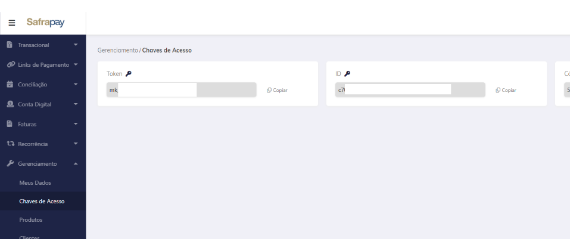

Acessar a seguinte URL para gerar o BCrypt: [https://bcrypt-generator.com/](https://bcrypt-generator.com/) e inserir os dados do CNPJ e Merchant Token concatenado.

Exemplo: 79138186000108mk_000s0022d035420560997628000135

**Observação**: Apenas números no CNPJ. Sem pontuação.

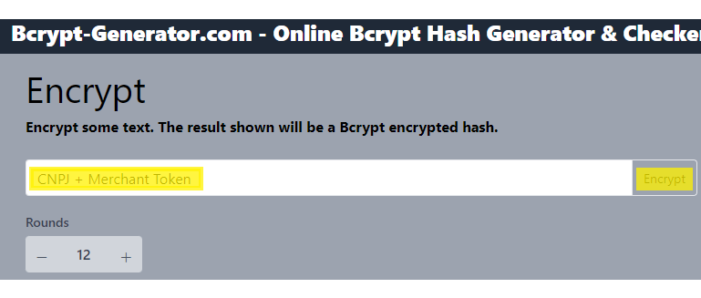

Após basta clicar em “Encrypt” e copiar a chave gerada (Campo verde).

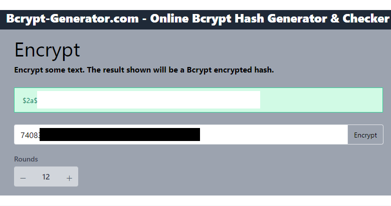

2º Para realizar o processo de compra, é necessário seguir as configurações abaixo:

**Obervação**: o processo deve ser realizado igualmente para ambas as opções de pagamento Cartão e PIX.

Acesse **Pagamento > Conectores de Pagamento F-Gateway**

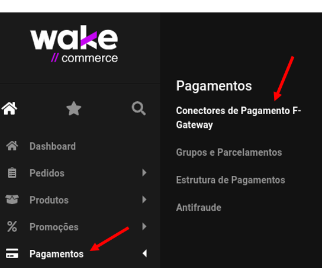

Após clicar em “Conectores de Pagamento F-Gateway”, será necessário cadastrar um novo pagamento customizado para a SafraPay.

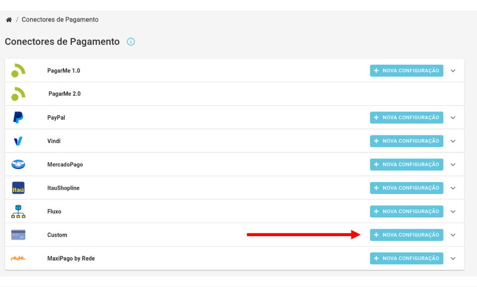

Preencher os campos com as seguintes informações:

Nome da configuração:

- Cartão *SafraPay*
- Pix *SafraPay*

3º Configurando conector cartão e PIX.

Localize o conector **Pagamento > Custom > Conector SafraPay criado**, configure utilizando as seguintes informações e clique em “Editar”:

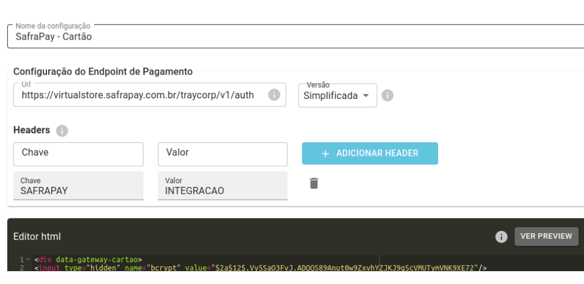

URL Homologação

```http
https://virtualstore-hml.safrapay.com.br/traycorp/v1/auth
```

URL Produção

```http
https://virtualstore.safrapay.com.br/traycorp/v1/auth
```

Headers

```http
Chave : SAFRAPAY      Valor : INTEGRACAO
```

Editor HTML

Se for cartão:

```http
<div data-gateway-cartao>
<input type="hidden" name="bcrypt" value="{{BCrypt}}"/>
<input type="hidden" name="cnpj" value="{{CNPJ}}"/>
</div>
```

Se for PIX:

```http
<div data-gateway-cartao>
<input type="hidden" name="bcrypt" value="{{BCrypt}}"/>
<input type="hidden" name="cnpj" value="{{CNPJ}}"/>
<input type="hidden" name="paymentType" value="pix"/>
</div>
```

<a id="grupos-e-parcelamentos"></a>

#### Grupos e Parcelamentos

Para associar o conector gateway a um tipo de pagamento, é necessário configurar o tipo de parcelamento e o grupo ao qual o conector irá pertencer.

No Painel da Wake, acesse **Pagamentos > Grupos de Parcelamentos**

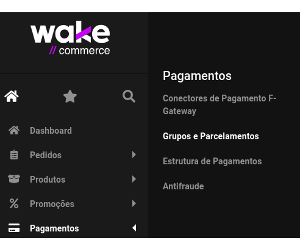

1º É possível criar configurações de parcelamentos para os pagamentos que serão configurados através do botão “Criar Parcelamento”

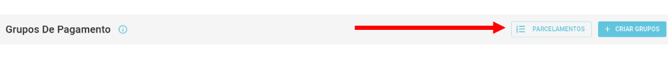

2º Após a configuração das parcelas, é necessário criar o grupo de pagamento SafraPay. Este grupo conterá todas as opções de pagamento configuradas. Por exemplo, cartão, pix.

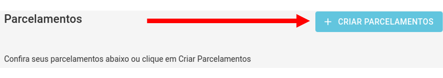

3º Ao adicionar um grupo, será disponibilizada a configuração de pagamento. Ative o grupo de pagamento e clique em vincular formas de pagamento.

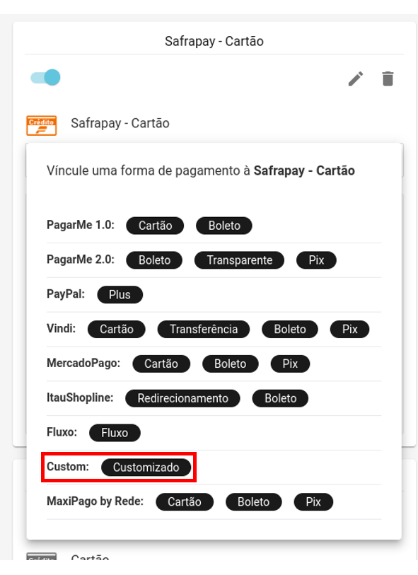

4º Em “Vincular Formas de Pagamento” clique em Customizado para listar o conector de pagamento configurado.

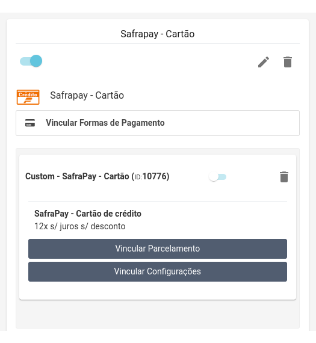

5º Vincule o parcelamento criado no botão “Vincular Parcelamento” e o conector customizado no botão vincular configurações.

<a id="gestor-de-script"></a>

#### Gestor de Script

Configure a chamada de serviço para obter o QR Code do Pix seguindo estes passos. Acesse **Configurações de Administração > Gerenciador de Scripts > Adicionar Script**.

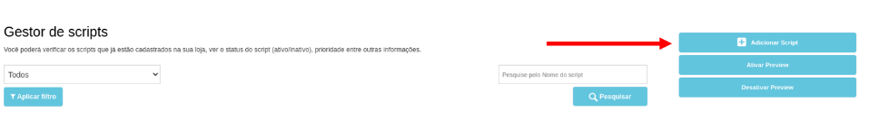

Preencha os campos “Nome, Ativar Script, Prioridade do Script, Posição do Script na página e Conteúdo do Script” como mostrado a seguir:

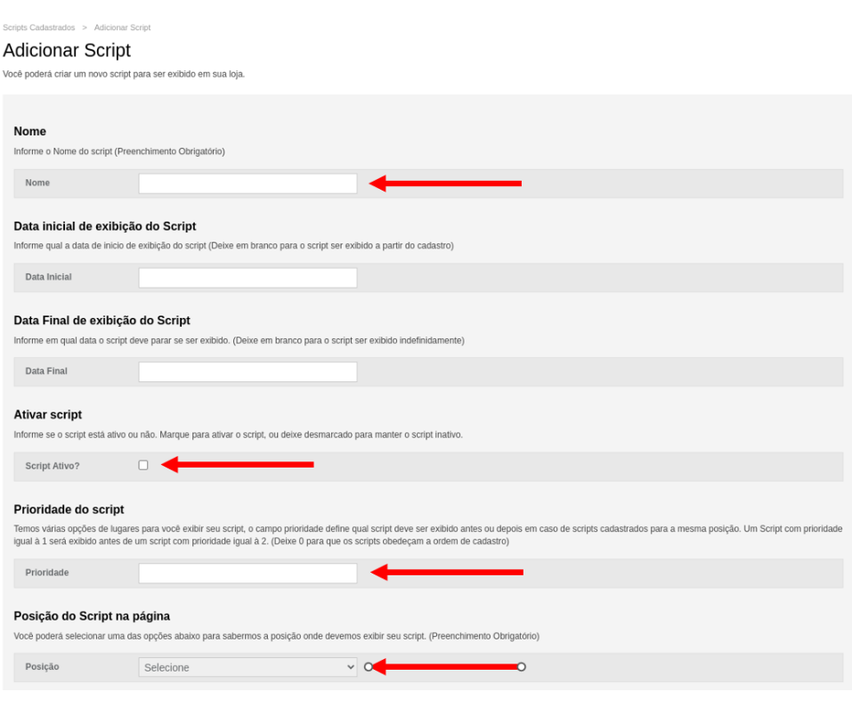

Conteúdo do Gestor de Script

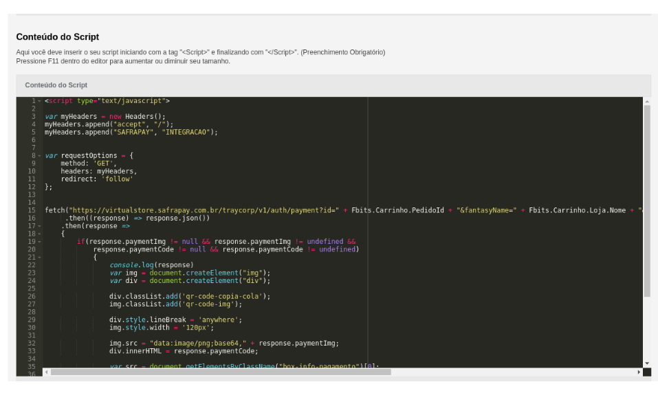

1º Copie e cole o script abaixo.

2º Altere as informações Bcrypt e CNPJ nos parâmetros do endpoint.

```http
<script type="text/javascript">
var myHeaders = new Headers();
myHeaders.append("accept", "/");
myHeaders.append("SAFRAPAY", "INTEGRACAO");
var requestOptions = {
method: 'GET',
headers: myHeaders,
redirect: 'follow'
};
fetch("https://virtualstore.safrapay.com.br/traycorp/v1/auth/payment?id=" + Fbits.Carrinho.PedidoId + "&fantasyName=" + Fbits.Carrinho.Loja.Nome + "&bcrypt=$2a$12$.Vy5SaO3FvJ.ADQQS89Anut0w9ZxvhYZJKJ9gScVMUTymVNK9XE72&cnpj=23168543000118", requestOptions)
.then((response) => response.json())
.then(response =>
{
if(response.paymentImg != null && response.paymentImg != undefined && response.paymentCode != null && response.paymentCode != undefined){
console.log(response)
var img = document.createElement("img");
var div = document.createElement("div");
div.classList.add('qr-code-copia-cola');
img.classList.add('qr-code-img');
div.style.lineBreak = 'anywhere';
img.style.width = '120px';
img.src = "data:image/png;base64," + response.paymentImg;
div.innerHTML = response.paymentCode;
var src = document.getElementsByClassName("box-info-pagamento")[0];
src.appendChild(img)
src.appendChild(div)
}
})
.then(result => console.log(result))
.catch(error => console.log('error', error));
</script>
```

<a id="cancelamento-de-vendas"></a>

#### Cancelamento de vendas

O cancelamento e estorno das vendas deve ser realizado dentro do Portal SafraPay.

Acesse [https://portal.safrapay.com.br/](https://portal.safrapay.com.br/)

**Transacional > Transacões**. Localize sua venda e execute o cancelamento.

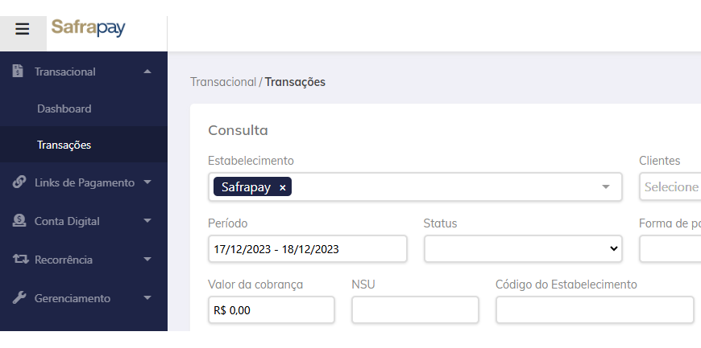

As ações de **cancelamento não atualizaram o status do pedido na Plataforma Wake**.

<a id="magento"></a>

## MAGENTO

<a id="instalação-do-módulo-magento-safrapay"></a>

#### Instalação do módulo magento Safrapay

<a id="requisitos-dos-plugins-safrapay"></a>

#### 🚧 Requisitos dos Plugins SafraPay

- 🐘 **PHP**: 7.1+
- 🧱 **Magento**: 2.x+
- 🗃️ **Banco de Dados**: MySQL 5.7+ ou MariaDB 10.2+
- 🌐 **Servidor Web**: Nginx 1.7.x+ ou Apache 2.4+
- 💻 **Sistema Operacional**: Linux x86-64/ARM ou Windows x86-64/ARM

<a id="baixar-módulo"></a>

#### Baixar módulo

Na raiz do projeto executar o comando:

```http
composer require safrapay/magento2-payment
```

\[link do packgist\](https://packagist.org/packages/safrapay/magento2-payment)

<a id="iniciar-a-configuração-do-módulo-na-loja"></a>

#### Iniciar a configuração do módulo na loja

```http
bin/magento setup:upgrade
```

<a id="compilar-o-projeto-loja-novamente"></a>

#### Compilar o projeto/loja novamente

```http
bin/magento setup:di:compile
```

<a id="configurar-os-campos-de-checkout"></a>

#### Configurar os campos de checkout

Na tela administrativa do magento, seguir o caminho:

```http
Stores > configuration > Customers > Customer Configuration > Name and Address Options
```

E modifique o valor de "Number of Lines in a Street Address" de 2 para 4.

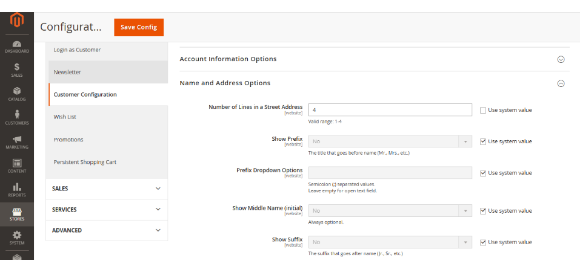

<a id="configurar-o-módulo"></a>

#### Configurar o Módulo

Na tela administrativa do magento, seguir o caminho:

```http
Stores > configuration > Sales > Payment Methods > others
```

Ao chegar no final da página você deve encontrar algumas opções de configuração do módulo Safrapay.

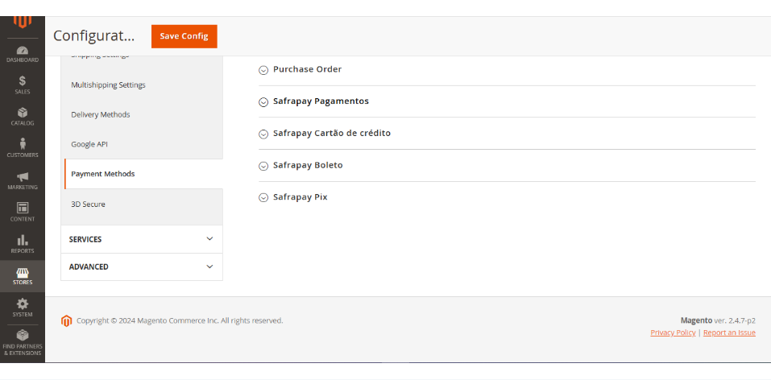

<a id="safrapay-pagamentos"></a>

#### Safrapay Pagamentos

- **Ativar** `Yes/No` *Ativa ou desativa módulo de pagamento Safrapay*
- **Ambiente** `Produção/Homologação` *Seleciona entre fazer transação em produção ou em ambiente de homologação(desenvolvimento)*
- **CNPJ** `número do cnpj` *Deve ser colocado o cnpj cadastrado na Safrapay*
- **Merchant Token** `id do merchant` *ID do merchant da Safrapay*
- **Status do pedido criado** `Pending/Processing/suspected fraud/Complete/Closed/Canceled` *Status inicial do pedido criado antes de receber uma confirmação de pagamento*

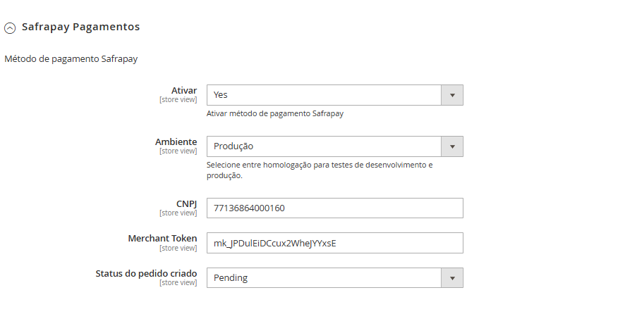

<a id="safrapay-cartão-de-crédito"></a>

#### Safrapay cartão de crédito

- **Ativar cartão de crédito** `Yes/No` *Ativa ou desativa opção de crédito*
- **Máximo de parcelas** `mínimo de 1 e máximo de 12`
- **Valor mínimo da parcela** `valor mínimo de uma parcela em R$`

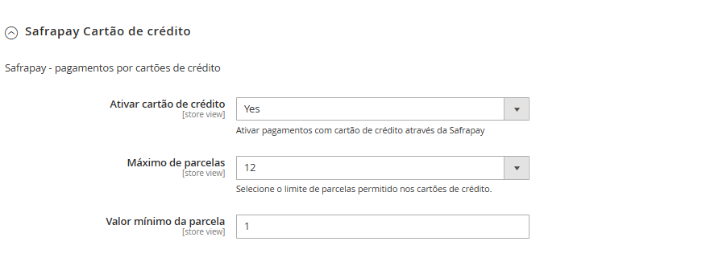

<a id="safrapay-boleto"></a>

#### Safrapay Boleto

- **Ativar boleto** `Yes/No` *Ativa ou desativa opção de boleto*
- **Dias para vencimento do boleto** `número de dias` *Quantos dias para efetuar o pagamento do boleto*
- **Dias para multa** `número de dias` *Dias para começar aplicar multa por atraso*
- **Valor fixo da multa** `valor em reais a ser pago na multa`
- **Valor percentual da multa** `valor percentual a ser pago na multa`

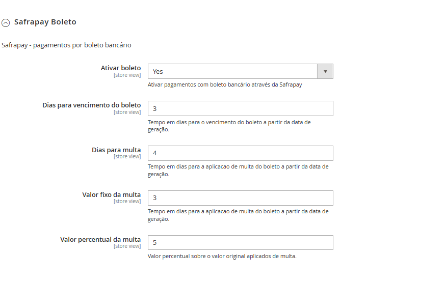

<a id="safrapay-pix"></a>

#### Safrapay PIX

- **Ativar Pix** `Yes/No` *Ativa ou desativa opção de PIX*

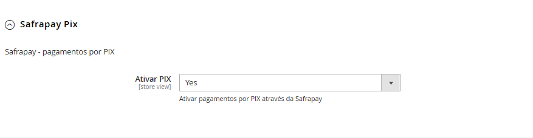

<a id="registrar-webhook"></a>

#### Registrar Webhook

Agora para que o módulo possa se comunicar com o gateway Safrapay, iremos precisar registrar o webhook, como no exemplo abaixo:

```http
POST
{{ENDPOINT_WEBHOOK}}/v1/webhook/bulk
Body:
{
"email": "seuemail@email.com.br",
"webhooks": [
{
"targetUrl": "https://seudomínio/safrapay/apicallback",
"eventType": 1
},
{
"targetUrl": "https://seudomínio/safrapay/apicallback",
"eventType": 2
}
]
}
```

Obs: Autenticação para utilização da API será feita no endpoint {{ENDPOINT_GATEWAY}}/v2/merchant/auth

<a id="woocommerce"></a>

## WOOCOMMERCE

<a id="instalação-do-plugin-woocommerce-safrapay"></a>

#### Instalação do plugin WooCommerce Safrapay

<a id="requisitos"></a>

#### Requisitos

É necessário instalar o plugin **Extra Checkout Fields for Brazil** para o funcionamento do plugin Safrapay.

<a id="requisitos-dos-plugins-safrapay-1"></a>

#### 🚧 Requisitos dos Plugins SafraPay

- 🧩 **Versão do WordPress**: 4.0+
- 🛍️ **WooCommerce**: 3.0+
- 🇧🇷 **WooCommerce Extra Checkout Fields for Brazil**: 4.0+
- 🐘 **PHP**: 7.2+

[https://gitlab.com/safrapay/woocommerce](https://gitlab.com/safrapay/woocommerce) (v1.5.7) Rev. 19/06/2026

<a id="baixar-plugin"></a>

#### Baixar plugin

Na tela administrativa do wordpress, seguir o caminho:

```http
Plugins > Add New Plugin
```

E pesquise por "SafraPay Gateway", clique em ```Install Now``` e ```Activate```.

<a id="configurar-o-plugin"></a>

#### Configurar o plugin

Na tela administrativa do wordpress, seguir o caminho:

```http
WooCommerce > Settings > Payments
```

Ao chegar no final da página você deve encontrar algumas opções de pagamento do plugin Safrapay, ative as opções que deseja utilizar em seu checkout e clique em ```Manage``` para configurá-las

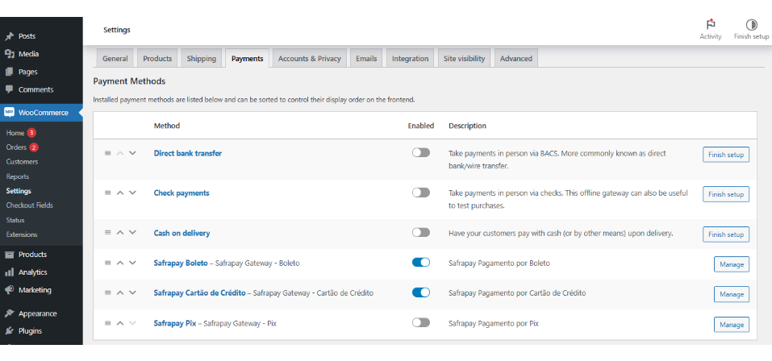

<a id="safrapay-cartão-de-crédito-1"></a>

#### Safrapay Cartão de Crédito

- **Habilitar/Desabilitar** `Yes/No` *Habilita o módulo para ser exibido no checkout*
- **Habilitar debug:** `Yes/No` *Habilita o modo de debug do plugin*
- **Ambiente do Gateway:** `Produção/Sandbox` *Seleciona entre fazer transação em produção ou em ambiente de homologação(sandbox)*
- **Título do Gateway:** `Título que aparecerá no checkout`
- **Descrição do Gateway:** `Descrição que aparecerá abaixo do título no chekcout`
- **Instruções Após o Pedido:** `Texto que aparecerá na página de obrigado e no e-mail do pedido`
- **Valor mínimo da parcela** `valor mínimo de uma parcela em R$`
- **Número máximo de parcelas:** `mínimo de 1 e máximo de 12`
- **Tempo de expiração do Pedido:** `Tempo que o link pedido estará disponivel para pagamento`
- **Status do Pedido criado:** `Pending payment/Processing/On hold/Completed/Cancelled/Refunded/Failed/Draft` *Status inicial para novos pedidos*
- **CNPJ** `número do cnpj` *Deve ser colocado o cnpj cadastrado na Safrapay*
- **Merchant Token** `id do merchant` *ID do merchant da Safrapay*

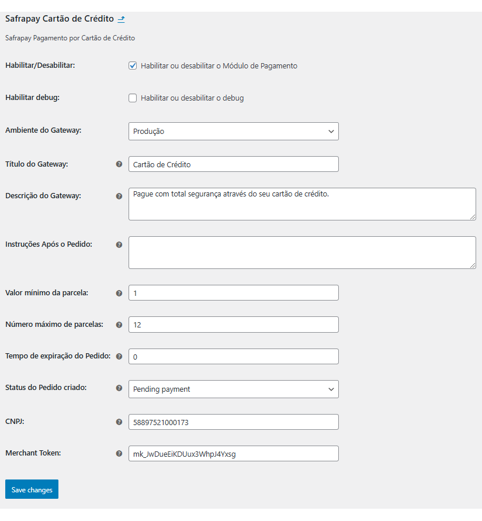

<a id="safrapay-boleto-1"></a>

#### Safrapay Boleto

- **Habilitar/Desabilitar** `Yes/No` *Habilita o módulo para ser exibido no checkout*
- **Habilitar debug:** `Yes/No` *Habilita o modo de debug do plugin*
- **Ambiente do Gateway:** `Produção/Sandbox` *Seleciona entre fazer transação em produção ou em ambiente de homologação(sandbox)*
- **Título do Gateway:** `Título que aparecerá no checkout`
- **Descrição do Gateway:** `Descrição que aparecerá abaixo do título no chekcout`
- **Instruções Após o Pedido:** `Texto que aparecerá na página de obrigado e no e-mail do pedido`
- **Tempo de expiração do Pedido:** `Tempo que o link pedido estará disponivel para pagamento`
- **Tempo de expiração do boleto (Dias):** `Validade do boleto`
- **Dias para multa** `número de dias` *Dias para começar aplicar multa por atraso*
- **Valor fixo da multa** `valor em reais a ser pago na multa`
- **Valor percentual da multa** `valor percentual a ser pago na multa`
- **Status do Pedido criado:** `Pending payment/Processing/On hold/Completed/Cancelled/Refunded/Failed/Draft` *Status inicial para novos pedidos*
- **CNPJ** `número do cnpj` *Deve ser colocado o cnpj cadastrado na Safrapay*
- **Merchant Token** `id do merchant` *ID do merchant da Safrapay*

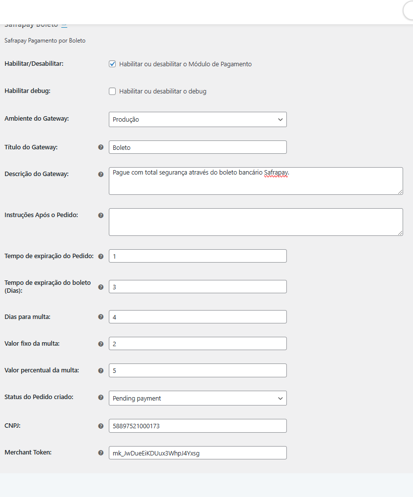

<a id="safrapay-pix-1"></a>

#### Safrapay Pix

- **Habilitar/Desabilitar** `Yes/No` *Habilita o módulo para ser exibido no checkout*
- **Habilitar debug:** `Yes/No` *Habilita o modo de debug do plugin*
- **Ambiente do Gateway:** `Produção/Sandbox` *Seleciona entre fazer transação em produção ou em ambiente de homologação(sandbox)*
- **Título do Gateway:** `Título que aparecerá no checkout`
- **Descrição do Gateway:** `Descrição que aparecerá abaixo do título no chekcout`
- **Instruções Após o Pedido:** `Texto que aparecerá na página de obrigado e no e-mail do pedido`
- **Status do Pedido criado:** `Pending payment/Processing/On hold/Completed/Cancelled/Refunded/Failed/Draft` *Status inicial para novos pedidos*
- **CNPJ** `número do cnpj` *Deve ser colocado o cnpj cadastrado na Safrapay*
- **Merchant Token** `id do merchant` *ID do merchant da Safrapay*

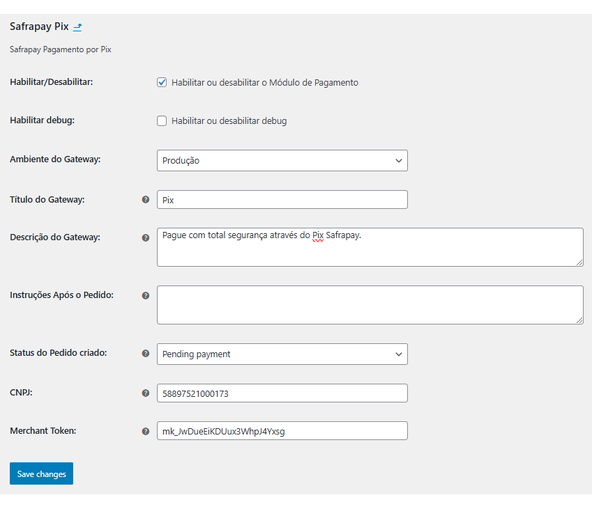

<a id="registrar-webhook-1"></a>

#### Registrar Webhook

Agora para que o plugin possa se comunicar com o gateway Safrapay, iremos precisar registrar o webhook, como no exemplo abaixo:

```http
POST
{{ENDPOINT_WEBHOOK}}/v1/webhook/bulk
```

Body:

```http
{
"email": "seuemail@email.com.br",
"webhooks": [
{
"targetUrl": "https://seudomínio/wc-api/safrapay",
"eventType": 1
},
{
"targetUrl": "https://seudomínio/wc-api/safrapay",
"eventType": 2
}
]
}
```

Obs: Autenticação para utilização da API será feita no endpoint {{ENDPOINT_GATEWAY}}/v2/merchant/auth

<a id="ativação-do-3ds-no-woocommerce"></a>

#### Ativação do 3DS no WooCommerce

Pré-requisito: Certifique-se de que o 3DS está habilitado junto à adquirente SafraPay.

<a id="passo-a-passo"></a>

#### Passo a Passo

1. Acesse o painel administrativo do seu site WooCommerce.
2. Vá até o menu Pagamentos (Payments).

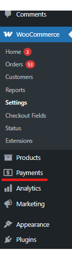

3. Clique em Gerenciar (Manage) no método SafraPay Cartão de Crédito.

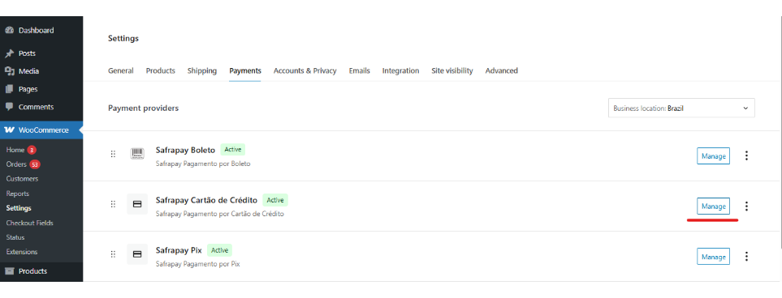

4. Na tela de configuração, localize as opções:

- Habilitar autenticação 3DS
- Habilitar 3DS Fallback (opcional – permite uma tentativa padrão caso o 3DS falhe ou o cartão não seja compatível).

5. Marque as opções desejadas.
6. Clique em Salvar alterações (Save changes).

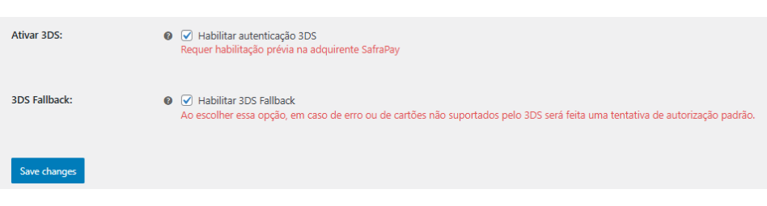

Pronto! O 3DS estará ativo para suas transações com cartão de crédito.

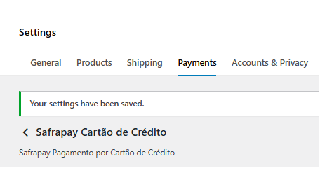

<a id="opencart"></a>

## OPENCART

<a id="módulo-integração-safrapay-para-opencart"></a>

#### Módulo integração Safrapay para Opencart

<a id="requisitos-dos-plugins-safrapay-2"></a>

#### 🚧 Requisitos dos Plugins SafraPay

- 🐘 **PHP**: 7.1.3+
- 🛒 **OpenCart**: 2.x ou 3.x
- 🗃️ **Banco de Dados**: MySQL 5.7+ ou MariaDB 10.2+
- 🌐 **Servidor Web**: Nginx 1.7.x+ ou Apache 2.4+
- 💻 **Sistema Operacional**: Linux x86-64/ARM ou Windows x86-64/ARM

<a id="compatibilidade"></a>

#### Compatibilidade

OpenCart 2.x à 3.x

<a id="funcionalidades"></a>

#### Funcionalidades

- Integrar sua loja virtual OpenCart com o gateway de pagamentos [Safrapay](http://safrapay.com.br)
- Transações de cartão de crédito

- Atualização de status automática
- Configuração de parcelamento de cartão

<a id="instalação"></a>

#### Instalação

**1º** Baixe os arquivos do repositorio, [clicando aqui](https://safrastatic-a.akamaihd.net/safrapay/plugins/safra-opencart.zip). Após baixar, extraia os arquivos.

**2º** Acesse o menu **Extensões > Instalador** ou **Extensions > Installer** Envie o arquivo safrapay-opencart.ocmod.zip e aguarde a instalação.

**3º** Depois acesse **Extensões > Modificações** ou **Extensions > Modifications** e limpe o cache de modificações clicando no botão AZUL do lado superior esquerdo.

Veja se Safrapay vai aparecer na lista de modificações.

<a id="pronto-tudo-instalado"></a>

#### **PRONTO! TUDO INSTALADO 😄**

Essas modificações são para adicionar o botão para baixar boleto na página de obrigado. Assim como o código de barras.

<a id="campos-customizáveis"></a>

#### Campos Customizáveis

Para as versões 2.x do Opencart é necessário criar alguns campos para que o módulo funcione perfeitamente, o campo obrigatório é de CPF/CNPJ e os opcionais são de número da casa e complemento. Você pode escolher em ter apenas o campo de CPF ou apenas o campo de CNPJ.

Acesse seu painel administrador, selecione a opção `Customer > Custom Fields`, e clique para adicionar um novo campo customizável.

Os campos que podem ser criados para que a integração entenda são `CPF`, `CNPJ`, `Número` e `Complemento`.

Crie o campo de CPF caso venda para pessoas físicas e o de CNPJ caso venda para pessoas jurídicas.

<a id="cpf"></a>

#### CPF

| *Campo do OpenCart* | *Valor Recomendado* | *Obrigatoriedade* |
| --- | --- | --- |
| Custom Field Name | CPF | Obrigatório |
| Location | Account | Obrigatório |
| Type | Text | Obrigatório |
| Customer Group | Habilite os grupos que possuirão esse campo | Obrigatório |
| Required | Habilitado | Obrigatório |
| Status | Habilitado | Obrigatório |
| Sort Order | 3 | Opcional |

<a id="cnpj"></a>

#### CNPJ

| *Campo do OpenCart* | *Valor Recomendado* | *Obrigatoriedade* |
| --- | --- | --- |
| Custom Field Name | CNPJ | Obrigatório |
| Location | Account | Obrigatório |
| Type | Text | Obrigatório |
| Customer Group | Habilite os grupos que possuirão esse campo | Obrigatório |
| Required | Habilitado | Obrigatório |
| Status | Habilitado | Obrigatório |
| Sort Order | 3 | Opcional |

<a id="número"></a>

#### Número

| *Campo do OpenCart* | *Valor Recomendado* | *Obrigatoriedade* |
| --- | --- | --- |
| Custom Field Name | Número | Obrigatório |
| Location | Address | Obrigatório |
| Type | Text | Obrigatório |
| Customer Group | Habilite os grupos que possuirão esse campo | Obrigatório |
| Required | Opcional | Opcional |
| Status | Opcional | Opcional |
| Sort Order | 2 | Opcional |

<a id="complemento"></a>

#### Complemento

| *Campo do OpenCart* | *Valor Recomendado* | *Obrigatoriedade* |
| --- | --- | --- |
| Custom Field Name | Complemento | Obrigatório |
| Location | Address | Obrigatório |
| Type | Text | Obrigatório |
| Customer Group | Habilite os grupos que possuirão esse campo | Obrigatório |
| Required | Opcional | Opcional |
| Status | Opcional | Opcional |
| Sort Order | 3 | Opcional |

<a id="wbuy"></a>

## WBUY

<a id="como-integrar-a-safrapay-à-sua-loja-wbuy"></a>

#### Como integrar a SafraPay à sua loja Wbuy

1. Acesse o painel administrativo da Wbuy.
2. Vá até o menu Configurações > Formas de pagamento e clique em Adicionar.
3. Na nova tela, pesquise por SafraPay e clique em Instalar.

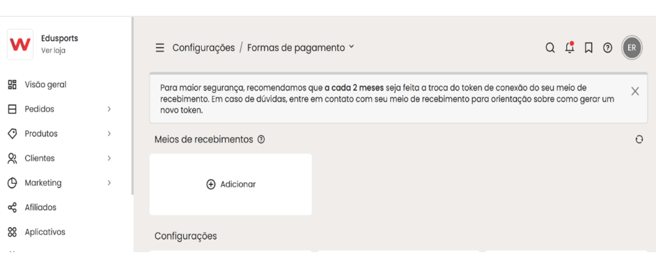

4. Clique em Instalar aplicativo SafraPay.
5. A seguir, você realizará a configuração da SafraPay dentro da plataforma Wbuy.

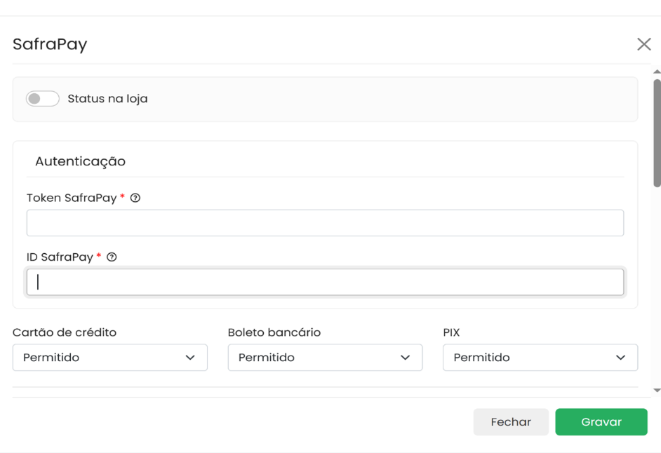

6. No Portal de produção da SafraPay, clique em Gerenciamento no menu principal.

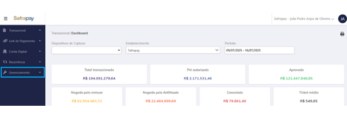

7. Em seguida, selecione a opção Chaves de acesso.

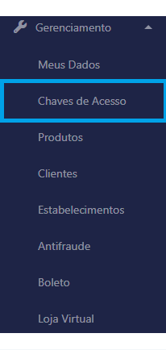

8. Clique em Sim para prosseguir.

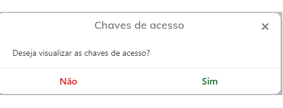

9. Um código de verificação será enviado para o seu e-mail. Copie e cole o código no campo indicado.

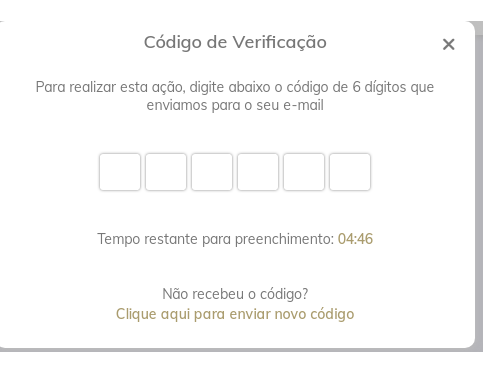

10. Após a verificação, serão exibidos o seu ID e o Merchant Token.

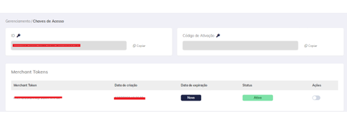

11. Retorne ao painel da Wbuy e preencha os campos:

Merchant Token: insira no campo Token SafraPay na Wbuy.

ID: insira no campo ID SafraPay.

12. Role a página para baixo, ajuste as configurações conforme necessário e clique em Gravar para concluir a configuração.

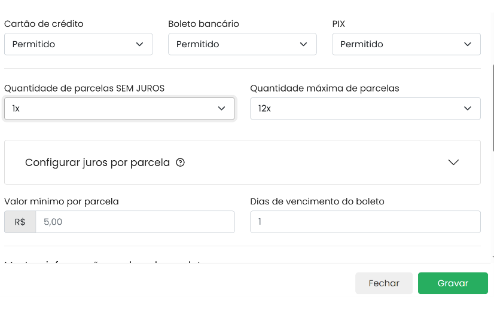

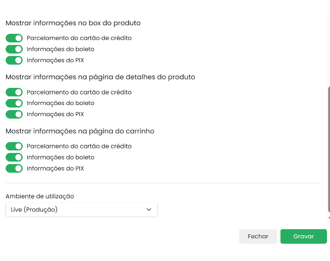

13. Processo Finalizado
