# Smart POS

<a id="sdk-safrapay"></a>

## SDK SafraPay

No link abaixo está publicado a última versão do SDK para download, sempre que for liberada uma nova versão ficará disponível no mesmo link.

[Download SDK](https://drive.google.com/drive/folders/1_pofB-Xba9CJZh5H7SjoUvj3cRQ3qOCa?usp=sharing)

No pacote do SDK contém:

- JAVADOC (pasta)
- IntegracaoSafra-vX.XX.aar
- TesteTransacaoSafra-X.XX.apk
- TesteTransacaoSafra-X.XX.zip
- ReleaseNotes.txt

Na pasta **JAVADOC** acessar o arquivo index.html para visualizar o material de apoio para o desenvolvimento;

**TesteTransacaoSafra-X.XX.apk**, simula um APP de automação comercial que pode ser utilizado para testes;

**TesteTransacaoSafra-X.XX.zip**, é o fonte do APP de exemplo;

**ReleaseNotes.txt**, possui as novidades do SDK e informa qual a versão da aplicação Safrapay que o POS precisa estar devido as novas funcionalidades do SDK.

**Observação**: caso o seu POS não esteja com a versão informada, favor realizar a função 995. Caso não baixe a versão, favor enviar e-mail para: `sustentacao.pos@safra.com.br` informando o serial do seu POS para liberarmos a atualização.

<a id="atenção"></a>

#### Atenção

Este SDK é para desenvolvimento de APP de automação comercial, onde o APP realiza a gestão do pedido / serviço e utiliza a aplicação Safrapay para autorizar a transação financeira.

Se o desenvolvimento for para APP de TEF, onde será utilizado uma Software House no processo de autorização da transação financeira (ex.: Sitef, Scope, LINX, Pay&GO, Auttar, etc) é necessário seguir a documentação da Software House e desconsiderar o nosso SDK.

<a id="solicitação-de-equipamento-de-hml-dev"></a>

## Solicitação de equipamento de HML / DEV

A área de produtos Safrapay é o responsável por disponibilizar o terminal POS de HML / DEV para ser utilizado no desenvolvimento.

Jose Carlos De Camargo Moura - [jose.moura@safra.com.br](mailto:jose.moura@safra.com.br)

<a id="ativação-do-pos-de-hml-dev"></a>

## Ativação do POS de HML / DEV

Caso o POS não esteja configurado, favor seguir o procedimento abaixo:

Acessar o menu funções através dos 3 pontinhos conforme destacado na imagem abaixo e utilizar a função 992 para conectar o POS no WiFi.

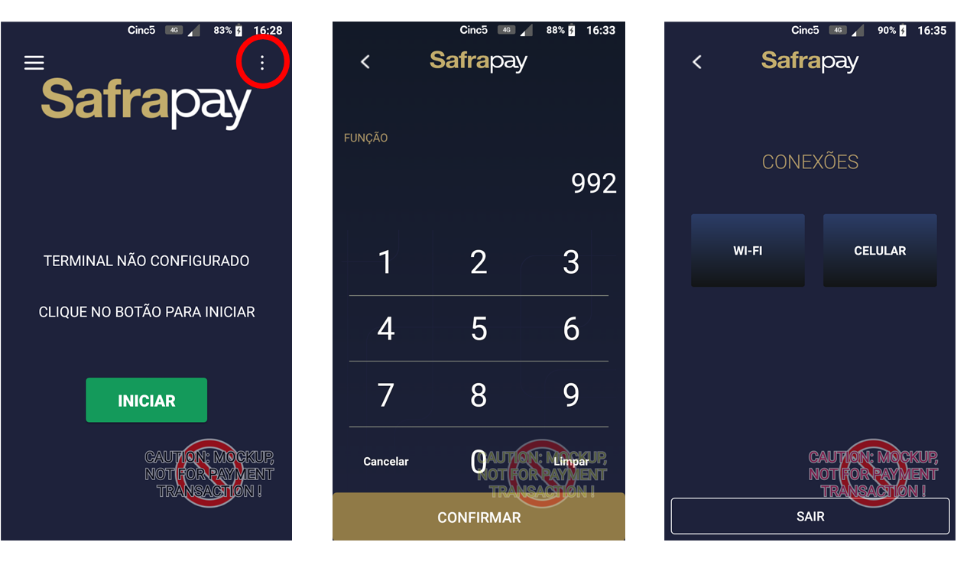

Pressionar o botão INICIAR que está localizado na tela principal, será realizado os Passos 01/05 e 02/05.

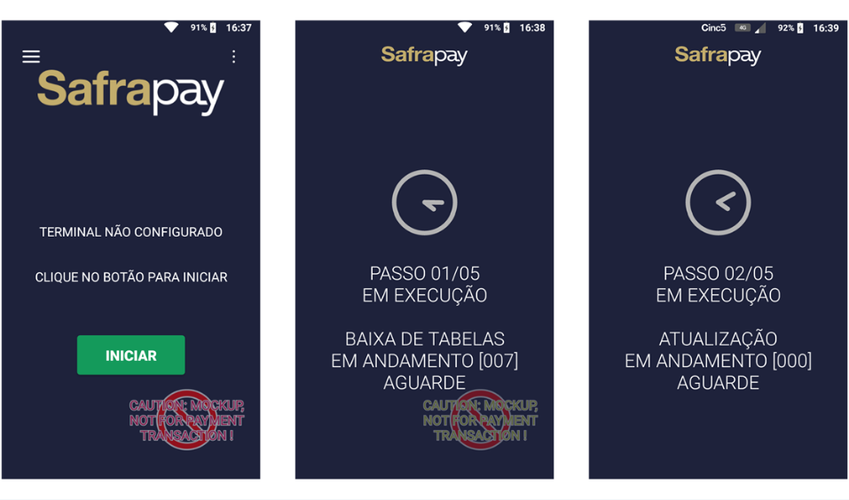

Pressionar o botão ATIVAR que está localizado na tela principal, será realizado os Passos 03/05, 04/05 e 05/05, no passo 04/05 irá apresentar a mensagem de erro “7-006 Serviço Indisponível”, após apresentar esse erro, acesse o menu funções e utilize a função 2001.

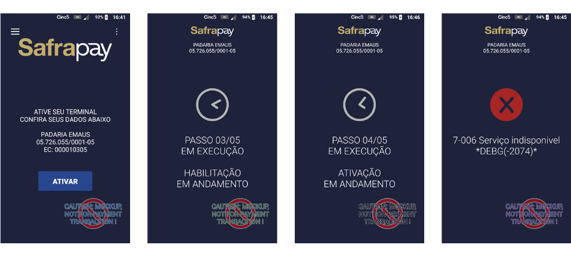

No passo 05/05 pode apresentar a mensagem “Dados cadastrais incompletos”, caso apresente esse erro, acesse o menu funções e utilize a função 2002.

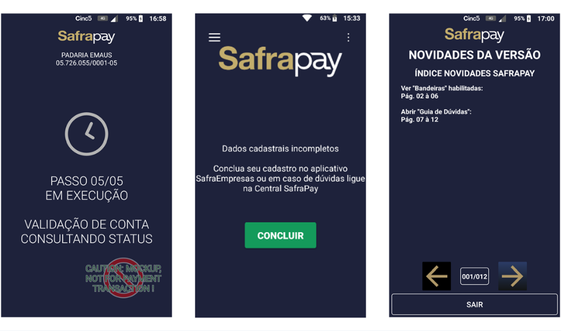

Passo 01 – baixa de parâmetros contendo os dados do estabelecimento e produtos;

Passo 02 – verifica se existe atualização pendente da aplicação Safrapay;

Passo 03 – valida cadastro do POS no autorizador;

Passo 04 – baixa de ordem de serviço;

Passo 05 – valida dados cadastrais do EC no backoffice.

<a id="códigos-de-funções-do-pos"></a>

## Códigos de funções do POS

Para acessar o menu funções, pressione os 3 pontinhos que ficam na tela principal do POS, conforme destacado na imagem abaixo:

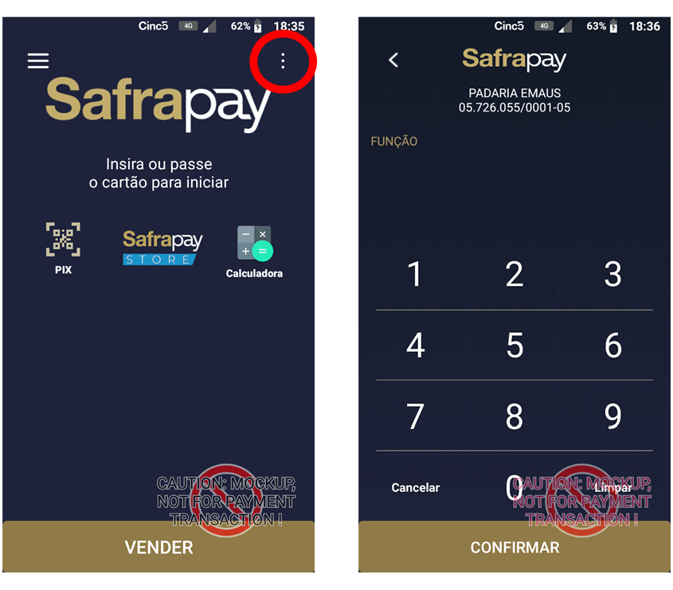

| *Código* | *Descrição* |
| --- | --- |
| 990 | Apaga todos os dados do POS |
| 992 | Configura a comunicação do POS (WiFi ou 4G/3G) |
| 993 | Atualiza parâmetros do POS (carga de tabelas) quando houver alteração cadastral |
| 995 | Telecarga (atualização remota da versão da aplicação Safrapay) |
| 998 | Exibe os dados do POS (dados do estabelecimento comercial, número lógico, serial do POS e versão da aplicação Safrapay) |
| 9992 | Desinstala APP de automação comercial |
| 9998 | Visualiza os APPs ocultos para download no POS (mais detalhes item 8 – Safrapay Store) |

<a id="dados-do-terminal-função-998"></a>

#### Dados do terminal (função 998)

Pela função 998 > VER MAIS IFORMAÇÕES é possível visualizar os dados do estabelecimento comercial, número lógico, serial do POS e versão da aplicação Safrapay.

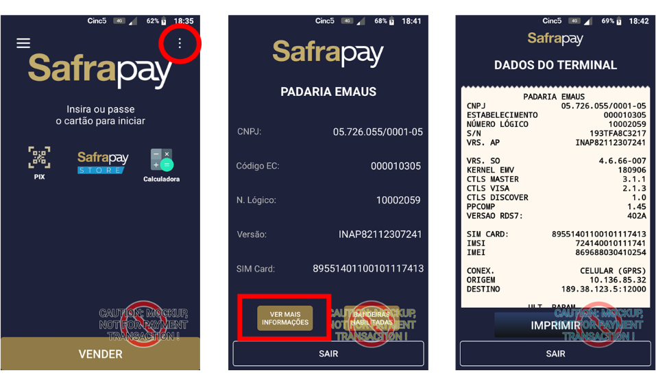

<a id="cadastro-senha-de-cancelamento"></a>

## Cadastro senha de cancelamento

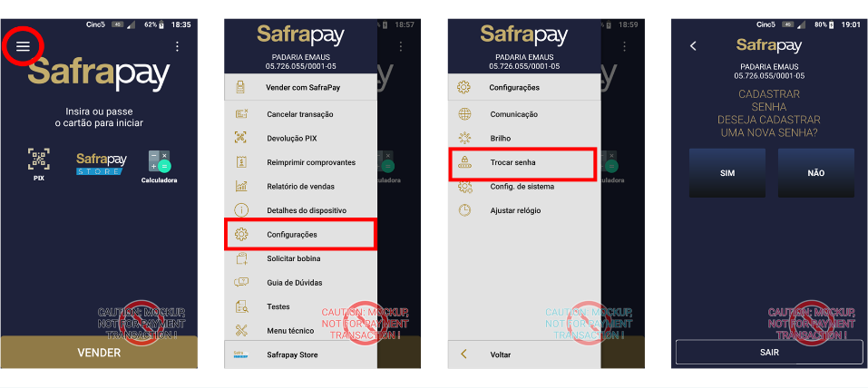

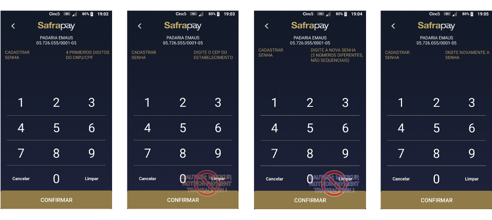

**4 PRIMEIROS DIGITOS DO CNPJ/CPF:** 0046

**DIGITE O CEP DO ESTABELECIMENTO:** 01451001

**DIGITE A NOVA SENHA:** (4 dígitos não sequenciais)

**DIGITE NOVAMENTE A SENHA:** (repetir a senha)

**Observação:** caso tenha esquecido a senha, basta realizar o mesmo processo.

<a id="informações-importantes-para-o-desenvolvimento"></a>

## Informações importantes para o desenvolvimento

<a id="manifest"></a>

#### Manifest

**Pré-Requisito aplicação de terceiro**

- Aplicação não deve ser gerada como substituta do launcher do Android, ou seja, não pode conter a category "DEFAULT".
- Além da category MAIN e LAUNCHER, a aplicação deve ser gerada com a category="safra".

**Exemplo Manifest:**

```xml
<activity android:name=".MainActivity" >
  <intent-filter>
    <action android:name="android.intent.action.MAIN" />
    <category android:name="android.intent.category.LAUNCHER" />
    <category android:name="safra"/>
  </intent-filter>
</activity>
```

<a id="build"></a>

#### Build

Para manter a compatibilidade com todo o parque de POS Safrapay, o APP de automação comercial deve ser gerada com o minSdk=22. Somente em casos específicos onde já está acordado com a Safrapay que a automação será disponibilizada para um modelo específico de POS, pode usar o parâmetro de acordo com o Android do POS.

Os terminais POS não possuem o Google Play Services disponível, portanto o APP de automação comercial não poderá ter dependência do serviço.

O SDK Safrapay possui embutido LIB de formatação de Json e Google Gson na sua versão 2.8.9, portanto não é necessário realizar nenhum import a mais para utilizá-lo. Para não ocorrer conflitos durante o build, adicionar esse comando no build.gradle:

```groovy
android {
  ...
  configurations.implementation {
    exclude group: 'com.google.code.gson', module: 'gson'
  }
}
```

Devido ao processamento de alguns modelos de POS e a internet ser limitada no 4G, não é recomendado que seja utilizado WebView no APP de automação comercial.

Algumas funcionalidades acessadas diretamente na LIB do fabricante do terminal POS podem causar conflitos com a aplicação Safrapay e causar erro na transação. Não é recomendado acessar nenhuma funcionalidade diretamente do terminal. Todas as funcionalidades mais comuns estão disponíveis através do SDK Safrapay. Ex.: impressão de cupom.

Caso o aplicativo exija alguma funcionalidade através da LIB nativa do fabricante do terminal POS (Ex.: tags NFC), alinhar com a Safrapay para evitar conflitos entre os sistemas.

<a id="uso-de-dados-móveis-4g-3g-do-app-automação-comercial"></a>

#### Uso de dados móveis 4G/3G do APP (automação comercial)

O APP de automação comercial irá navegar na internet via WiFi sem problemas, porém os CHIPs fornecidos pela Safrapay não possuem internet liberada, caso o estabelecimento comercial possa usar o APP via dados móveis 4G/3G é necessário informar a lista de URLs para [sustentacao.pos@safra.com.br](mailto:sustentacao.pos@safra.com.br) para providenciar a liberação com a área responsável. O SLA para liberação da(s) URL(s) é de até 7 dias corridos.

Os CHIPs que serão liberados para acesso à internet são das operadoras CINCO, Claro e Vivo.

<a id="nome-do-arquivo-do-app-automação-comercial"></a>

#### Nome do arquivo do APP (automação comercial)

Para manter o padrão do nome arquivo, favor seguir o exemplo abaixo:

NomeDoAplicativo_versaoDoAPK_LibSafrapay.apk Ex.: "GestorVendas_1.0_Lib2.3.apk"

Sem acentos e com no máximo 50 caracteres contando a extensão do arquivo.

<a id="testes-transacionais-cartões"></a>

#### Testes transacionais (cartões)

O POS de HML / DEV envia as transações para o ambiente de testes das bandeiras. Sugerimos o uso de cartões da bandeira Mastercard, pois ele fica disponível para uso o dia todo, já as demais bandeiras podem não estar disponíveis ou com todas as funcionalidades disponíveis.

<a id="testes-transacionais-pix"></a>

#### Testes transacionais (PIX)

Temos um simulador que aprova as transações PIX, porém é necessário agendar uma janela de testes através do e-mail: [sustentacao.pos@safra.com.br](mailto:sustentacao.pos@safra.com.br)

Quando o POS está direcionado para o simulador PIX, ele não realiza transações de crédito, débito ou outra modalidade.

<a id="homologação-do-app"></a>

## Homologação do APP

**Homologação Safrapay:** Enviar o seu APP através do Google Drive ou plataforma simular com os dados para login e manual da automação para o e-mail: [sustentacao.pos@safra.com.br](mailto:sustentacao.pos@safra.com.br)

O SLA de homologação do APP é de até 3 dias úteis.

Na homologação é realizado algumas transações financeiras e caso tenham solicitado liberação de URL para os dados móveis, validamos o acesso à internet.

A homologação é realizada somente na primeira entrega do APP, quando houver a liberação de uma nova versão do APP, apenas assinamos e publicamos.

<a id="liberação-de-nova-versão-automação-comercial"></a>

## Liberação de nova versão (automação comercial)

Quando houver a necessidade de liberar uma nova versão, favor enviar o seu APP através do Google Drive ou plataforma simular para o e-mail: [sustentacao.pos@safra.com.br](mailto:sustentacao.pos@safra.com.br)

O SLA de publicação do APP é de até 2 dias úteis.

<a id="suporte"></a>

## Suporte

Caso o desenvolvedor tenha alguma dúvida e precise de apoio técnico pode solicitar através do e-mail: [sustentacao.pos@safra.com.br](mailto:sustentacao.pos@safra.com.br)

Quando o APP estiver em produção e o cliente precisar de suporte deve acionar a central de atendimento Safrapay, caso o suporte da automação comercial precise de apoio, pode acionar o e-mail: [sustentacao.pos@safra.com.br](mailto:sustentacao.pos@safra.com.br)

<a id="safrapay-store"></a>

## SafraPay Store

Nos terminais SmartPOS temos na tela principal o ícone Safrapay STORE, onde os clientes podem baixar o(s) APP(s) desejados, porém para o APP ser disponibilizado na STORE é necessário acionar a equipe de produtos Safrapay para saber as condições comerciais.

Jose Carlos De Camargo Moura - [jose.moura@safra.com.br](mailto:jose.moura@safra.com.br)

Caso a automação comercial não tenha interesse na parceria comercial, o APP fica oculto e só é possível localizá-lo para download / atualização através da função 9998.

No POS de HML / DEV existe o ícone da Safrapay STORE e a função 9998, mas só está disponível o download de APP em produção.

<a id="acessar-os-apps-públicos-via-ícone-safrapay-store"></a>

#### Acessar os APPs públicos (via ícone Safrapay Store)

Na tela principal do POS pressione no ícone Safrapay Store.

Procure o APP por segmento utilizando a barra em destaque ou pode digitar o nome do APP na barra de pesquisa.

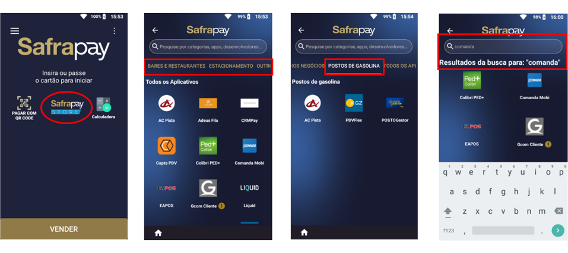

Selecione o APP desejado e pressione o botão INSTALAR.

Será necessário informar os dados do estabelecimento comercial, pois a automação comercial irá receber da Safrapay os dados do cliente para contato.

Ao concluir a instalação irá aparecer o status de instalado e será possível visualizar o APP na tela principal do POS.

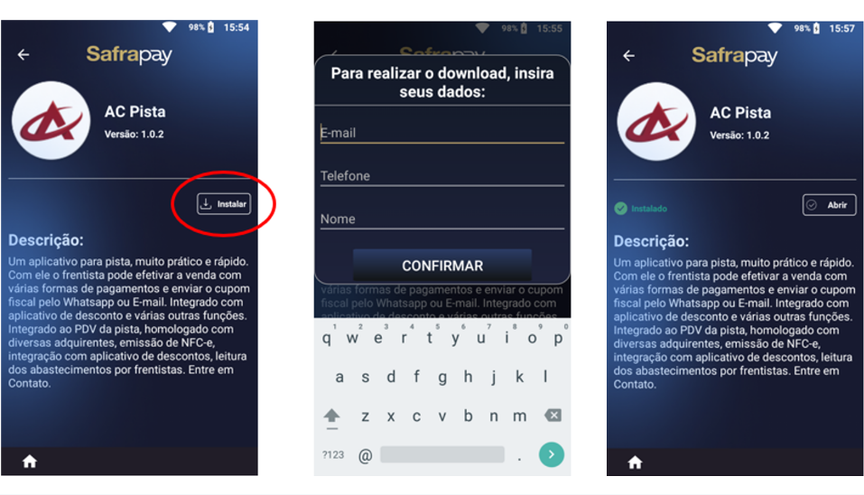

<a id="acessar-os-apps-ocultos-via-função-9998"></a>

#### Acessar os APPs ocultos (via função 9998)

Para acessar o menu funções, pressione os 3 pontinhos que ficam na tela principal do POS, informe a função 9998 e CONFIRMAR.

Procure o APP por segmento utilizando a barra em destaque ou pode digitar o nome do APP na barra de pesquisa.

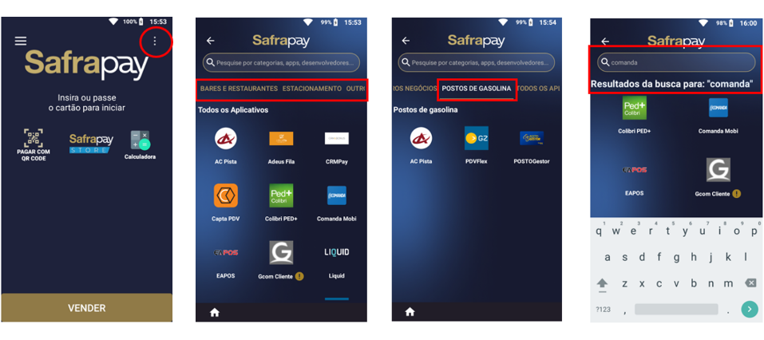

Selecione o APP desejado e pressione o botão INSTALAR.

Ao concluir a instalação irá aparecer o status de instalado e será possível visualizar o APP na tela principal do POS.

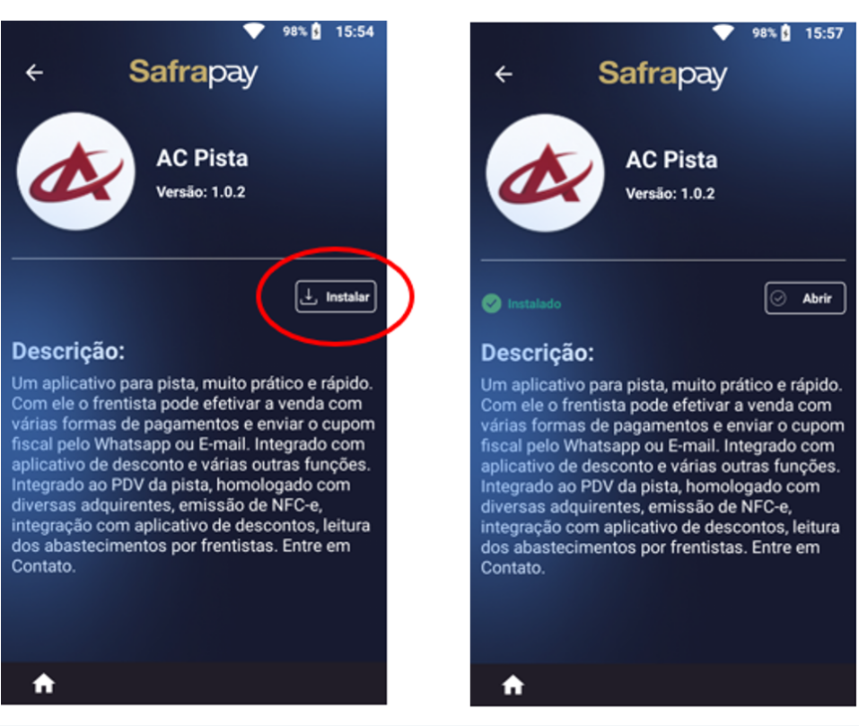

<a id="baixar-atualização-app-da-automação-comercial"></a>

#### Baixar atualização – APP da automação comercial

Quando existir uma atualização do APP é necessário o usuário acessar o ícone Safrapay Store ou a função 9998, localizar o APP e abri-lo e pressionar o botão ATUALIZAR.

Quando houver uma atualização pendente, haverá um ícone amarelo com uma exclamação, conforme imagem abaixo, este processo é manual.

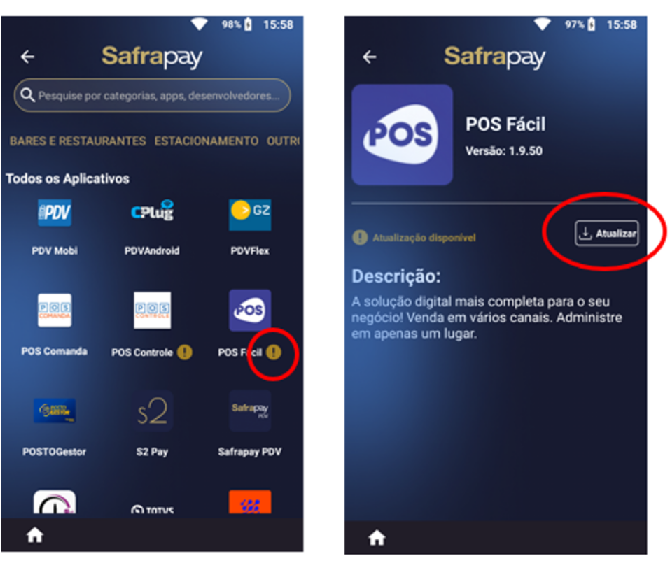

<a id="desintalar-app"></a>

#### Desintalar APP

Na tela principal pressione os 3 pontinhos conforme destacado, informe a função 9992 e CONFIRMAR.

O usuário deve selecionar o APP a ser desinstalado e pressiona o botão DESINSTALAR.

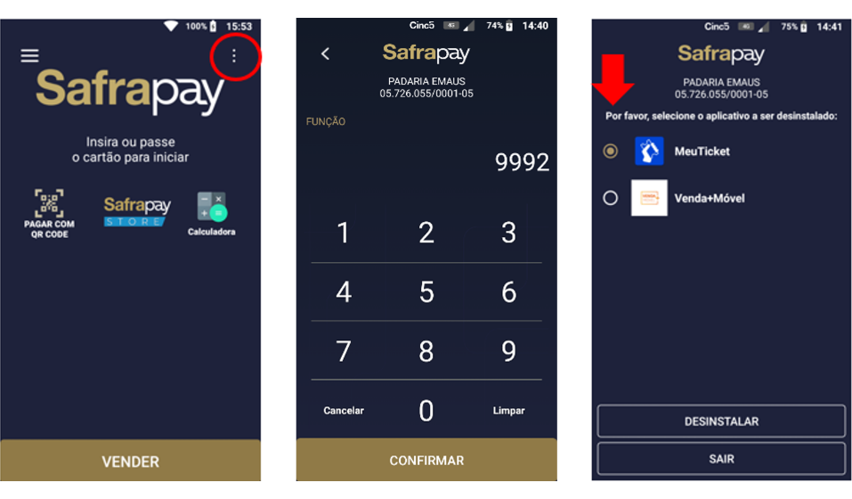

<a id="devolução-do-pos"></a>

## Devolução do POS

Após término do processo de homologação, o terminal deverá ser devolvido para o endereço abaixo.

A/C Welquer Alysson Santos Silva

End.: Rua Bela Cintra N° 560 (1 SubSolo, sala 09 - ramal 1095)

Bairro: Consolação

Cidade: São Paulo - SP

CEP: 01415-000
